# Data-Pura-Vida

## 1. Introduction: The Challenge and the Opportunity
For years, Costa Rica has contended with a significant structural limitation: the absence of a centralized, secure data ecosystem. This fragmentation of information across public and private sectors has hindered evidence-based decision-making, slowed institutional processes, and limited the innovative solutions that could emerge from the strategic use of data. "Data Pura Vida" is born from this challenge, envisioned not merely as a technological platform, but as a strategic piece of national infrastructure designed to unlock Costa Rica's potential in the global digital economy.

### 1.1 Vision
To transform Costa Rica into a leading digital-first nation, fostering a sovereign data economy where critical government decisions, private sector innovation, and citizen empowerment are driven by democratic, secure, and transparent access to information. "Data Pura Vida" will be the engine that eliminates data silos, creating a single source of truth that fuels a more efficient state, a more dynamic market, and a more informed society, securing the nation's sustainable digital transformation for generations to come.
### 1.2 Core Guiding Principles 
- **Total Auditability:** Every action, query, and transaction within the ecosystem will be immutably logged. This ensures absolute traceability, providing a transparent record for accountability and regulatory oversight.
- **Provider Accountability:** The veracity and quality of information are the direct responsibility of the entity that provides it. The platform's architecture will be designed to enforce this traceability, making the data's origin unequivocally clear.
- **Controlled Flexibility:** The system will not be a rigid, one-size-fits-all solution. It will provide a powerful and granular ruleset, empowering data owners to precisely configure how their information is shared, modified, and monetized.
- **Supervised Automation:** We will leverage intelligent automation and AI for maximum efficiency, but will always provide the option for human-in-the-loop review for critical processes, perfectly balancing technological speed with human-led rigor.
- **Data Sovereignty and Security:** The design will guarantee that users and entities have ultimate control over their data and cryptographic keys. Security is not a feature but the foundation upon which the entire ecosystem's trust is built.
### 1.3 Key Benefits
**For Costa Rica and its Government:**
- **Enhanced Public Policy & Process Optimization:** By centralizing and standardizing disparate data sources, institutions can streamline operations, accelerate processes, and design more effective, evidence-based public policies.
- **Strengthened Juridical and Commercial Certainty:** The mandatory validation of identities and financial accounts against national banking systems creates a high-trust environment, reducing fraud and strengthening the legal certainty of transactions conducted within the ecosystem.
- **Transparent and Efficient Governance:** Absolute traceability provides an unprecedented tool for regulatory oversight and fosters a culture of transparency, enabling data-driven governance.

**For the Private Sector:**
- **A New Frontier for Innovation & Business Models:** Access to a regulated data marketplace will fuel the creation of new technology products and services in fields like fintech, agritech, and health tech. The freedom to set prices and define access models (e.g., public instant access vs. private approval-based) creates a dynamic new revenue stream.
- **Secure and Risk-Mitigated Collaboration:** The ability to explore detailed metadata and data samples before purchase reduces investment risk. Furthermore, the support for organizations to use their own encryption keys provides an unparalleled level of security for B2B 

**For a a Citizens and Civil Society:**
- **Empowerment Through Information Access:** Providing access to useful, reliable, and transparent information reinforces democratic principles, enables informed citizen participation, and strengthens social auditing.
- **Guaranteed User Rights:** The platform enshrines user control, granting individuals the granular right to manage their data lifecycle, including the "right to be forgotten," and ensures fair processes through the option of human review, preventing automated exclusion.
### 1.4 Unique Value Proposition: An Integral Architecture for Data Sovereignty
"Data Pura Vida" is distinguished by its holistic approach to creating a national ecosystem built on trust, value, and control. Our unique proposition is delivered through three core architectural pillars:
1. **A National-Grade, Zero-Trust Security Architecture:** Security is the bedrock of the entire system. We implement a strict **internal zero-trust model**, architecturally preventing any privileged technical staff from accessing plaintext data. This is achieved through universal **encryption at rest and in transit**, fortified by a tripartite key custody system for master keys, ensuring no single entity holds absolute power. User identity is shielded with **unbreakable biometric authentication and multi-factor protocols**, with identities cross-validated against national banking systems to provide the highest degree of assurance.
2. **AI as an End-to-End Value and Quality Engine:** Artificial Intelligence is woven into the fabric of the data lifecycle to maximize its value from ingestion to insight.
    - **At Registration:** AI intelligently validates the authenticity and completeness of identity documents, streamlining onboarding while preventing fraud.
    - **At Ingestion:** A sophisticated **ETDL (Extract, Transform, Depurate, Load)** engine uses AI to automatically clean, standardize, model, and enrich incoming data, detecting relationships and ensuring a high standard of quality before it enters the Data Lake.
    - **At Exploration:** AI empowers all users, regardless of technical skill, to become data analysts. Through the use of natural language prompts, users can ask complex questions and have the system automatically generate insightful dashboards and visualizations.
3. **A Sovereign Ecosystem for Secure Exploration and Monetization:** We have designed a unique dual-environment that masterfully balances the need for data exploration with the imperative for absolute control.
    - The "Descubriendo Costa Rica" (Discovering Costa Rica) portal serves as a secure "sandbox" for analysis. It allows users to build and share rich, interactive dashboards, but is governed by a fundamental rule: it is technically impossible to download raw data or export visualizations. This ensures that sensitive information never leaves the secure environment.
    - This is complemented by a flexible data marketplace within the "Feliz Compartiendo Datos" (Happy Sharing Data) module. Here, data providers exercise full sovereignty, setting their own prices, defining access models, and managing their data's lifecycle, all within a regulated framework that protects both producer and consumer.

---

## 2. Risk Assessment

### 2.1 Risk Identification

#### Technical Risks:
| ID  | Risk                                   | Description                                                        |
| --- | -------------------------------------- | ------------------------------------------------------------------ |
| T01 | Format incompatibility                 | Difficulty processing datasets of diverse formats (CSV, JSON, XML) |
| T02 | Failures in data processing approaches | Data loss or corruption during transformations                     |
| T03 | Data Lake scalability                  | Storage/query limitations with data growth                         |
| T04 | Visualization performance              | High latency in complex dashboards / high traffic                  |
| T05 | Legacy system integration              | Incompatibility with public institutions' APIs/databases           |
| T06 | System availability                    | Downtime during peak demand                                        |
| T07 | AI complexity                          | Implementation may have low accuracy                               |

#### Security Risks:
| ID  | Risk                    | Description                                              |
| --- | ----------------------- | -------------------------------------------------------- |
| S01 | Sensitive data breaches | Accidental exposure of personal/confidential information |
| S02 | Identity management     | MFA authentication failures or identity spoofing         |
| S03 | Inadequate encryption   | Vulnerability of data at rest/in transit                 |
| S04 | Access privileges       | Administrator permission abuse                           |
| S05 | Lack of auditing        | Insufficient traceability of access/changes              |

#### Legal & Compliance Risks:
| ID  | Risk                     | Description                                    |
| --- | ------------------------ | ---------------------------------------------- |
| L01 | Non-compliance with laws | Penalties for mishandling personal information |
| L02 | Data ownership           | Disputes over rights to shared datasets        |

#### Operational Risks:
| ID  | Risk                 | Description                              |
| --- | -------------------- | ---------------------------------------- |
| O01 | Resistance to change | Rejection by institutions or individuals |
| O02 | Vendor dependency    | Cloud outages or critical API changes    |

#### Financial Risks:
| ID  | Risk                      | Description                                 |
| --- | ------------------------- | ------------------------------------------- |
| F01 | High operational costs    | Infrastructure more expensive than budgeted |
| F02 | Failed monetization model | Low adoption of paid datasets               |

#### Quality Risks:
| ID  | Risk                    | Description                              |
| --- | ----------------------- | ---------------------------------------- |
| C01 | Data inconsistency      | Source errors affecting analysis         |
| C02 | Lack of metadata        | Hinders AI interpretation of datasets    |
| C03 | Interoperability issues | Datasets that cannot be cross-referenced |

### 2.2 Risk Analysis and Evaluation  
**Criteria**: Probability (Low <30%, Medium 30-70%, High >70%) × Impact (Minor, Medium, Major, Critical).  

| Risk ID | Level    | Actions to Take                                                                                                       |
| ------- | -------- | --------------------------------------------------------------------------------------------------------------------- |
| **S01** | Critical | - Apply AES-256 encryption for sensitive data<br>- Restrict access using RBAC and RLS |
| **L01** | Critical | - Validate consent during registration                                                                                |
| **T02** | Critical | - Use the project's AI engine for data validation during loading (ETDL)<br>- Maintain regular backups                 |
| **T03** | High     | - Use scalable cloud storage<br>- Automatically clean unused data                                       |
| **S02** | High     | - Enforce MFA and liveness checks for registrations                                                                   |
| **S03** | High     | - Encrypt data in transit with TLS<br>- Use tripartite keys as specified                                              |
| **O01** | High     | - Train officials on platform usage<br>- Show success cases with open data                                            |
| **T01** | Moderate | - Convert files to standard formats (CSV/JSON) using built-in tools                                                   |
| **T05** | Moderate | - Create adapters for common APIs                                                          |
| **C01** | Moderate | - Use system AI to detect duplicates                                                                                  |
| **F01** | Moderate | - Monitor costs monthly                                                                                               |
| **T04** | Moderate | - Optimize queries with indexes                                                                                       |
| **S04** | Moderate | - Review admin permissions every 3 months<br>- Log all actions                                                        |
| **T07** | Low      | - Allow users to manually correct AI errors                                                                           |
| **T06** | Low      | - Use load balancers to prevent downtime                                                                              |
| **L02** | Low      | - Include clear usage agreements when uploading datasets                                                              |
| **O02** | Low      | - Maintain contracts with multiple cloud providers                                                                    |
| **F02** | Low      | - Offer free sample datasets                                                                                          |
| **C02** | Low      | - Require column descriptions when uploading data                                                                     |
| **C03** | Low      | - Use relationship fields between datasets                                                                            |
| **S05** | Low      | - Maintain access logs for extended periods                                                                                                                                                                                                      
---

## Strategic Milestones

- These milestones represent the key progress markers for the implementation team. Each one corresponds to a functional and verifiable deliverable, aligned with the architecture and technologies described in the project.

---

### Milestone 1: Operational Base Environment  
**Target Date:** End of Week 1  
**Expected Outcome:**
- AWS accounts, roles, and service access fully configured.
- Initial CI/CD running via GitHub Actions.
- Repositories cloned with local dev environment running on Lambda.
- IAM roles and policies defined for the dev environment.
---

### Milestone 2: Identity and Security Functional (Auth + WAF)  
**Target Date:** Week 4  
**Expected Outcome:**
- `AuthService` and `CognitoProvider` fully integrated (login, MFA, user creation).
- Biometric verification operational using `RekognitionAdapter`.
- Active endpoint protection with AWS WAF and `IPWhitelistFilter`.
---

### Milestone 3: Functional Modular Backend (MVP Backend)  
**Target Date:** Week 7  
**Expected Outcome:**
- SOLID architecture in place: `handlers/`, `use_cases/`, `services/`, `infra/`.
- Decoupled repositories (`IUserRepository`, `IDatasetRepository`) running on DynamoDB/S3.
- First full business flow implemented: registration -> verification -> storage.
- Core unit tests (`UserRegistrationHandlerTest`) running in CI/CD pipeline.
---

### Milestone 4: Functional Web Portals (UI MVP)  
**Target Date:** Week 9  
**Expected Outcome:**
- "Green data" submission portal connected to backend, with validation enabled.
- Admin backoffice with basic monitoring for users and datasets.
- Adaptive forms by entity type, with MFA and liveness checks.
- React/Next.js configured with secure routing, and reusable modular components.
---

### Milestone 5: ETDL Engine Operational  
**Target Date:** Week 13  
**Expected Outcome:**
- `DatasetETDLProcessor` implemented with all phases (extract, transform, model, load).
- Auto-triggered execution via S3 event.
- Automated data quality validation (metadata, format, fields).
- Structured logging to CloudWatch with traceable error paths per dataset.
---

### Milestone 6: Observability and Metrics Ready  
**Target Date:** Week 15  
**Expected Outcome:**
- Metrics and logs from backend services and ETDL tasks centralized in CloudWatch.
- Dashboards available for monitoring usage and system health.
- Alerts for critical errors, security events, or data processing failures.
- Real-time monitoring for API usage and active sessions.
---

### Milestone 7: DevSecOps Finalized + Production Ready  
**Target Date:** Week 16  
**Expected Outcome:**
- Static and dynamic analysis (SAST/DAST) automated in every push.
- Dependency scanning enabled via Dependabot.
- Full testing coverage: unit, integration, and contract tests.
- Infrastructure and build artifacts ready for production deployment.
---

## Final Milestone: Client Approval and Handover  
**Target Date:** Week 17 (buffer for stakeholder validation)  
**Expected Outcome:**
- All deliverables verified against acceptance criteria.
- Deployment and operations manual delivered.
- End-to-end demo of every module with real use cases.
- Secure handover of credentials, documentation, and environment access.
---

# Product Roadmap

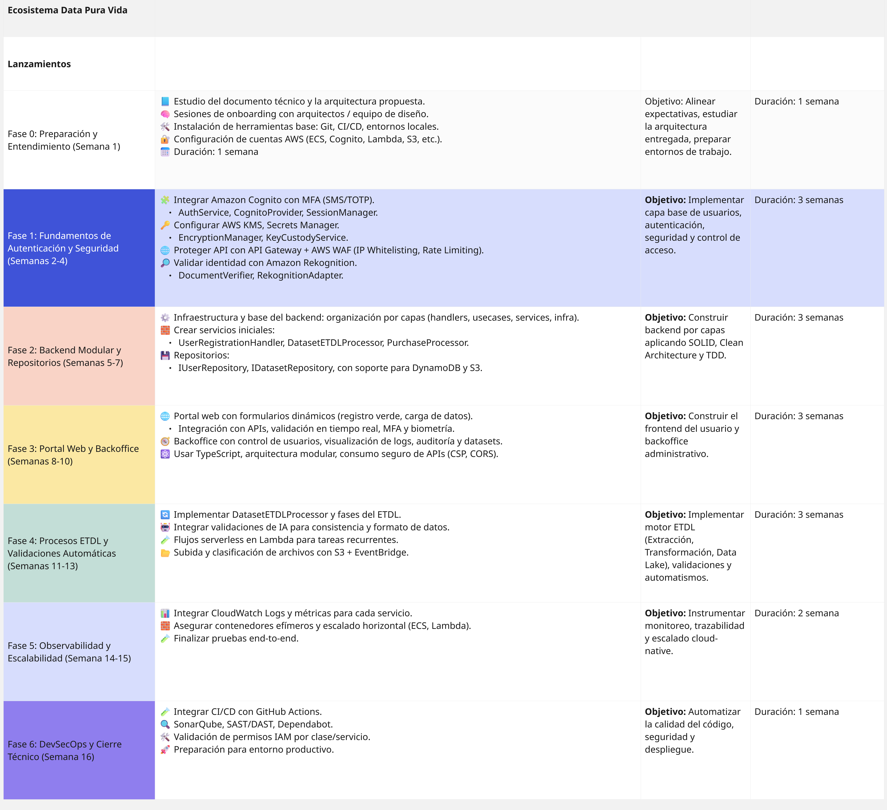


# Implementation Team Structure – Data Pura Vida
This team structure is designed to cover the full lifecycle of the project, based on the proposed roadmap and architectural needs. Each role is aligned with specific milestones, AWS services, and modules defined in the system.

---

## Core Technical Team

### 2 × **Cloud & DevOps Engineers**
**Primary Responsibilities:**
- Set up and manage AWS environments (IAM, Lambda, API Gateway, Cognito, Secrets Manager, WAF).
- Configure CI/CD pipelines with GitHub Actions.
- Infrastructure-as-Code (IaC) setup using Terraform or AWS CDK.
- Logging and observability with CloudWatch and AWS Config.

**Key Milestones:**  
M1 (Environment Setup), M5 (ETDL), M6 (Monitoring), M7 (DevSecOps)

---

### 2 × **Backend Developers**
**Primary Responsibilities:**
- Implement core logic using modular architecture (handlers, use cases, services).
- Design and develop services like `AuthService`, `DatasetETDLProcessor`, `PaymentGatewayFacade`, `RekognitionAdapter`, etc.
- Ensure compliance with SOLID principles and Clean Code.
- Build integration with AWS (DynamoDB, S3, Rekognition, SES).

**Key Milestones:**  
M2 (Auth & Security), M3 (Modular Backend), M5 (ETDL)

---

### 2 × **Frontend Developers (React / Next.js)**
**Primary Responsibilities:**
- Develop the data submission portal and admin backoffice using React + Tailwind + TypeScript.
- Implement MFA, biometric capture, and adaptive forms.
- Integrate with backend APIs securely and with token management.
- Apply strict CSP, routing guards, and reusable UI components.

**Key Milestones:**  
M4 (Portals), M6 (Monitoring), M7 (UI Testing)

---

### 1 × **ETDL / Data Engineer**
**Primary Responsibilities:**
- Build and optimize `DatasetETDLProcessor` pipeline (extract, transform, model, load).
- Set up automated validations (format, metadata, permissions).
- Handle S3 triggers, orchestration (ECS, Lambda) and monitoring of tasks.

**Key Milestones:**  
M5 (ETDL), M6 (Observability)

---

## UX / Functional Team

### 2 × **UX/UI Designers**
**Primary Responsibilities:**
- Design user flows and interfaces for the data submission process and backoffice.
- Create mockups, adaptive form logic, and verification flows (biometrics, MFA).
- Ensure accessibility, mobile-responsiveness, and UX compliance.
- Collaborate with frontend team to maintain consistency.

**Key Milestones:**  
M2 (Identity UX), M4 (Portals), M8 (Final Handover)

---

### 1 × **Product Owner / Functional Analyst**
**Primary Responsibilities:**
- Maintain alignment with stakeholders and manage scope creep.
- Translate business logic into backlog-ready tasks.
- Define acceptance criteria and validate each milestone.
- Facilitate demos, sprint reviews, and handover preparation.

**Key Milestones:**  
Across all milestones, particularly M1, M4, M8

---

## QA & Security

### 1 × **QA Engineer**
**Primary Responsibilities:**
- Write and execute test cases (unit, integration, E2E).
- Set up testing pipelines in CI/CD: Jest, Pytest, Postman/Newman, etc.
- Ensure coverage for AuthService, Dataset handling, front portals.
- Conduct regression and smoke testing before releases.

**Key Milestones:**  
M3, M4, M6, M7

---

### 1 × **Security Analyst / DevSecOps**
**Primary Responsibilities:**
- Integrate and monitor SAST/DAST tools (SonarQube, OWASP ZAP, etc).
- Review IAM roles, API permissions, and secure configuration of AWS services.
- Ensure encryption, MFA, key management and secret storage follow best practices.
- Collaborate with DevOps on secure deployment flows.

**Key Milestones:**  
M2 (Security), M6 (Monitoring), M7 (DevSecOps)

---

## Summary Table

| Role                     | Headcount |
| ------------------------ | --------- |
| Cloud & DevOps Engineers | 2         |
| Backend Developers       | 2         |
| Frontend Developers      | 2         |
| ETDL / Data Engineer     | 1         |
| UX/UI Designers          | 2         |
| Product Owner / Analyst  | 1         |
| QA Engineer              | 1         |
| Security / DevSecOps     | 1         |
| **Total**                | **12**    |

---
Roles can be distributed in squads or sprints. For early phases (M1–M3), focus is backend-heavy. Mid-project (M4–M6) shifts to frontend + data, while the final phase (M7–M8) emphasizes QA, DevSecOps, and handover.


## Technical Policies for the **Data Pura Vida** Platform

This section defines how each legal and regulatory framework is technically enforced within the **Data Pura Vida** platform. It translates abstract legal principles into actionable rules, showing exactly **what to implement**, **where**, and **how**, for system developers and security teams.


### Law 8968 – Personal Data Protection (Costa Rica)

| Policy                          | Where? (Module)            | How and when is it applied? (Technical implementation)                                                              |
|----------------------------------|----------------------------|---------------------------------------------------------------------------------------------------------------------|
| Informed consent                | Bio Verde Registration     | Mandatory `checkbox` in the initial form; saved with `timestamp` in the `consents` table; audited in logs.          |
| Data usage transparency         | Happy Sharing Data         | Data usage preferences view (`/data-preferences`); changes persisted per user in `data_preferences`.                |
| Sensitive data access control   | Data Lake, Security        | RLS filter (`user_id` or `org_id`) in Glue and QuickSight; applied to each query based on JWT token.                |
| Deletion upon request           | Backoffice Admin           | `DELETE /user-data/:id` endpoint with MFA validation; entry recorded in `deletion_requests`.                        |
| Data encryption                 | Database layer             | AES-256 encryption at rest (S3, RDS, DynamoDB); keys managed by AWS KMS with automatic rotation.                    |

### GDPR – General Data Protection Regulation (EU)

| Policy                           | Where? (Module)           | How and when is it applied? (Technical implementation)                                                              |
|-----------------------------------|---------------------------|---------------------------------------------------------------------------------------------------------------------|
| Right of access / portability     | Backoffice, API           | `GET /user-data/export` returns user data in digitally signed JSON; generated on-demand.                            |
| Right to be forgotten             | Backoffice                | Logical deletion: `deleted_at` field is set; permanent purge by weekly `cron` job (`purgeDeletedUsersJob`).         |
| Consent record                    | Registration              | Consents stored in `consents` table (`user_id`, `policy_id`, `timestamp`); updated if changed.                      |
| Breach notification               | Security, Notifications   | Detection via CloudWatch (or X-Ray); automatic notification by SES to affected users with technical summary.         |

### ISO/IEC 27001 – Information Security Management

| Policy                          | Where? (Module)           | How and when is it applied? (Technical implementation)                                                              |
|----------------------------------|---------------------------|---------------------------------------------------------------------------------------------------------------------|
| Access control                  | Security, Backoffice      | IAM + RBAC (by role and subrole) applied to endpoints and database filters (`authStore.role`).                      |
| Access and change auditing      | Audit system              | Event logging (`/logs`) in the `audit_logs` table with `user_id`, `action`, `resource`, `timestamp`.                |
| Encryption in transit and at rest| Data security             | HTTPS for all services; AES-256 encryption (at rest) + TLS 1.2+ (in transit); certificate verified by ACM.          |
| Key lifecycle management        | KMS Security              | Keys generated by AWS KMS; automatic rotation every 365 days; revocation with IAM control and auditing.              |
| Alerts and risk assessment      | Security + AI             | CloudWatch dashboards with anomalous metrics detected by SageMaker (suspicious or out-of-pattern events).           |


### Data Governance Principles – OECD

| Principle                      | Where? (Module)           | How and when is it applied? (Technical implementation)                                                              |
|--------------------------------|---------------------------|---------------------------------------------------------------------------------------------------------------------|
| Interoperability               | Happy Sharing Data        | REST APIs documented with Swagger/OpenAPI; input/output in JSON/CSV; GraphQL support where applicable.              |
| Data flow transparency         | Dashboards, Audit         | Traceability graph (`data_lineage`) generated by Glue + stored per event in `lineage_logs`.                         |
| Data quality control           | ETDL Layer (Glue)         | AI validations (SageMaker): detection of duplicates, empty fields, anomalous data; rules in Glue DataBrew.          |
| Dataset documentation          | Dataset Catalog           | Metadata automatically generated (Glue Catalog); includes structure, relationships, and usage conditions.            |


### AI Bill Project Exp. 23.771 – Costa Rica

| Requirement                     | Where? (Module)           | How and when is it applied? (Technical implementation)                                                              |
|----------------------------------|---------------------------|---------------------------------------------------------------------------------------------------------------------|
| Explainability of decisions      | Dashboard with AI         | AI prompt saved with result in `prompt_logs`; autogenerated `technical explanation` field visible to the user.      |
| AI decision supervision          | Backoffice + Audit        | Actions marked as `triggered_by_AI`; accessible via admin interface with filters by date, type, and model.          |
| Ethical validation of records    | Registration + AI         | Models used are auditable (Azure Form Recognizer); logs contain origin, model, `confidence_score`.                  |
| AI traceability                  | Security + Logs           | Each inference saves `input`, `output`, `model`, `timestamp`, `confidence` in `ai_logs`; visible to admin.          |

---

## Macro components diagrams

This section contains hierarchical decomposition diagrams, with a top-down (Macro-to-micro decomposition) functional analysis.
-   **Data Lake**: Core data integration, storage, processing, and governance.
-   **Security**: Platform-wide authentication, authorization, key management, and data protection layers.
-   **Inteligencia Artificial (AI)**: Embedded AI capabilities enhancing various system functions.
-   **Dashboard (Descubriendo Costa Rica)**: User interface for data exploration and visualization.
-   **Catálogo (Catalog)**: System for discovering and managing dataset information.
-   **Back Office**: Administrative portal for system management and oversight.
-   *(Note: Key processes like Document Validation and Purchases are detailed under relevant components or their own sections where they represent significant, distinct flows shown in diagrams.)*

### Diagram access
View the full hierarchical diagrams here: [Diagrams](https://app.diagrams.net/#G1yVFPUMvNwK_1kUzsVjszH3h54usKBPj5#%7B%22pageId%22%3A%22HHjvdh1xR4mO0dgaIlwd%22%7D)

## Macrocomponents

### Component: Registration

#### General Overview

The **Registration** component is the entry point for individuals and organizations into the Data Pura Vida ecosystem. It ensures that all actors are validated, authenticated, and securely onboarded using advanced identity verification, customizable registration flows, and role-aware configurations. The entire process integrates AI-based document validation, biometric authentication, geographic filtering, and multifactor mechanisms to guarantee integrity and compliance.

The component is divided into six key functional blocks:

#### 1. Identity and Security Verification

Handles the secure identification of users before access is granted.

- **Geographic Verification**: Restricts registration based on IP location (e.g., only from Costa Rica).
- **Authentication**:
  - MFA (Multi-Factor Authentication)
  - Biometric Authentication (e.g., facial recognition)
  - Proof-of-life detection to prevent spoofing

#### 2. Document Validation (AI-powered)

Ensures that required legal and identity documents are submitted, complete, and authentic.

- **Validation**: AI-based document structure recognition
- **Document Identification**: Detection of document type and content
- **Verification**: Cross-check against expected data patterns or legal templates
- **Manual Review**: Pending states trigger manual administrator validation

#### 3. Dynamic Form Handling and Data Adaptation

Tailors the registration experience according to the entity or individual profile.

- **Form Capture**: Collection of personal, legal, or corporate information
- **Dynamic Forms**: Fields change depending on the type of user (e.g., person, institution, company)
- **Form Generation**: Automatic UI creation per user category
- **Data Validation**: Ensures required fields are complete and values are within valid ranges

#### 4. Cryptographic Key and Custody Management

Manages the creation and secure handling of access keys associated with users or organizations.

- **Key Generation**: Creation of symmetric, asymmetric, and multi-party cryptographic keys
- **Key Lifecycle**: Tracks the status, validity, and expiration of keys
- **Custody and Protection**:
  - Vault-based storage
  - Tripartite custody system involving multiple trusted parties

#### 5. Account Configuration and Role Assignment

Defines roles, scopes, and account relationships.

- **Roles**: Assigns access levels and privileges depending on the entity's role (e.g., admin, data provider)
- **Multi-organization Accounts**: Allows a single user to manage multiple organizations under the same identity
- **Registration of Accounts**:
  - Supports individuals and organizations
  - Allows linking of purchases or data access models

#### 6. Notification System

Manages system-to-user communication during and after registration.

- **Email Notifications**: Confirmation of registration status, approvals, or rejections
- **Account Status Updates**: Inform users when their registration is pending, validated, or rejected

#### Architectural Justification

The Registration component was designed to ensure strict compliance with identity verification, legal data protection, and system governance. By integrating AI-powered document processing, biometric technologies, secure key management, and dynamic configuration per user type, the onboarding process becomes adaptive, secure, and scalable. All stages of the process are monitored, verifiable, and aligned with access and usage policies defined by the platform.

### Component: Security

#### General Overview

The **Security** component ensures the integrity, confidentiality, and controlled access to all operations within the Data Pura Vida ecosystem. It provides robust identity verification, encryption mechanisms, access control models, audit trails, and secure key management. This system supports legal compliance, resilience to misuse, and fine-grained policy enforcement throughout the platform.

The Security module is divided into five primary functional blocks:

#### 1. Access Control

Defines and enforces the rules under which users, systems, and organizations interact with the platform.

- **Restricted Access**: Limits entry to specific zones based on IP, roles, or other policies
  - **Geographic Verification**: IP-based region control
  - **Whitelist**: Approved institutional IP ranges
- **Authentication**:
  - **MFA** (OTP, SMS, Email, Authenticator App)
  - **Biometrics** (Facial, Fingerprint, Voice)
  - **Proof-of-Life Detection**
- **Dynamic Access Control**: Manages usage quotas, download limits, and role-specific rules
- **Access Policies**: Enforces conditional logic depending on user status or entity type

#### 2. Role-Based Access and Permissions

Applies structured RBAC logic for multi-entity collaboration and fine-grained user control.

- **Roles (RBAC)**:
  - Assignment of user and system roles
  - Multi-organization account enablement
  - Delegated account management (e.g., organizations)
- **Permissions by Role**: Assign and revoke access to features, datasets, and tools
- **Data Use Restrictions**:
  - Export and download blocking
  - Graphs/content protection per access level

#### 3. Audit and Validation System

Provides end-to-end traceability of user actions, data operations, and document verification.

- **Access Logs**: Tracks all access attempts and sessions
- **Change Logs (DataLake)**: Logs changes to datasets and resources
- **Document Validation Logs**: Records validation results and processes
- **Row-Level Security**:
  - Access segmentation at the row or record level
  - Enforced through dynamic policies

#### 4. Key Management and Custody

Handles the secure generation, storage, and lifecycle of cryptographic credentials.

- **Key Generation**: Creation of symmetric, asymmetric, and tripartite keys
- **Custody and Protection**:
  - Tripartite Custody System
  - Secure vault integration for storage
- **Key Lifecycle**: Rotation, expiration, revocation

#### 5. Data Security and Encryption

Guarantees protection of data at all stages: in storage, in transit, and at application level.

- **Data Encryption**:
  - **At Rest** (DataLake, databases)
  - **In Transit** (APIs, dashboards)
  - **At Application Level**
- **Secure External Communication**:
  - Encrypted APIs
  - Whitelisted connections
- **Data Integrity Monitoring**: Detects unauthorized modifications or anomalies
- **Digital Signatures and Non-repudiation**: Ensures authenticity and accountability of actions

#### Architectural Justification

This security architecture is designed to provide layered protection for sensitive data and user interactions. By combining MFA, biometric authentication, RBAC, encryption, auditability, and key lifecycle controls, the system ensures resilience, compliance, and strict policy enforcement. Each subcomponent is isolated and traceable, allowing for dynamic response to threats, full visibility, and secure delegation of authority across the Data Pura Vida platform.

### Component: Data Lake

#### General Overview

The **Data Lake** is the core of the *Data Pura Vida* ecosystem. It serves as the central repository for structured and semi-structured data, enabling integration, transformation, and analysis through intelligent services. Its hierarchical design ensures secure storage, versioning, dataset relationships, and full traceability, while complying with the system’s security and data governance requirements.

The component is decomposed into five main functional blocks:

#### 1. Input

Responsible for receiving data from multiple sources. Supports:

- Automatic ingestion via:
  - File uploads (Excel, CSV, JSON)
  - Connectors to SQL / NoSQL databases
  - External APIs
- Manual data entry
- Source and upload location registration
- Structure and format validation
- Metadata collection for AI processing

#### 2. Storage

Manages safe and versioned data retention:

- Dataset version control
- Relationships between datasets via linked columns
- Delta load management:
  - Differential fields
  - Timed pull configuration
  - Event-triggered callbacks

#### 3. Transformation (ETDL)

The smart data processing engine based on AI, composed of:

- **Extraction**: capturing new and existing data
- **Transformation**: normalization, schema redesign, automatic linking of datasets
- **Cleaning**: detection and correction of errors via AI
- **Modeling and final loading** into the system

#### 4. Delivery

Regulates secure and controlled access to processed data:

- Restricted access based on role, time, volume, or entity
- Internal dashboards for data visualization (no export allowed)
- Optional integration with AI models (vector format delivery)
- Real-time metrics on data usage and limits

#### 5. Security

A transversal system that guarantees data protection and traceability:

- Encryption at rest, in transit, and at the application level
- Role-Based Access Control (RBAC) and Row-Level Security (RLS)
- Multifactor authentication (MFA)
- Dynamic access policies per user/entity type
- Access and modification logging for full auditability

#### Architectural Justification

This hierarchical design was created based on system requirements and best practices in modular software architecture. Each subcomponent is a self-contained unit with clear responsibilities, supporting scalability, maintainability, and full data traceability. The Data Lake interacts with other major components (Backend API, Public Portal, and Backoffice) through secure and auditable integration layers, aligned with modern standards of data governance and information security.

### Component: Dashboard

#### General Overview

The **Dashboard** component provides users with a centralized interface to explore, visualize, and interact with datasets available within the Data Pura Vida platform. It enables real-time monitoring of data consumption, auditability, visualization through customizable graphs, and AI-assisted dashboard generation — all within a secure, non-exportable environment.

This component is organized into seven major functional blocks:

#### 1. Data Access and Consumption Management

Controls user access to data, tracks usage, and enforces limits.

- **Consolidated Data Source**: All queries are executed on a unified virtual layer of available data.
- **Consumption Tracking**:
  - Real-time monitoring of:
    - Amount of data consumed
    - Time remaining
    - Number of queries executed
  - Blocking of access upon exceeding allowed limits
- **Audit and Access History**:
  - All user interactions are logged
  - Query and consumption logs are made accessible for internal audit purposes

#### 2. Dashboard Construction

Allows users to build their own dashboards manually or via intelligent prompts.

- **Manual Construction**: Drag-and-drop or selection-based UI
- **AI-Powered Prompts**: Users can request dashboards using natural language
- **Persistence**: Dashboards can be saved for future access or reuse

#### 3. Visualization

Enables interactive and visual exploration of data without exporting.

- **Graphical Outputs**:
  - Tables
  - Charts
  - Counters
  - Trends
- **Preview Mode**:
  - Shows sample data while building dashboards
  - Executes actual queries only after completion to protect sensitive data

#### 4. Sharing Options

Manages how dashboards can be shared or viewed by other users.

- **Dashboard Visibility**:
  - Public dashboards: visible to all users
  - Private dashboards: visible only to owner
- **Sharing Between Users**: Selective sharing with named collaborators or organizations

#### 5. Data Security and Export Prevention

Ensures sensitive data cannot be extracted from the platform.

- **Export Blocking**:
  - Disables copying or exporting of visual elements or raw data
- **Download Restriction**:
  - Prevents downloading of underlying datasets through dashboards
  - Applies to graphs, charts, or source tables

#### 6. AI Model Integration

Restricts and supervises data access by AI systems connected to the platform.

- **Model Monitoring**:
  - Monitors data flow to AI agents
  - Detects and blocks attempts to persistently store data
- **Security Enforcement**:
  - Ensures AI only accesses data under strict, controlled use cases

#### 7. Dataset Acquisition and Audit

Supports access to paid datasets and enables auditing of data usage.

- **Dataset Acquisition**:
  - Purchase flow for datasets with cost
  - Catalog view of available datasets, terms, and prices
- **Audit Logs**:
  - Tracks dataset visualization activity
  - Accessible by administrators through the Backoffice module

#### Architectural Justification

This component combines user-friendly data exploration with strict governance and privacy control. It ensures that users can analyze information without compromising the security or ownership of the data. By integrating audit logs, AI moderation, access control, and real-time consumption metrics, the Dashboard supports responsible and compliant data usage within the ecosystem.

### Component: Catalog

#### General Overview

The **Catalog** component provides a centralized interface for exploring, filtering, and acquiring datasets within the Data Pura Vida platform. It allows users to distinguish between public and private datasets, review key information before purchase, and access datasets through dashboards post-acquisition. This component ensures transparency, usability, and secure dataset transactions.

The Catalog is composed of five major functional blocks:

#### 1. Dataset Exploration

Enables users to browse available datasets with visibility controls and filtering tools.

- **View**:
  - Public datasets: visible to all users
  - Private datasets: accessible based on permissions or roles
- **Filters**:
  - By dataset name
  - By category or thematic area
  - By access model (free or paid)
- **Dataset Metadata**:
  - Name
  - Category
  - Free or paid status
  - Short description

#### 2. Dataset Detail Sheet

Displays detailed information about a selected dataset before access or acquisition.

- **Usage Policies**: Describes who can access the dataset and under what terms.
- **Terms and Conditions**: Legal and technical constraints associated with dataset use.

#### 3. Purchase Functionality

Facilitates access to paid datasets through a clear and secure purchasing process.

- **Buy**: Initiates the transaction for datasets with an associated cost.
- **Purchase Record**: Creates a traceable record for auditing and access validation.

#### 4. Dataset Visualization

Allows users to access and use purchased datasets within the platform’s secure dashboard environment.

- **Access via Dashboard**: Users visualize datasets only through internal tools — direct downloads or exports are not permitted.
- **Link with Access Rights**: Ensures only authorized users visualize private or paid datasets.

#### 5. Data Access Management

Manages who can view or interact with datasets after exploring or purchasing them.

- Integrated with access control policies and security layer.
- Ensures the catalog is compliant with licensing, privacy, and traceability requirements.

#### Architectural Justification

The Catalog component is designed to serve as the user-facing entry point for discovering and accessing datasets. It integrates policy enforcement, visibility rules, and secure purchase flows, ensuring that dataset availability is transparent, controlled, and compliant. Combined with auditability and usage governance, the Catalog supports responsible data sharing and monetization within the Data Pura Vida platform.

### Component: Purchases

#### General Overview

The **Purchases** component manages the acquisition of datasets that are subject to payment within the Data Pura Vida platform. It handles data capture, payment validation, security protocols, permission assignment, user notification, and audit logging. This ensures a transparent, secure, and traceable process for accessing paid information.

The component is divided into six primary functional blocks:

#### 1. Information Capture

Collects the necessary data to process a purchase securely.

- **User Information**: Identity and account details from the registration system
- **Payment Methods**:
  - Credit/Debit Cards
  - Digital Gateways (e.g., PayPal)
  - IBAN Transfers

#### 2. Payment Validation

Verifies that the payment was successfully processed before granting access.

- Integrates with external payment gateways
- Triggers next steps in permission assignment and notification
- Ensures payment status is securely stored

#### 3. Data Encryption

Protects sensitive transactional information using cryptographic techniques.

- Encryption of payment data during transmission and storage
- Integration with the platform's central **Security** component

#### 4. Permission Assignment

Manages how access is granted after successful payment based on dataset type.

- **Public Datasets**: Immediate access is granted
- **Private Datasets**: Requires manual or automatic approval based on rules

#### 5. User Notification

Sends communication to the user regarding the outcome of their purchase.

- Email confirmation of payment receipt
- Notification of access granted or pending approval

#### 6. Auditing

Creates a persistent transaction log for administrative review and traceability.

- **Transaction Record**:
  - Stored for future reference and billing reconciliation
  - Accessible from the **Backoffice**
- Tracks who bought what, when, and under what conditions

#### Architectural Justification

The Purchases component ensures secure and compliant access to paid datasets. It integrates with external payment systems, internal security modules, and the platform’s access control framework to provide a seamless and traceable transaction process. This component supports revenue-generating models, strengthens auditability, and preserves user trust through secure data handling and transparent communication.

### Component: Artificial Intelligence (AI)

#### General Overview

The **Artificial Intelligence** component enhances various platform functionalities by introducing intelligent automation, pattern recognition, and dynamic adjustment of data processes. It operates across modules like document validation, data modeling, visualization, and security monitoring. AI is embedded to improve efficiency, accuracy, and scalability in the platform's key operations.

The component is structured into four main areas of integration:

#### 1. Document Validation Intelligence

Automates document processing and adapts validation according to the context of the user or entity.

- **Automated Validation**:
  - Checks completeness and correctness of uploaded files
  - Applies validation rules depending on entity type or user profile
- **Field-Level Validation**:
  - Document type classification
  - Automatic data extraction
  - Verification of required fields
  - Format and legibility checking
  - Comparison with templates and predefined rules
  - Highlighting of inconsistencies

#### 2. ETDL Automation in the Data Lake

Uses AI to streamline the Extract, Transform, Detect, Load (ETDL) flow and improve data relationships.

- **ETDL Engine**:
  - Orchestrates extraction and loading using AI logic
  - Requires metadata such as column name, description, and tags
- **Deduplication and Optimization**:
  - Detects repeated data
  - Links datasets with existing ones based on usage patterns
- **Model Adjustment**:
  - Refines the structure of datasets based on actual interrelations and usage

#### 3. Intelligent Data Modeling

Improves and simplifies how data is structured, linked, and used in the platform.

- **Model Optimization**:
  - Redesign datasets depending on actual access and usage
- **Normalization**:
  - Converts data into consistent formats and schema
- **Automated Linking**:
  - Establishes semantic or referential connections to existing datasets

#### 4. Visualization and Monitoring Support

Enables AI to assist in generating dashboards, detecting anomalies, and summarizing activity.

- **Dashboard Construction via Prompts**:
  - Users generate visualizations using natural language
  - AI translates prompts into graphs and charts
- **Vector-Based Data Delivery**:
  - Allows data to be exposed as vectors for ML/AI consumption with controlled access
- **Monitoring and Detection**:
  - Tracks ETDL events (transfers, cleanings, deletions, model changes)
  - Reports usage, integration anomalies, and data quality issues

#### Architectural Justification

The AI component acts as a cross-cutting enabler within the Data Pura Vida platform. It reduces manual effort in validation and transformation, enhances data discoverability, and supports regulatory enforcement through automated monitoring. AI-driven decisions help enforce security, improve the user experience, and enable scalable data governance.

### Component: Back Office (Extended View)

#### General Overview

The **Back Office** is the administrative core of the Data Pura Vida platform. It is used exclusively by authorized personnel to manage access keys, integrations, validations, data loading policies, user permissions, and compliance actions. This component provides complete operational oversight, enabling secure, auditable, and policy-driven control over the platform.

The component is structured into six principal functional domains:

#### 1. User and Key Management

Handles the secure creation, revocation, and assignment of cryptographic credentials and key custodianship.

- **Custodian Management**:
  - Mancomunated Assignment (multi-party approval for key management)
  - Cross-confirmation for sensitive operations
- **Key Generation/Revocation**:
  - Support for symmetric, asymmetric, and tripartite cryptographic keys

#### 2. Integration Management

Controls all platform-level integrations with external data sources and systems.

- **Database Connections**
- **ETL Pipelines** supervision
- **Callbacks / Webhooks** management
- **External APIs** connectivity and configuration

#### 3. Audit and Monitoring

Provides detailed operational visibility into all backoffice-related and system-wide activities.

- **Internal Operations**:
  - Logs, system events, service performance
- **Report Generation**:
  - Custom reports for access, datasets, usage
- **Real-Time Monitoring**:
  - Live dashboards showing system behavior

#### 4. Legal Evidence and Compliance

Supports legal procedures and ensures regulatory compliance through controlled access and traceability.

- **Legal Evidence Extraction**
- **Action Traceability**
- **Regulatory Compliance**:
  - Supports standards such as Ley 8968, GDPR, ISO/IEC 27001

#### 5. Data Load Rule Management

Allows for advanced configuration and enforcement of dataset ingestion rules.

- **Format and Structure Requirements**
- **Validations** based on entity type or content
- **Conditions by Entity**:
  - Custom rules per organization, institution, or user type

#### 6. Visibility and Permissions Management

Manages how roles, users, and entities interact with the system’s components and data.

- **Role-Based Access Control (RBAC)**:
  - Assignment and delegation of roles
- **Object Visibility**:
  - Dataset or component visibility by user scope
- **Component Control**:
  - Activation or deactivation of functionalities based on policy

#### Architectural Justification

This component enforces organizational governance and system control, allowing platform administrators to handle integrations, enforce security, monitor operations, and maintain compliance with national and international standards. Each subcomponent is modular, auditable, and tailored to ensure traceability and least-privilege access across every operational layer of the Data Pura Vida ecosystem.

## Key Administrative Functions

-   **Gestión de Usuarios y Entidades**:
    -   Onboarding, validation, and role management (RBAC) for all registered entities and internal users.
    -   Management of security aspects like key custodians for the tripartite system.
-   **Configuración del Sistema y Reglas de Negocio**:
    -   Defining and managing rules for data loading, validation, and dataset structuring.
    -   Configuration of connectivity to external data sources.
-   **Supervisión y Monitoreo Operativo**:
    -   Real-time monitoring of platform services, data pipelines, ETL(D) processes, and system health.
    -   Generation of operational reports, usage statistics, data quality metrics, and anomaly detection.
-   **Gobernanza y Cumplimiento**:
    -   Comprehensive audit trails of all system operations and administrative actions.
    -   Tools for extracting information for legal or regulatory purposes (under authorization).
    -   Ensuring adherence to data protection laws (e.g., Ley 8968) and standards.
-   **Gestión de Contenido y Datasets**:
    -   Activating, deactivating, editing, and supervising data objects within the platform.

*(Note: The "Validación de Documentos" process, while having its own diagram, is a critical sub-function primarily within the "bio registro verde" (user registration) workflow, heavily utilizing "AI" and "Security" components, and managed/audited via the "Back Office".)*

---

This comprehensive decomposition, visually represented in the linked diagrams and aligned with the detailed requirements, forms a clear foundation for the strategic selection of technologies, ensuring that all functionalities and objectives of the Data Pura Vida ecosystem will be effectively implemented and supported.

# Technology Stack - Data Pura Vida
## 1. Registration & Authentication
- **AWS Cognito**: User authentication, MFA (SMS/TOTP)  
- **Amazon Rekognition**: Biometric validation (facial recognition, liveness check).  
- **AWS IAM Identity Center**: RBAC (role and permission management) and group management.  
- **AWS WAF**: Geographic restriction (Costa Rica IPs only) and attack protection  

### Document Validation
- **Amazon Textract**: Data extraction from documents (IDs, certificates, etc.).  
- **SageMaker**: Custom models for format validation, readability, and consistency. Document classification by type.  
- **DynamoDB**: Storage of validation records and statuses (pending/approved).  

### Advanced Security
- **AWS KMS**: Cryptographic key generation and rotation (symmetric/asymmetric).  Soporte para importación de claves si se requiere custodia externa (tripartita). integrar claves propias (por ejemplo, de organizaciones o terceros) para cumplir el esquema de llave tripartita.  
- **Secrets Manager**: Almacenamiento seguro de secretos y llaves compartidas entre partes. Manejo de rotación automática y control de acceso con IAM.  

## 2. Data Management (DataLake)

### Storage & Processing
- **Amazon S3**: Primary storage for datasets (structured/semi-structured).  
- **AWS Glue** (con soporte para Iceberg incluido para control y gestion de cargas delta): Automated ETL, data cataloging, and schema detection, Versioning and delta loads management.  
- **Amazon Athena**: SQL queries on S3 data.  

### Quality & Transformation
- **AWS Glue DataBrew**: Data cleaning and normalization with AI, Quality validation (integrity, format).  
- **SageMaker**: Advanced modeling, deduplication, and data enrichment.  

### Security & Governance
- **AWS Lake Formation**: Access control (RLS/Row-Level Security) and auditing.  
- **KMS + TLS**: Encryption at rest/in transit.  

## 3. Visualization & Dashboards

- **Amazon QuickSight**:  
  - AI-powered dashboard generation (QuickSight Q).  
  - Embedded visualization (Embedding SDK).  
  - Export restrictions (download blocking).  
  - Análisis directo de datos desde S3  

- **Glue**: Data preview in "sample" mode.  

## 4. Monetization & Dataset Purchases

- **Stripe Connect + SINPE API**: Payment processing (cards, transfers).  
- **DynamoDB**: Transaction records and associated permissions.  
- **SES**: Post-purchase notifications (email/SMS).  

## 5. Backend & API

- **AWS AppSync**: Secure GraphQL API (JWT/MFA validation).  
- **API Gateway**: REST APIs for external integrations.  
- **Lambda**: Business logic (validations, approval flows).  
- **Step Functions**: Complex process orchestration (e.g., tripartite custody).  

## 6. Backoffice (Administration)

- **Next.js + App Runner**: Admin interface (user/dataset management).  
- **CloudTrail + OpenSearch**: Action auditing and traceability.  

## 7. Artificial Intelligence (AI)

- **SageMaker**:  
  - ETDL flow automation (Extract, Transform, Clean, Load).  
  - Dataset relationship modeling (data graph with Amazon Neptune).  
  - Data quality anomaly detection.  
- **QuickSight Q**: Automated visualization generation via NLP.  

## 8. Monitoring & Operations

- **CloudWatch**: Performance metrics, alarms.  
- **X-Ray**: Microservice tracing.  
- **EventBridge**: Event automation (e.g., recurring loads).  

## 9. Additional Technologies

- **React.js (Frontend)**: Dynamic forms (Amplify Studio).  
- **DynamoDB Streams**: Data change traceability.  
- **SNS/SQS**: Notifications and async processing queues.  

## External Service Integrations

### AWS Cognito

- **Protocol**: OAuth2 + OpenID Connect
- **Token**: Signed JWT
- **Authentication**: Native MFA (SMS/TOTP), Identity Federation
- **Main Class**: `/services/AuthService.ts`
- **.env**: `COGNITO_USER_POOL_ID`, `COGNITO_CLIENT_ID`, `COGNITO_DOMAIN`

**JWT Class Schema**:

```ts
const AuthTokenPayload = {
  sub: "uuid",
  email: "string",
  "custom:rol": "string",
  "custom:organizacion_id": "string",
  exp: 1718200100,
  iss: "https://cognito-idp.us-east-1.amazonaws.com/us-east-1_xyz",
  iat: 1718196500,
  token_use: "id",
};
```

**Functional code**:

```ts
import { Auth } from "aws-amplify";

const user = await Auth.signIn("usuario@correo.com", "MiClave123");

// Tokens para usar con APIs protegidas
const jwt = (await Auth.currentSession()).getIdToken().getJwtToken();
console.log("JWT:", jwt);
```

### Amazon Rekognition

- **Protocol**: HTTPS (AWS SDK)
- **Authentication**: IAM Role associated with Lambda
- **Use**: Facial verification (`compareFaces`), liveness detection (`detectFaces`, `detectLiveness`)
- **Main Class**: `/services/BiometricService.ts`
- **.env**: `REKOGNITION_REGION`

**Entry scheme**:

```ts
const RekognitionRequest = {
  SourceImage: {
    S3Object: {
      Bucket: "documentos-usuarios",
      Name: "selfie.jpg",
    },
  },
  TargetImage: {
    S3Object: {
      Bucket: "documentos-usuarios",
      Name: "foto_cedula.jpg",
    },
  },
  SimilarityThreshold: 90,
};
```

**Functional code**:

```ts
import AWS from "aws-sdk";

const rekognition = new AWS.Rekognition({
  region: process.env.REKOGNITION_REGION,
});

const result = await rekognition
  .compareFaces({
    SourceImage: {
      S3Object: { Bucket: "documentos-usuarios", Name: "selfie.jpg" },
    },
    TargetImage: {
      S3Object: { Bucket: "documentos-usuarios", Name: "foto_cedula.jpg" },
    },
    SimilarityThreshold: 90,
  })
  .promise();

console.log("Coincidencias:", result.FaceMatches);
```

### AWS IAM Identity Center

- **Protocol**: IAM + STS (Security Token Service)
- **Authentication**: Single Sign-On (SSO) + control de sesión; asignación dinámica de roles y grupos; integración con Cognito
- **Use**: Access management for backoffice, API, and dashboards according to group and role
- **Main Class**: `/services/auth/iamSession.ts`
- **.env**:
  - `AWS_REGION`
  - `AUTHORIZED_GROUPS=[admin,analista,ciudadano]`

**Contract Schema**

```ts
const UserSession = {
  sub: "uuid",
  email: "user@domain.com",
  groups: ["admin", "backoffice"],
  sessionName: "Luis Corrales",
  roles: ["dataset:write", "dataset:read"],
};
```

**Functional code**:

```ts
function checkRole(required: string[]) {
  return (req, res, next) => {
    const session = req.userSession;
    if (!session || !required.some((r) => session.roles.includes(r))) {
      return res.status(403).json({ error: "Access denied" });
    }
    next();
  };
}
```

### AWS WAF + Lambda@Edge

- **Protocol**: HTTP(S) with incoming traffic inspection (L7)
- **Authentication / Llaves**: IAM Role attached to Lambda@Edge
- **Use**: Filtering of requests
- **Main Class**: `/edge/geo-block-handler.js`
- **.env**: _(no required, configuration in WAF console and JSON file)_

**Configuración de WAF**

```json
{
  "Name": "AllowCRBlockRest",
  "Priority": 1,
  "Action": { "Allow": {} },
  "Statement": {
    "GeoMatchStatement": {
      "CountryCodes": ["CR"]
    }
  },
  "VisibilityConfig": {
    "SampledRequestsEnabled": true,
    "CloudWatchMetricsEnabled": true,
    "MetricName": "GeoMatch"
  }
}
```

**Functional code**:

```ts
exports.handler = async (event) => {
  const request = event.Records[0].cf.request;
  const country = request.headers["cloudfront-viewer-country"]?.[0]?.value;

  if (country !== "CR") {
    return {
      status: "403",
      statusDescription: "Access denied",
      body: "Este sitio solo está disponible desde Costa Rica.",
    };
  }

  return request;
};
```

### Amazon Textract

- **Protocol**: HTTPS (AWS SDK)
- **Authentication**: IAM Role
- **Use**: Extracted structured text from PDF/JPG documents in S3
- **Main Class**: `/services/document/TextractService.ts`
- **.env**: `TEXTRACT_REGION`

**Input schema**

```ts
const TextractRequest = {
  Document: {
    S3Object: {
      Bucket: "uploads-documentos",
      Name: "cedula_usuario.pdf",
    },
  },
};
```

**Functional code**:

```ts
import AWS from "aws-sdk";

const textract = new AWS.Textract({ region: process.env.TEXTRACT_REGION });

const result = await textract
  .detectDocumentText({
    Document: {
      S3Object: {
        Bucket: "uploads-documentos",
        Name: "cedula_usuario.pdf",
      },
    },
  })
  .promise();

console.log(
  "Texto detectado:",
  result.Blocks.map((b) => b.Text).filter(Boolean)
);
```

### Amazon SageMaker

- **Protocol**: HTTPS (InvokeEndpoint via AWS SDK)
- **Authentication**: IAM Role attached to client
- **Use**: Deduplication, semantic data validation, enrichment of records
- **Main Class**: `/services/ai/SageDeduplicationService.ts`
- **.env**:
  - `SAGEMAKER_REGION`
  - `SAGEMAKER_ENDPOINT_NAME`

**Input schema**

```ts
const DatasetSample = {
  datasetId: "abc123",
  columnas: ["nombre", "cedula"],
  registros: [
    ["Luis Ureña", "123456789"],
    ["Luis Ureña", "123456789"],
  ],
};
```

**Functional code**:

```ts
import AWS from "aws-sdk";

const runtime = new AWS.SageMakerRuntime({
  region: process.env.SAGEMAKER_REGION,
});

const response = await runtime
  .invokeEndpoint({
    EndpointName: process.env.SAGEMAKER_ENDPOINT_NAME!,
    Body: JSON.stringify(DatasetSample),
    ContentType: "application/json",
  })
  .promise();

const resultado = JSON.parse(response.Body.toString());
console.log("Respuesta SageMaker:", resultado);
```

### AWS KMS

- **Protocol**: HTTPS (AWS SDK KMS API)
- **Authentication**: IAM Role with permissions on the key + key-level policies
- **Use**: Symmetric encryption (AES), asymmetric encryption (RSA/ECC), key rotation, and tripartite custody
- **Main Class**: `/services/security/KmsCryptoService.ts`
- **.env**:
  - `KMS_KEY_ID`
  - `KMS_REGION`

**Usage Schema**

```ts
const payload = {
  plaintext: "MiDatoConfidencial",
};
```

**Functional code**:

```ts
import AWS from "aws-sdk";

const kms = new AWS.KMS({ region: process.env.KMS_REGION });

const encrypted = await kms
  .encrypt({
    KeyId: process.env.KMS_KEY_ID!,
    Plaintext: Buffer.from(payload.plaintext),
  })
  .promise();

const decrypted = await kms
  .decrypt({
    CiphertextBlob: encrypted.CiphertextBlob,
  })
  .promise();

console.log("Texto original:", decrypted.Plaintext.toString());
```

### AWS Secrets Manager

- **Protocol**: HTTPS (REST API vía AWS SDK)
- **Authentication**: IAM Role (para crear, leer o rotar secretos)
- **Keys**: All secrets are encrypted with AWS KMS (either the `DefaultEncryptionKey` or a custom key)
- **Use**: Custodia de tokens, claves API, certificados, llaves compartidas (Schema tripartita)
- **Main Class**: `/services/security/SecretsManagerService.ts`
- **.env**:
  - `SECRETS_REGION`
  - `SECRET_NAME_API_KEYS`, `SECRET_NAME_SHARED_KEY`

**Secret schema**

```json
{
  "sinpe_token": "abc123xyz",
  "stripe_key": "sk_live_...",
  "shared_key_part": "MIIBIjANB..."
}
```

**Functional code**:

```ts
import AWS from "aws-sdk";

const secrets = new AWS.SecretsManager({ region: process.env.SECRETS_REGION });

const secret = await secrets
  .getSecretValue({
    SecretId: process.env.SECRET_NAME_SHARED_KEY!,
  })
  .promise();

const valores = JSON.parse(secret.SecretString!);
console.log("Clave compartida:", valores.shared_key_part);
```

### Amazon S3

- **Protocol**: REST sobre HTTPS (AWS SDK o presigned URLs)
- **Authentication**: IAM Role (programmatic access) + bucket policies (read, write, public/private)
- **Use**: Upload, storage, and controlled download of structured/semi-structured files (CSV, JSON, XLSX)
- **Main Class**: `/services/storage/S3DatasetService.ts`
- **.env**:
  - `S3_DATASETS_BUCKET`
  - `S3_REGION`
  - `MAX_FILE_SIZE_MB`

**Dataset metadata schema**

```ts
const DatasetS3Metadata = {
  id: "dataset-001",
  nombre: "Demografía 2025",
  formato: "csv",
  uploadedBy: "user-123",
  sizeMB: 45,
};
```

**Functional code**:

```ts
import AWS from "aws-sdk";

const s3 = new AWS.S3({ region: process.env.S3_REGION });

await s3
  .putObject({
    Bucket: process.env.S3_DATASETS_BUCKET!,
    Key: "datasets/demografia-2025.csv",
    Body: archivoBuffer,
    ContentType: "text/csv",
  })
  .promise();
```

### AWS Glue

- **Protocol**: Glue SDK (boto3 or AWS SDK), JDBC (connectors to external sources)
- **Authentication**: IAM Role associated with the Glue Job (with permissions on S3, Glue Catalog, and Lake Formation)
- **Use**: Automated ETL, incremental loading, version management (Iceberg), dataset cataloging
- **Main Class**: `/services/etl/GlueETLService.ts`
- **.env**:
  - `GLUE_JOB_NAME`
  - `GLUE_REGION`
  - `GLUE_SCRIPT_PATH`
  - `GLUE_TEMP_DIR`

**Schema del Glue Job**

```ts
const GlueJobMetadata = {
  jobName: "dataset-transform-etl",
  scriptPath: "s3://scripts/etl.py",
  inputBucket: "uploads/",
  outputTable: "iceberg.datasets",
};
```

**Functional code**

```ts
import AWS from "aws-sdk";

const glue = new AWS.Glue({ region: process.env.GLUE_REGION });

await glue
  .startJobRun({
    JobName: process.env.GLUE_JOB_NAME!,
    Arguments: {
      "--INPUT_BUCKET": "s3://uploads/",
      "--OUTPUT_TABLE": "iceberg.datasets",
      "--scriptPath": process.env.GLUE_SCRIPT_PATH!,
    },
  })
  .promise();
```

---

### Amazon Athena

- **Protocol**: SQL over REST API (AWS SDK), JDBC/ODBC (for external visualization)
- **Authentication**: IAM Role with permissions on `athena:*`, result S3 bucket, and Glue Catalog
- **Use**: Preview of uploaded datasets, ad-hoc exploration of data transformed with Glue, integration with QuickSight for citizen and administrative dashboards
- **Main Class**: `/services/analytics/AthenaQueryService.ts`
- **.env**:

  - `ATHENA_REGION`
  - `ATHENA_OUTPUT_LOCATION`
  - `DATABASE_NAME`

  **Query schema**

### AWS Glue DataBrew

- **Protocol**: HTTPS + AWS Glue DataBrew SDK
- **Authentication**: IAM Role with permissions on DataBrew, S3, and Glue Catalog
- **Use**: Cleansing and normalization of datasets uploaded by users before validation or being offered for sale
- **Main Class**: `/services/etl/DataBrewCleaner.ts`
- **.env**:
  - `DATABREW_PROJECT_NAME`
  - `DATABREW_REGION`
  - `DATABREW_OUTPUT_BUCKET`

**Step Schema**

```json
[
  { "Action": "REMOVE_DUPLICATES", "Parameters": { "columns": ["cedula"] } },
  {
    "Action": "FORMAT_DATE",
    "Parameters": { "column": "fecha", "format": "yyyy-MM-dd" }
  },
  {
    "Action": "FILL_NULLS",
    "Parameters": { "column": "provincia", "value": "Desconocido" }
  }
]
```

### AWS Lake Formation

- **Protocol**: Native integration with AWS Glue, S3, and Athena (no direct SDK required)
- **Authentication**: IAM Role + tag-based access policies and governed permissions
- **Use**: Dataset access control by user, organization, or data type (Row-Level Security, Column-Level Access)
- **Main Class**: _(manual configuration via console or CLI)_
- **.env**: _(not required; access governed by Glue/Lake cataloging permissions)_

**Policy Schema**

```json
{
  "TagPolicy": {
    "DatasetClass": ["public", "privado"],
    "RegionAccess": ["CR", "NO_CR"]
  },
  "RowLevelFilter": {
    "dataset_propietario": "usuario-123"
  }
}
```

### Amazon QuickSight

- **Protocol**: QuickSight Embedding SDK + AWS SDK (GenerateEmbedUrlForDashboard)
- **Authentication**: IAM Role + user registration in QuickSight (Enterprise Edition, namespace `default`)
- **Use**: Embedded visualization of analytical dashboards in the user portal or backoffice, with data filtered by permissions
- **Main Class**: `/services/visualization/QuickSightEmbedService.ts`
- **.env**:
  - `QUICKSIGHT_REGION`
  - `QUICKSIGHT_DASHBOARD_ID`
  - `QUICKSIGHT_NAMESPACE`
  - `QUICKSIGHT_USER_ARN_PREFIX`

**Session Embed Schema**

```ts
const QuickSightEmbedRequest = {
  userArn: "arn:aws:quicksight:us-east-1:123456789012:user/default/usuario-123",
  dashboardId: "dashboard-abc123",
  sessionLifetimeInMinutes: 600,
};
```

**Functional code**:

```ts
import AWS from "aws-sdk";

const quicksight = new AWS.QuickSight({
  region: process.env.QUICKSIGHT_REGION,
});

const result = await quicksight
  .generateEmbedUrlForRegisteredUser({
    AwsAccountId: "123456789012",
    DashboardId: process.env.QUICKSIGHT_DASHBOARD_ID!,
    IdentityType: "QUICKSIGHT",
    SessionLifetimeInMinutes: 600,
    UserArn: `${process.env.QUICKSIGHT_USER_ARN_PREFIX}/usuario-123`,
  })
  .promise();

console.log("URL embebida:", result.EmbedUrl);
```

### Stripe + SINPE API

- **Protocol**: REST API (Stripe) + Webhooks + Payment tokenization + HTTP integration with SINPE
- **Authentication**:
  - Stripe: private keys (`sk_test_...`) and public keys (`pk_live_...`)
  - SINPE: temporary token stored in Secrets Manager
- **Use**: Dataset purchases, successful payment registration, controlled access release managed by DynamoDB
- **Main Class**:
  - `/services/payments/StripeService.ts`
  - `/webhooks/paymentConfirmation.ts`
- **.env**:

  - `STRIPE_SECRET_KEY`
  - `STRIPE_WEBHOOK_SECRET`
  - `SINPE_API_URL`
  - `SINPE_TOKEN_SECRET_NAME`
  - **Applied Patterns**:
    - `Adapter`: Each gateway (Stripe, SINPE) is implemented as an isolated adapter (`StripePaymentAdapter`, `SinpePaymentAdapter`) to decouple from the domain.
    - `Facade`: The `PaymentGatewayFacade` class unifies the payment interface and delegates to the corresponding adapter.
    - `Anti-Corruption Layer`: The adapters translate external contracts into internal domain structures.
    - `Retry`: Automatic retries with backoff for temporary failures.
    - `Circuit Breaker`: Configured to prevent repeated calls to failed gateways.

**`PurchaseRequest` Schema**

```ts
const PurchaseRequest = {
  datasetId: "ds-123",
  userId: "user-456",
  metodo: "stripe|sinpe",
  monto: 3500,
};
```

**`PaymentConfirmationWebhook` Schema**

```ts
const PaymentConfirmationWebhook = {
  tipo: "payment_intent.succeeded",
  datos: {
    userId: "user-456",
    datasetId: "ds-123",
    transaccionId: "txn_abc123",
    monto: 3500,
  },
};
```

**Functional code**

```ts
import Stripe from "stripe";
const stripe = new Stripe(process.env.STRIPE_SECRET_KEY!, {
  apiVersion: "2022-11-15",
});

await stripe.paymentIntents.create({
  amount: 3500,
  currency: "crc",
  metadata: {
    datasetId: "ds-123",
    userId: "user-456",
  },
});
```

---

### AWS AppSync

**Protocol**: GraphQL over HTTPS (AWS AppSync)  
**Authentication**: Cognito JWT (OAuth2 OIDC) automatically validated by AppSync  
**Use**: Query and mutation of entities such as users, datasets, purchases, accesses, validations  
**Main Class**: `/graphql/schema.graphql`, resolvers in `/resolvers/*.vtl` or Lambda functions  
**.env**:

- `APPSYNC_API_URL`
- `APPSYNC_REGION`

**GraphQL Schema**

```graphql
type Dataset {
  id: ID!
  nombre: String!
  descripcion: String
  precio: Float
  propietario: String
  publicado: Boolean
}
```

### API Gateway

- **Protocol**: REST (HTTP/HTTPS with standard methods: GET, POST, PUT, DELETE)
- **Authentication**: Cognito JWT (validated via authorizer linked to the User Pool)
- **Use**: External integration points for uploading datasets, checking status, and executing document validations from other entities
- **Main Class**: `/routes/api/*.ts` (Lambda handlers connected via API Gateway)
- **.env**:
  - `API_BASE_URL`
  - `API_GATEWAY_STAGE`

**Dataset upload endpoint schema**

```http
POST /api/dataset/upload
Authorization: Bearer <JWT>

{
  "nombre": "datasetA",
  "archivoUrl": "s3://documentos-publicos/ds001.csv"
}
```

**Functional code**

```ts
app.post("/api/dataset/upload", authMiddleware, async (req, res) => {
  const { nombre, archivoUrl } = req.body;
  // Validación básica
  if (!archivoUrl || !nombre) return res.status(400).send("Datos incompletos");

  await registrarCargaDataset({ nombre, archivoUrl, userId: req.user.sub });
  res.status(200).send({ status: "OK" });
});
```

### AWS Lambda

- **Protocol**: Triggers from AppSync (direct resolvers), API Gateway (HTTP), EventBridge (events), S3 (upload), DynamoDB Streams, and SQS
- **Authentication**: IAM Role assigned per Lambda function; access to S3, DynamoDB, Textract, SageMaker, etc.
- **Use**:
  - Automatic validations (documents, duplicates)
  - Orchestration of verification steps
  - Payment processing, dataset upload and publication
- **Main Class**: `/lambdas/*.ts`
- **.env**: function-specific variables (`TABLE_NAME`, `BUCKET_NAME`, `MODEL_ENDPOINT_NAME`, etc.)

**Example payload from AppSync**

```json
{
  "fieldName": "crearDataset",
  "arguments": {
    "nombre": "Salud Pública 2025",
    "archivoUrl": "s3://cargas/ds-xyz.csv"
  },
  "identity": {
    "sub": "user-123",
    "rol": "escuela"
  }
}
```

**Functional code**

```ts
exports.handler = async (event) => {
  const { nombre, archivoUrl } = event.arguments;
  const userId = event.identity.sub;

  // Lógica de registro en DynamoDB
  await guardarDataset({ nombre, archivoUrl, userId });

  return { status: "OK", mensaje: "Dataset creado" };
};
```

---

### AWS Step Functions

- **Protocol**: JSON State Machine + AWS Step Functions SDK
- **Authentication**: IAM Role that invokes other Lambdas and services such as DynamoDB, Textract, SageMaker, etc.
- **Use**: Orchestration of sequential validations and tripartite custody; composition of asynchronous tasks and human approvals
- **Main Class**: `/workflows/publicacionDatasetStateMachine.json`
- **.env**:
  - `STEP_FUNCTION_NAME`
  - `STEP_REGION`

**Simplified state machine schema**

```json
{
  "StartAt": "ValidarFormato",
  "States": {
    "ValidarFormato": {
      "Type": "Task",
      "Resource": "arn:aws:lambda:...:func:ValidarFormato",
      "Next": "ClasificarDocumento"
    },
    "ClasificarDocumento": {
      "Type": "Task",
      "Resource": "arn:aws:lambda:...:func:ClasificarDocumento",
      "Next": "EsperarAprobacionHumana"
    },
    "EsperarAprobacionHumana": {
      "Type": "Wait",
      "Seconds": 3600,
      "Next": "Finalizar"
    },
    "Finalizar": {
      "Type": "Succeed"
    }
  }
}
```

**Functional code**

```ts
import AWS from "aws-sdk";

const stepfunctions = new AWS.StepFunctions({
  region: process.env.STEP_REGION,
});

await stepfunctions
  .startExecution({
    stateMachineArn: process.env.STEP_FUNCTION_NAME!,
    input: JSON.stringify({
      datasetId: "ds-123",
      submittedBy: "user-456",
    }),
  })
  .promise();
```

### AWS CloudTrail

- **Protocol**: JSON log entries (structured records) with export to S3 + OpenSearch for analysis
- **Authentication**: IAM automatically configured (managed service)
- **Use**: Auditing of all administrative actions, API invocations, and changes to critical resources (datasets, users, policies)
- **Main Class**: _(not applicable, logs are managed automatically)_
- **.env**: _(not required; logs are configured in the CloudTrail/OpenSearch console)_

**Typical log schema (`AuditLogEntry`)**

```json
{
  "eventTime": "2025-06-06T14:22:00Z",
  "eventName": "UpdateDataset",
  "userIdentity": {
    "type": "IAMUser",
    "userName": "admin-user"
  },
  "sourceIPAddress": "2800:600:abc...",
  "requestParameters": {
    "datasetId": "ds-123",
    "changes": {
      "precio": 4000
    }
  },
  "responseElements": {
    "status": "SUCCESS"
  }
}
```

**OpenSearch Search Configuration**

- Kibana → Index: `cloudtrail-*`
- Query: `eventName:UpdateDataset AND userIdentity.userName:"admin-user"`

### AWS OpenSearch

- **Protocol**: REST API compatible with Elasticsearch (searches, filters, dashboards)
- **Authentication**: IAM Role with SigV4 request signing or proxy-based Kibana SSO authentication
- **Use**: Real-time visualization, search, and analysis of security logs (CloudTrail, Lambda, AppSync, API Gateway)
- **Main Class**: `/dashboards/opensearch-dashboards.json`
- **.env**:
  - `OPENSEARCH_ENDPOINT`
  - `OPENSEARCH_REGION`

**Typical indexed schema**

```json
{
  "timestamp": "2025-06-06T16:02:00Z",
  "usuario": "admin-user",
  "accion": "EliminarDataset",
  "datasetId": "ds-999",
  "resultado": "Error: permiso denegado"
}
```

### Amazon CloudWatch

- **Protocol**: Push of custom metrics via AWS SDK
- **Authentication**: IAM Role with `cloudwatch:PutMetricData` permissions
- **Use**: Logging of events such as queries, dataset uploads, validation errors, and endpoint usage monitoring
- **Main Class**: `/services/monitoring/CloudWatchMetrics.ts`
- **.env**:
  - `CLOUDWATCH_NAMESPACE`
  - `CLOUDWATCH_REGION`

**Input schema for custom metric**

```ts
const MetricEntry = {
  namespace: "DataPuraVida",
  metricName: "ConsultasDataset",
  value: 1,
  unit: "Count",
  dimensions: [{ Name: "datasetId", Value: "ds-123" }],
};
```

**Functional code**

```ts
import AWS from "aws-sdk";
const cw = new AWS.CloudWatch({ region: process.env.CLOUDWATCH_REGION });

await cw
  .putMetricData({
    Namespace: MetricEntry.namespace,
    MetricData: [
      {
        MetricName: MetricEntry.metricName,
        Value: MetricEntry.value,
        Unit: MetricEntry.unit,
        Dimensions: MetricEntry.dimensions,
      },
    ],
  })
  .promise();
```

### AWS X-Ray

- **Protocol**: Automatically embedded in AWS Lambda and API Gateway via the X-Ray Daemon
- **Authentication**: IAM Role with `xray:PutTraceSegments`, `xray:PutTelemetryRecords` permissions
- **Use**: Detailed tracing of flows such as document validation, purchase processing, and Glue ETL via Lambda
- **Main Class**: No direct class required (X-Ray is embedded via wrapper or console)
- **.env**: _(not required if Lambda tracing is already enabled)_

**Trace schema**

```json
{
  "trace_id": "1-67993d0f-1234567890abcdef12345678",
  "segments": [
    {
      "name": "lambda-validation",
      "start_time": 1718200000.123,
      "end_time": 1718200000.456,
      "http": {
        "method": "POST",
        "url": "/api/validate",
        "status": 200
      },
      "annotations": {
        "user_id": "usr-456",
        "dataset_id": "abc-001"
      },
      "error": false
    }
  ]
}
```

**Schema de evento**

```ts
const AWSXRay = require("aws-xray-sdk");
const AWS = AWSXRay.captureAWS(require("aws-sdk"));
```

### Amazon EventBridge

- **Protocol**: JSON Events (event buses + matching patterns)
- **Authentication**: IAM Role (Lambda, Step Functions, or producer/consumer services)
- **Use**: Automation of flows such as post-publication dataset notifications, recurring ETL processes, and action traceability
- **Main Class**: `/services/events/EventBusPublisher.ts`
- **.env**:
  - `EVENT_BUS_NAME`
  - `EVENTBRIDGE_REGION`

**Event schema**

```ts
const DatasetPublishedEvent = {
  eventType: "DATASET_PUBLISHED",
  timestamp: "2025-06-06T15:30:00Z",
  datasetId: "abc-001",
  publishedBy: "usuario-123",
};
```

**Functional code**:

```ts
import AWS from "aws-sdk";

const eb = new AWS.EventBridge({ region: process.env.EVENTBRIDGE_REGION });

await eb
  .putEvents({
    Entries: [
      {
        Source: "data-pura-vida.dataset",
        DetailType: "DATASET_PUBLISHED",
        EventBusName: process.env.EVENT_BUS_NAME!,
        Detail: JSON.stringify(DatasetPublishedEvent),
      },
    ],
  })
  .promise();
```

### External Verification APIs

- **Protocol**: External REST (HTTPS)
- **Authentication**: Depends on the provider (API token or HTTP signature)
- **Pattern**: Adapter + Anti-Corruption Layer
- **Use**: Identity validation, legal entity verification, existence checks for individuals/companies
- **Main Class**: `/src/backend/adapters/ExternalVerificationAdapter.ts`
- **.env**:
  - `VERIF_API_URL`
  - `VERIF_API_TOKEN`
  - `VERIF_TIMEOUT_MS`

**Adapted payload**

```ts
const VerificacionInput = {
  tipoEntidad: "persona",
  numeroIdentificacion: "1-2345-6789",
};
```

**Schema de respuesta (externo)**:

```ts
const VerificacionOutput = {
  valido: true,
  fuente: "RegistroCivil",
  fecha: "2025-06-05T12:00:00Z",
};
```

### AWS CloudHSM

- **Protocol:** PKCS#11 (native to HSM) via VPC + client
- **Authentication:** Preconfigured client certificates and keys
- **Pattern:** Adapter + Proxy + Command
- **Use:** Store 1/3 of the master key outside the system's control
- **Main Class:** `/src/backend/security/ExternalHSMService.ts`
- **.env:**
  - `HSM_CLUSTER_ID`
  - `HSM_ACCESS_CERT`
  - `HSM_KEY_ID`

**Example of Use**

```ts
const firma = externalHSM.sign("clave_tripartita", Buffer.from("hash1234"));
```

---

## Customer Journeys

### Journey #1 (a company representative, register and validation)

#### Customer profile:
  - Its the legal representative of a Costa Rican company who has the necesity to share information and access public data sets
  - The key technologies in this case are: 
    - Amazon Textract + SageMaker (document validation)
    - Cognito + Rekognition (biometric authentication)
    - DynamoDB + Step Functions (registration status management)

### Journey Phases
| Phase         | Touchpoints                                                 | Customer Actions                                                           | Emotions/Thoughts                                                                       | Improvement Opportunities                        |
| ------------- | ----------------------------------------------------------- | -------------------------------------------------------------------------- | --------------------------------------------------------------------------------------- | ------------------------------------------------ |
| Discovery     | - Data Pura Vida website<br>- Social media                  | - Looks for the registration process<br>- Reads opinions                  | *"Will this be complicated?"*<br>*"What documents do I need?"*                          | Provide step-by-step guide before registration   |
| Consideration | - Registration portal<br>- FAQ                              | - Compares with other open data systems (in our case there are none)<br>- Checks legal requirements     | *"Is this worth?"*<br>*"Will my data be secure?"*                            | AWS Lex chatbot for queries                      |
| Registration  | - Web form (React + Amplify)<br>- Document upload           | - Completes company info<br>- Uploads legal ID and authorization documents | *"I hope they don't ask for too many papers."*<br>*"Why is validation taking so long?"* | Real-time progress bar with Lambda + EventBridge |
| Validation    | - SES notification<br>- Human backoffice review (if needed) | - Waits for approval<br>- Receives confirmation email                      | *"Why was I rejected?"* (if error)<br>*"Finally!"* (if successful)                      | Add SMS notifications via SES               |
| First Use     | - QuickSight dashboard<br>- Dataset catalog                 | - Explores public data<br>- Configures team permissions                    | *"How do I filter what I need?"*<br>*"Visualization is so easy!"*                       | Interactive tutorial on first login              |


### Journey #2 (a TEC student, data purchase and analysis)

#### Customer profile:
  - a university researcher who needs data for an investigation
  - The hey technologies in this case are:
    - Lake Formation + Athena (catalog search)
    - Stripe connect (card payments)
    - QuickSight Q (AI-powered analysis)

### Journey Phases
| Phase         | Touchpoints                                     | Customer Actions                                                 | Emotions/Thoughts                                                                            | Improvement Opportunities                   |
| ------------- | ----------------------------------------------- | ---------------------------------------------------------------- | -------------------------------------------------------------------------------------------- | ------------------------------------------- |
| Discovery     | - Data Pura Vida website<br>- Webinars             | - Researches available datasets<br>- Checks pricing and licenses | *"Is there updated  data?"*<br>*"Can I afford this?"*                    | Show success stories from other researchers |
| Consideration | - Interactive catalog<br>- Data preview         | - Filters by topic, year, cost<br>- Requests sample access    | *"This dataset is necessary."*<br>*"Can I export the graphs?"*                 | Implement "pay-per-query" option (based on the amount of data scanned or processed by the query)           |
| Purchase      | - Stripe checkout<br>- SES confirmation         | - Enters payment details<br>- Downloads e-invoice                | *"I hope the payment is secure."*<br>*"When will I get access?"*                             | Add SINPE for local payments          |
| Analysis      | - QuickSight Embedded<br>- SageMaker (optional) | - Creates charts with natural language<br>- Saves dashboards     | *"The AI suggests useful visualizations."*<br>*"I can't download raw data..."* (frustration) | Allow raw data requests with justification  |
| Loyalty       | - New dataset notifications<br>- User community | - Shares research<br>- Recommends portal to colleagues           | *"This helped my thesis."*<br>*"I wish there was more data of this topic."*                         | Academic program                   |


### Journey #3 (a public institution, Open data publishing)

#### Customer profile:
  - ministery of finance functionary
  - The key technologies in this case are:
    - AWS Glue (data quality validation)
    - S3 + Iceberg (versioned storage)
    - CloudTrail (security and auditing)

### Journey Phases
| Phase       | Touchpoints                                                   | Customer Actions                                               | Emotions/Thoughts                                                                     | Improvement Opportunities                |
| ----------- | ------------------------------------------------------------- | -------------------------------------------------------------- | ------------------------------------------------------------------------------------- | ---------------------------------------- |
| Discovery   | - Government training<br>- Technical manual                   | - Attends workshops<br>- Consults publication guidelines       | *"How do I ensure no errors?"*<br>*"Who will see this data?"*                         | Assign technical guides per institution  |
| Preparation | - Excel/CSV templates<br>- Metadata tool                      | - Cleans data internally<br>- Completes metadata               | *"This field doesn't apply to us."*<br>*"What does 'sensitive classification' mean?"* | Interactive validator with Glue DataBrew |
| Upload      | - Backoffice portal (Next.js)<br>- Integration API            | - Uploads files or connects database<br>- Checks progress      | *"I hope it doesn't fail due to file size."*<br>*"Why is validation taking so long?"* | Real-time notifications via EventBridge  |
| Validation  | - Quality report (Glue Jobs)<br>- Manual approval (if needed) | - Fixes detected errors<br>- Waits for confirmation            | *"It passed automatic validation!"*<br>*"Why do they want me to review this again?"*  | Explain errors with clear examples       |
| Publication | - Public catalog<br>- Usage dashboard                         | - Configures license (open/restricted)<br>- Monitors downloads | *"Our data is helping researchers."*<br>*"We should update this quarterly."*          | Automatic update reminders               |

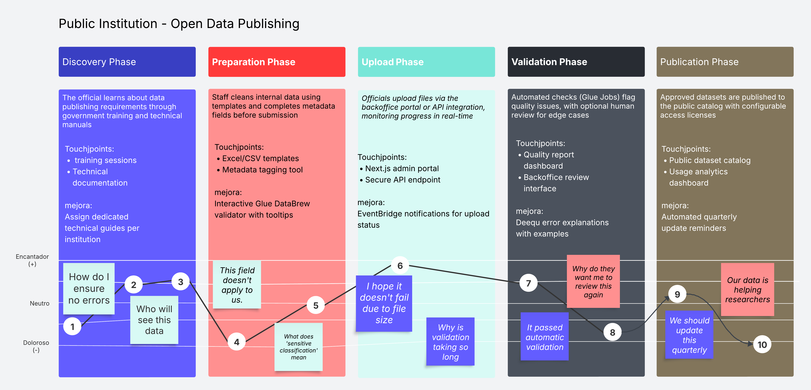


## Collaborative Pattern  
This pattern is based on the idea that a complex problem is solved more efficiently and robustly through the cooperation of multiple specialized agents, rather than a single monolithic agent. Each agent has a specific skill or knowledge, and all collaborate by sharing information in a common space to arrive at a comprehensive solution.  

### Metaphor: "The Antique Furniture Restoration Workshop"  
Imagine our AI system is a prestigious artisanal workshop. Its specialty is taking batches of old, mismatched, and forgotten furniture and transforming them into coherent, optimized, and highly valuable display sets.  

### 1. Input: New Datasets and Metadata  
- **Metaphor:** The Newly Arrived Furniture Batch and the Owner's Notes.  
- **Description:** A truck arrives at the workshop and unloads a set of dusty and disorganized furniture (the datasets). Along with the furniture, the driver hands over a folder with notes (the metadata). Some notes are clear ("Dining table, mahogany"), others are cryptic ("Grandpa's box, has a number underneath", "Chairs from the good set"). This is the raw material and context the workshop must work with.  

### 2. Controller Agent  
- **Metaphor:** The Master Restorer (Workshop Foreman).  
- **Description:** This is the person who receives the batch of furniture and the notes. They don’t sand or varnish themselves but have the complete vision. Their job is to initiate the project, call their specialists, and ensure everyone works in a coordinated manner to achieve the goal: "Team, from this batch, we need to create a functional and aesthetic dining set." They are the ones who will make the final decision on the restoration plan.  

### 3. Shared Memory / Blackboard  
- **Metaphor:** The Central Workshop Blackboard.  
- **Description:** This is the heart of the operation. It’s a large whiteboard mounted on the main wall where the entire project is managed. The Master Restorer writes the project name at the top. As each specialist works, they go to the board and add their findings: sketches, measurements, style analysis, joining proposals. Everyone can see it, read each other’s contributions, and add their own, ensuring the team works with the same information.  

### 4. Semantic Analyst Agent  
- **Metaphor:** The Art and Antiques Historian.  
- **Description:** This specialist doesn’t focus on the wood but on the soul of the furniture. Using the owner’s notes and their own expertise, they examine the styles, engravings, and small details to understand the meaning and origin. They note on the board: "I’ve determined that the 'dining table' and the 'chairs from the good set' are Costa Rican neoclassical style. The 'grandpa’s box' with the number underneath appears to be a piece from the same era and maker, likely a sideboard. I propose grouping these three items conceptually."  

### 5. LLM / AI Service  
- **Metaphor:** The Vast Reference Library of Art History.  
- **Description:** The Art Historian doesn’t know everything by heart. When they encounter an engraving or joint type they don’t recognize (input), they go to their office, which contains an immense library with history books, auction catalogs, and artisan records (the LLM). They consult these books to precisely identify the style and era (output), then return to the board with validated knowledge.  

### 6. Structural Analyst Agent  
- **Metaphor:** The Structural Carpenter.  
- **Description:** This craftsman is purely technical. They ignore the style and focus on the physics of the furniture. They measure each piece, check the integrity of the joints, identify the type of wood, and look for unique identifiers. They note on the board: "Table: 1.80m x 0.90m, oak. Chairs: cedar. The number under the sideboard is 'SN-78-CR,' unique and not repeated in the batch (potential primary key). The chairs have a notch that perfectly matches the table’s edge (potential structural relationship)."  

### 7. Relationship Agent  
- **Metaphor:** The Assembler and Designer.  
- **Description:** This specialist connects the dots. They look at the board and see the Historian’s notes ("these pieces are from the same concept") and the Carpenter’s notes ("these pieces fit physically"). Then, they draw a detailed blueprint on the board and write: "DESIGN PROPOSAL: Merge the table, chairs, and sideboard into a single set called 'Neoclassical Dining Set.' The 'SN-78-CR' field of the sideboard will be the primary key of the set. Rename the 'number' column to 'Furniture_ID' in all pieces for standardization."  

### 8. Code Generator Agent  
- **Metaphor:** The Technical Scribe (Instruction Manual Writer).  
- **Description:** The Master Restorer reviews all proposals on the board and gives final approval. They call the Technical Scribe and say, "The plan is approved. Please draft the final assembly manual, step by step, so the apprentices can execute it without errors." The scribe takes the blueprints and notes and translates them into a clear and precise document.  

### 9. Result Output: Transformation Plan and Execution Script (SQL/DDL)  
- **Metaphor:** The Detailed Final Assembly Manual.  
- **Description:** This is the final product of the design process. It’s a bound manual containing the material list, detailed blueprints, and numbered step-by-step instructions for restoration and assembly (the SQL/DDL script). Any craftsman in the workshop can take this manual and build the dining set exactly as designed by the team of specialists.  

### Functional Explanation:  
1. **Input:** Receives datasets with their metadata.  
2. **Controller Agent:** Starts the work and distributes it among specialized agents.  
3. **Shared Memory:** Shared knowledge where all agents write and read.  
4. **Semantic Analyst Agent:** Groups data based on meaning, type, or role.  
5. **LLM:** Uses LLM models to fill missing knowledge, verify hypotheses, or name entities.  
6. **Structural Analyst Agent:** Checks column sizes, data types, etc.  
7. **Relationship Agent:** Based on the analysts' findings, proposes a logical relational structure: tables, foreign keys, etc.  
8. **Code Generator Agent:** Generates the code representing the approved design.  
9. **Output:** Formal document or executable script ready for another system (or human) to implement.  

### Diagram:  
[Collaborative pattern](https://drive.google.com/file/d/19RyEgnIBL0t_Xn1qkGxolLqWiGIJQ1Sx/view?usp=sharing)

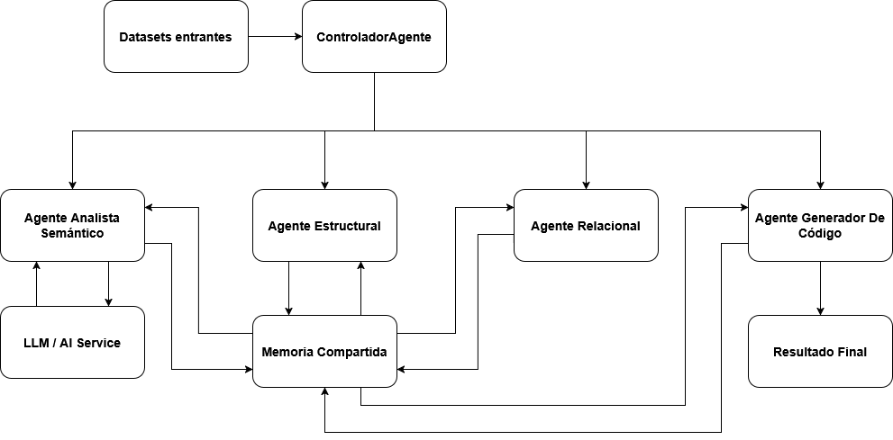

---

## Saga Pattern

### Problem Statement

The system must perform a structural update of the data model in three steps: model transformation, data loading, and model publication. If any step fails, all previous changes must be automatically reverted so that the system remains consistent. The process must log every event for audit and troubleshooting, and notify a data architect if human intervention is required.

### Solution Diagram

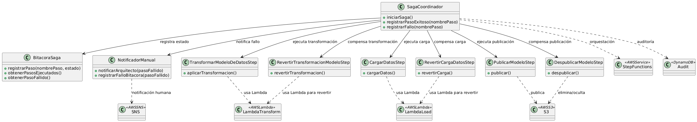

### Technical Solution

The data model update process is executed in three stages:

1. **Transformation** (AWS Lambda)
2. **Data Load** (AWS Lambda)
3. **Publication** (AWS S3)

A **Coordinator** controls the entire flow using **AWS Step Functions**, executing each stage and recording the state of each step in **DynamoDB**.  
If any stage fails, the coordinator triggers specific rollback functions for each completed step:

- **Unpublishing** (S3)
- **Deleting loaded data** (Lambda)
- **Reverting the model transformation** (Lambda)

Every action and its result (success or failure) is logged in DynamoDB.  
If a rollback fails or manual intervention is required, **SNS (Simple Notification Service)** sends an immediate alert to the data architect.

### Components and Responsibilities

- **AWS Step Functions:** Orchestrates and controls the sequence of process steps.
- **AWS Lambda:** Executes the model transformation, data loading, and all rollback operations.
- **AWS S3:** Publishes and unpublishes the data model.
- **DynamoDB:** Stores the state and result of each process step for auditability and recovery.
- **SNS:** Notifies the data architect in case of errors or failed rollback.

### Interactions

1. Step Functions calls Lambda functions to transform the model, load data, and publish to S3.
2. Each step's outcome (success or failure) is logged in DynamoDB.
3. If a failure occurs, Step Functions invokes the rollback Lambdas and unpublishes in S3.
4. If rollback fails or requires manual intervention, SNS alerts the data architect with process context.

---

## Scheduler-Agent-Supervisor Pattern

### Problem Statement

The system must support uploading large datasets (hundreds of MBs to multiple GBs) to a data lake, ensuring each chunk is processed exactly once, with no duplicates or data loss, even under unreliable network conditions. The process must be resumable, fully auditable, and alert responsible staff if errors or manual intervention are needed.

### Solution Diagram

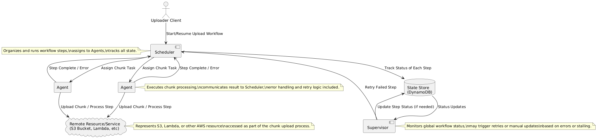

### Technical Solution
The chunked upload process is managed by three primary roles:
- **Scheduler:** Starts and manages upload sessions, splits files into chunks, assigns tasks to agents, and tracks all states in DynamoDB. Handles retries for failed or missing chunks.
- **Agents:** Each agent processes assigned chunk upload tasks, uploads the chunk to S3 or processes it via Lambda, and updates chunk status in DynamoDB. Each agent must ensure idempotent processing (no duplicate chunk writes).
- **Supervisor:** Monitors the global status of the upload workflow by inspecting DynamoDB. If a chunk fails repeatedly or the process stalls, the supervisor may request a retry from the scheduler or update state after manual intervention.
All interactions with storage (S3), state (DynamoDB), and notifications (SNS) are explicit and auditable. The workflow is scalable, resilient to network issues, and provides real-time monitoring and manual override if required.

### Components and Responsibilities

- **Scheduler (AWS Lambda/Step Functions):** Orchestrates and assigns chunk upload tasks, manages overall session and state in DynamoDB.
- **Agents (AWS Lambda):** Independently process chunk tasks, upload chunks to S3, update status in DynamoDB, and report results.
- **Supervisor (AWS Lambda/EC2):** Monitors session status, triggers retries, updates state after review, and may notify staff.
- **State Store (DynamoDB):** Tracks the status of each chunk and session for audit and recovery.
- **Remote Resource/Service (S3, Lambda, etc.):** Receives and stores each chunk or executes business logic as needed.
- **SNS (Simple Notification Service):** Notifies staff of errors, failed uploads, or manual intervention needs.
  
### Interactions

1. Scheduler starts upload, splits file into chunks, assigns tasks to agents, and records all state in DynamoDB.
2. Agents process and upload each chunk to S3 (or via Lambda), updating chunk status in DynamoDB, reporting completion or error to Scheduler.
3. Supervisor monitors progress via DynamoDB. If a chunk fails or process stalls, Supervisor may instruct Scheduler to retry the step.
4. All events are logged for auditability and recovery.
5. If unrecoverable errors occur, SNS alerts responsible staff with session context for manual intervention.
---

## Arquitectura de clases, patrones y dependencias

### Layer: Frontend

#### Overview and Key Architectural Patterns

The Frontend layer constitutes the user interface for all interactions with the Data Pura Vida ecosystem, both for end users (citizens, companies, researchers) and for system administrators via the Backoffice portal. Its design focuses on providing an intuitive, accessible, responsive, and secure user experience (UX), facilitating information presentation, data capture, and seamless communication with the Backend layer.

##### Main Technologies
- **Main Portal:** React.js integrated with AWS Amplify for connecting with backend services (authentication, storage, APIs).
- **Backoffice Portal:** Next.js (a framework built on React) to leverage server-side rendering (SSR) and static site generation (SSG) where beneficial, also integrated with AWS Amplify and deployed using AWS AppRunner.
- **Styles:** Tailwind CSS for utility-first development, ensuring a modern, customizable, and responsive design.
- **Dashboards (embedding):** Amazon QuickSight Embedded for data visualization.

##### Key Architectural Patterns

- **Component-Based Architecture (React):** The system will be built on well-defined, reusable, cohesive, and testable React components, styled with Tailwind CSS, ensuring visual consistency and development efficiency. Accessibility (WCAG) will be prioritized.
- **Single Page Application (SPA) / Next.js Hybrid:** The main portal will operate as a SPA. The Backoffice with Next.js will use a hybrid rendering approach (SSR/SSG/CSR) to optimize performance and experience.
- **Strategic State Management:**
    - Local component state: Native React hooks (useState, useReducer).
    - Server data handling and complex global state: React Query (TanStack Query) will be used for server data fetching, caching, synchronization, and updating. Zustand will be used for managing shared UI global state between unrelated components due to its simplicity and efficiency.
- **API-Driven:** All communication with business logic and data will be routed through a well-defined API service layer in the frontend, interacting with AWS AppSync (GraphQL) and/or Amazon API Gateway (REST).
- **Responsive Design:** Responsive design principles will be applied via Tailwind CSS for optimal experience across different devices.
- **Progressive Web App (PWA):** Future Consideration: PWA features such as service workers and push notifications (potentially with Amazon SES) may be incorporated to enhance the user experience.
  
---

#### Main React Classes/Modules/Components and Their Responsibilities

##### 1. General Structure and Layout Components:

**`App` (React/Next.js Root Component)**  
- **Responsibility:**  Entry point of the application. Sets up routing (React Router or Next.js router), global context providers (React Query Client, Zustand store, Tailwind theme, AuthService). Initializes singleton frontend services like APIServiceClient.
  
**`MainLayout / BackofficeLayout` (React/Next.js Components)**  
- **Responsibility:**  Define the main visual structure (header, footer, navigation, content area) for the user portal and Backoffice, respectively. Implement responsive base and may contain logic to show/hide elements based on user roles.
  
**`AuthGuard` (Higher-Order Component or Custom React Hook)**  
- **Responsibility:**  Protects routes requiring authentication and/or specific roles, using AuthService to verify state and redirect if necessary.
  
**`ErrorBoundary` (React Component)**  
- **Responsibility:**   Captures JavaScript errors in child components, logs them, and shows a fallback UI. Multiple instances will be implemented for granularity.

##### 2. UI Kit / Common Components (React and Tailwind CSS):

- **Responsibility:**  Internal collection of base UI components, reusable, accessible (WCAG), and consistently styled, forming the visual design system. Use of Headless UI with Tailwind CSS is considered.
- **Examples:** Button, InputField (with validation), SelectField, CheckboxField, ModalDialog, DataTable, CardDisplay, Spinner, AlertMessage, Notificatio nToast.

##### 3. Functional Modules (Container Views and Specific Presentation Components):

**`Entity Registration Module`**  
- **RegistroView:**  Orchestrates the registration flow.
- **TipoEntidadSelector:**  Allows selecting the type of entity.
- **FormularioDinamicoRegistro:**  Renders forms based on JSON schemas (from backend) and entity type. Validates inputs with Yup.
- **UploaderDocumentosRegistro:**  Manages file uploads to S3 via Amplify Storage, with previews and client-side validations.

**`User Dataset Management Module`**  
- **GestionDatasetsView:**  Lists and allows dataset creation/management.
- **FormularioCargaDataset:**  UI for dataset uploads (file, API, DB).
- **AsistenteMetadatosDataset:**  UI to define metadata.
- **ConfiguradorAccesoPrecioDataset:**  UI to define visibility, price, and access.

**`Dataset Catalog`**  
- **CatalogoView:**  Contains FiltrosDataset and ListaResultadosDataset.
- **FichaDetalladaDatasetView:**  Allows selecting the type of entity.Shows complete dataset details.

**`Dataset Purchase Module`**  
- **CheckoutView:**  Orchestrates the payment process.
- **SelectorMetodoPago:**  Integrates with Stripe Elements and facilitates SINPE interaction.

**`Dashboard and Data Exploration`**  
- **DashboardView:**  Container for QuickSightEmbeddedView.
- **QuickSightEmbeddedView:**  Embeds and manages the Amazon QuickSight session (using the Embedded SDK).
- **PanelControlDashboard:**  Controls to save, share, and interact with QuickSight Q.
- **MonitorConsumoDatos:**  Displays paid data usage.

**`Backoffice Portal (Next.js Pages)`**  
- UserManagementPage, KeyAdministrationPage, SystemMonitoringPage, etc., each with dedicated components.

##### 4. Frontend Services (Non-Visual Logic and Communication):

**`APIServiceClient` (and specializations)**  
- **Responsibility:**  Facade for communicating with backend APIs (AppSync GraphQL/API Gateway REST). Includes interceptors to attach JWT tokens, handle common errors, and centralize API base URL.
  
**`AuthService` (Wrapper for AWS Amplify Auth)**  
- **Responsibility:**  Manages authentication lifecycle (login, signup, logout, tokens) with AWS Cognito. Updates global state (StateService) on changes.

**`StateService` (Implemented with React Query and Zustand)**  
- **Responsibility:**  React Query handles server state (fetching, caching, etc.). Zustand handles global UI state (user profile, roles, preferences, global loading state) through specific stores (e.g., authStore, registroStore).

**`ConfigService`**  
- **Responsibility:** Loads and provides frontend configurations from environment variables or a configuration endpoint.

**`FormValidationService` (Using Yup)**  
- **Responsibility:** Centralizes client-side form validation logic through reusable Yup schemas.

**`NotificationUIManager` (Función Lambda)**  
- **Responsibility:** Manages display of notifications/toasts (NotificationToast) in the UI.

---

#### Relevant Design Patterns

##### Structural Patterns

- **Facade:** APIServiceClient simplifies backend calls. AuthService simplifies interaction with Amplify/Cognito. QuickSightEmbeddedView acts as a facade for the QuickSight SDK.
- **Adapter:** Wrapper components for third-party UI libraries or to adapt the QuickSight Embedded SDK into a cohesive React component.
- **Composite:** Complex views are built by nesting React components, forming a tree structure.
    
##### Behavioral Patterns

- **Observer (via State Management – Zustand and React Query):**  Components subscribe to Zustand store changes or React Query results. When data changes, components update.
- **State:** React components manage their local state. StateService (Zustand) manages global states affecting UI behavior.
- **Strategy:** FormularioDinamicoRegistro may use strategies to render and validate different field types based on the form schema.
- **Command:** User interactions that trigger data mutations (e.g., form submission) are handled by React Query, encapsulating execution logic, state, and retries.
  
---

#### Key Dependencies

##### Internal:
- Between React components (nesting, composition).
- Views/Pages depend on common components and frontend services (APIServiceClient, AuthService, StateService).
- State management libraries (Zustand, React Query) and routing (React Router or Next.js router).

##### External
- **Backend Layer (APIs - AWS AppSync/API Gateway):**  Critical dependency for all business operations and data access. Well-defined API contracts (GraphQL/OpenAPI) are required.
- **AWS Amplify:** Auth (for Cognito), Storage (for S3), API (for AppSync/API Gateway).
- **Amazon QuickSight:** Through the QuickSight Embedded SDK.
- **Stripe Elements:**  For payment UI.
- **Protocols:**  HTTPS, GraphQL, REST, WSS (for AppSync subscriptions).
- **NPM Libraries:**  React, Next.js, Tailwind CSS, Zustand, React Query (TanStack Query), Yup, Axios (or similar HTTP client if used outside of Amplify API), AWS SDKs.
    

### Layer: Backend (Including Middlewares, Handlers, and Business Logic)

#### Overview and Key Architectural Patterns

The Backend Layer is the operational and logical core of Data Pura Vida. It is responsible for executing all business logic, processing data, interacting with the Data Layer (persistence), managing communication with Third-Party Services, enforcing detailed business rules and security policies, and exposing robust, secure, and efficient APIs. These APIs are primarily consumed by the Frontend Layer and, potentially, by other authorized systems or services.

The design is based on a serverless architecture, using AWS Lambda as the main compute platform. APIs are exposed via AWS AppSync (GraphQL) and/or Amazon API Gateway (RESTful). The orchestration of complex workflows is handled by AWS Step Functions, and asynchronous event-driven communication is implemented using Amazon EventBridge, Amazon SNS, and Amazon SQS.

##### Main Technologies
- **Serverless Compute:** AWS Lambda
- **API Exposure:** AWS AppSync (GraphQL), Amazon API Gateway (REST)
- **Workflow Orchestration:** AWS Step Functions
- **Messaging and Events:** Amazon EventBridge, Amazon SNS, Amazon SQS
- **Integration with AWS Services:** AI (SageMaker, Textract, Rekognition), Data (DynamoDB, S3, Glue, Athena, Lake Formation, Neptune), Security (Cognito, KMS, IAM, WAF), etc.

##### Key Architectural Patterns

- **Serverless Architecture:** Business logic resides in AWS Lambda functions, promoting scalability and reducing operational overhead.
- **Microservices-Oriented:** Specialized Lambda functions support a modular design with high cohesion and low coupling, facilitating independent development, deployment, and scaling.
- **API-Driven:**  Communication is based on well-defined API interfaces (GraphQL and REST).
- **Event-Driven Architecture (EDA):** Used for asynchronous communication, service decoupling, and response to business or system events (via EventBridge, SNS, SQS).
- **Hexagonal Architecture (Ports and Adapters - Conceptual):** Within complex Lambdas, domain logic is isolated from external dependencies via clear interfaces (ports) and adapters, enhancing testability and flexibility.

---

#### Main React Classes/Modules/Components and Their Responsibilities

The following modules represent specialized Lambda functions, AppSync resolvers, API Gateway configurations, and Step Functions workflows that comprise the logic of the Backend layer, grouped by the main functionalities of Data Pura Vida they serve.

##### 1. API Interface Sub-layer (Backend Entry Point):

**`AppSyncGraphQLService` (AWS AppSync)**  
- **Responsibility:**  Exposes the main GraphQL API for the frontend. Defines the GraphQL schema. Integrated with AWS Cognito for authentication/authorization and invokes Lambda functions as resolvers.
  
**`APIGatewayRESTService` (Amazon API Gateway)**  
- **Responsibility:**  Exposes RESTful endpoints for specific functionalities or third-party integrations. Integrated with AWS WAF, AWS Cognito, or Lambda Authorizers, and invokes Lambda functions.

##### 2. Business Logic and Orchestration by Main Functionality:

**`Entity Registration Module`**  
- **RegistroRequestHandlerLambda:**  Orchestrates the backend registration flow, validates, interacts with GestorFormulariosServiceLambda, invokes document validation and persistence.
- **GestorFormulariosServiceLambda:**  Provides structure and rules for dynamic forms (from JSON Schema in AppSync or DynamoDB).
- **ServicioValidacionDatosEntradaLambda:**  Performs advanced business validations.
- **ServicioPersistenciaRegistroLambda:**  Saves registration information and status in Amazon DynamoDB.
- **OrquestadorFlujoRegistroStepFunctions:**  (Optional) Manages asynchronous registration flow, including AI validation and manual review.

**`Document Validation with AI Module`**  
- **OrquestadorValidacionDocumentoStepFunctions:**  Orchestrates the document validation pipeline.
- **ServicioExtraccionDatosTextractLambda:**  Uses Amazon Textract for OCR and data extraction.
- **ServicioClasificacionDocumentoComprehendSageMakerLambda:**  Uses SageMaker to classify document types.
- **ServicioVerificacionContenidoSageMakerLambda:**  Applies business rules and SageMaker models to verify information, format, and detect inconsistencies.
- **ServicioValidacionFirmasDigitalesKMSLambda:**  Verifies digital signatures using AWS KMS and/or AWS Signer.
- **ServicioConsultaFuentesExternasLambda:**  Connects to external APIs (via API Gateway) for validations.
- **RegistroEstadoValidacionDynamoDBModule:**  Stores and updates validation process status in Amazon DynamoDB.

**`Central Security Component` (Backend Implementation)**  
- **CognitoTriggerLambda:**  Lambda functions as AWS Cognito triggers to customize authentication flows.
- **RekognitionBiometricServiceLambda:**  Encapsulates logic for biometric verification and liveness detection using Amazon Rekognition.
- **KeyManagementCoordinatorLambda:**  Orchestrates key management operations for tripartite custody (with AWS KMS, external HSM, AWS Secrets Manager).
- **WAFRuleManagerLambda:**  (Optional) Dynamically updates AWS WAF rules.
- **SecurityAuditProcessingLambda:**  Processes AWS CloudTrail logs findings for alerts/security records.

**`User Dataset Management Module`**  
- **DatasetUploadHandlerLambda:**  Handles file uploads to S3 or configuration of external connections (credentials in AWS Secrets Manager).
- **MetadataExtractionServiceLambda:**  Uses AWS Glue DataBrew or Amazon SageMaker to suggest metadata.
- **DatasetConfigurationServiceLambda:**  Stores dataset configuration in Amazon DynamoDB.
- **DatasetLifecycleManagerLambda:**  Manages temporary availability and recurring/delta uploads using Amazon EventBridge and Amazon SNS/API Gateway for callbacks.
- **ETDLOrchestratorTriggerLambda:**  Triggers the ETDL pipeline in the Data Lake.
- **DatasetAccessPolicyManagerLambda:**  Translates access settings into AWS Lake Formation/IAM policies.

**`Core Data Lake and Backend Data Processing`**  
- **GlueETDLJobs (PySpark/Scala in AWS Glue):**  Main ETDL logic.
- **SageMakerProcessingPipelines:**  ML tasks integrated into ETDL (duplicate detection with SageMaker or Amazon Entity Resolution, modeling).
- **DataLakeOrchestrationStepFunctions:**  Orchestrates Glue Jobs, SageMaker Jobs, and Lambdas in ETDL pipelines.
- **DeltaLoadProcessorLambda:**  Processes delta loads (identified via Glue).
- **LakeFormationAdminServiceLambda:**  Programmatic administration of permissions in AWS Lake Formation.

**`Dataset Catalog`**  
- **DatasetSearchServiceLambda:**  Processes search/filters (querying AWS Glue Data Catalog via Amazon Athena and Amazon DynamoDB), applying AWS Lake Formation visibility.
- **DatasetDetailServiceLambda:**  Retrieves combined details from Glue Data Catalog, DynamoDB, and S3.

**`Dataset Purchase Module`**  
- **ProcesadorPagoAPILambda:**  Initiates purchase.
- **ServicioPasarelaPagoLambda:**  Encapsulates logic for Stripe Connect, SINPE API, and PayPal, using AWS KMS for encryption.
- **StripeWebhookHandlerLambda:**  Validates and processes Stripe webhooks.
- **GestorPermisosDatasetLambda:**  Assigns permissions in AWS Lake Formation or AWS IAM Identity Center after payment.
- **RegistroTransaccionCompraDynamoDBLambda:**  Logs transactions in Amazon DynamoDB.
- **DatasetPrivadoApprovalStepFunctions:**  (Optional) Orchestrates approvals for private datasets post-purchase.

**`Dashboard and Data Exploration`(Backend Support)**  
- **QuickSightEmbeddingServiceLambda:**  Generates secure URLs for embedding Amazon QuickSight, applying AWS Lake Formation permissions.
- **ConsumoDatosTrackerServiceLambda:**  Tracks data usage (Amazon CloudWatch, Amazon DynamoDB).
- **LimiteConsumoManagerLambda:**  Manages limit breaches (AWS WAF, AWS Lake Formation).
- **HistorialConsumoQueryServiceLambda:**  Provides usage history (AWS CloudTrail, Amazon OpenSearch).
- **ModeloAIDataProvisioningServiceLambda:**  Orchestrates controlled delivery of data to Amazon SageMaker models.

**`Backoffice Portal`(Backend Administration Logic)**  
- **AdminUserManagementServiceLambda:**  Manages users/entities and roles (DynamoDB/RDS, AWS IAM Identity Center).
- **KeyAdministrationServiceLambda:**  Orchestrates key and custodian management (AWS KMS, AWS Step Functions).
- **DataIntegrationRuleEngineLambda:**  Manages data load rules (DynamoDB, AWS Glue, AWS Glue DataBrew).
- **SystemMonitoringServiceLambda:**  Exposes CloudWatch metrics.
- **AuditLogAccessServiceLambda:**  Queries CloudTrail/OpenSearch logs.
- **ReportingGenerationServiceLambda:**  Generates reports using QuickSight.
- **LegalComplianceServiceLambda:**  Extracts evidence with Amazon CloudTrail, queries AWS Artifact.
- **ObjectVisibilityControlServiceLambda:**  Manages permissions with Lake Formation.

**`Cross-cutting Notification Service`**  
- **NotificationDispatcherLambda:**  Entry point, orchestrates sending.
- **TemplateManagerModule (Lambda):**  Manages email templates from Amazon S3.
- **EmailSenderServiceSESModule (Lambda):**  Uses Amazon SES to send emails.
- **NotificationLoggerModule (Lambda):**  Logs sends (DynamoDB or CloudWatch Logs).

---

#### Relevant Design Patterns

##### Creational Patterns

- **Factory Method:** For instantiating specific processors or clients within Lambdas (e.g., different document validators, different payment gateway clients).
- **Builder:** For constructing complex configuration objects or service requests with multiple parameters.

##### Structural Patterns

- **Facade:** Multiple service Lambdas act as facades to simplify interaction with underlying AWS services or complex flows. API Gateway/AppSync are the main backend facades.
- **Adapter:** For interacting with third-party APIs (Stripe, SINPE, external validation APIs).
- **Proxy:** API Gateway and AppSync act as proxies for Lambda functions.
- **Decorator (via Lambda Layers or Middlewares):** To add cross-cutting concerns (logging, metrics) to Lambdas.
    
##### Behavioral Patterns

- **Chain of Responsibility:**  For validation or authorization flows in API Gateway/AppSync or within Lambdas.
- **Strategy:** To select algorithms or processors at runtime (e.g., different data cleaning strategies).
- **State (AWS Step Functions):** Core for orchestrating stateful workflows (registration, document validation, ETDL).
- **Command:** API requests and messages in queues (SQS)/topics (SNS) are treated as commands.
- **Observer/Event-Driven (Amazon EventBridge, SNS, S3 Events, DynamoDB Streams):**  Central pattern for asynchronous communication and decoupling.
- **Template Method:** Lambda functions or Glue scripts define skeletons for processes, allowing step customization.
- **Saga (AWS Step Functions):** To manage consistency in distributed transactions.
  
---

#### Key Dependencies

##### Internal:
- Interdependence between Lambdas (synchronous or asynchronous).
- AppSync resolvers/API Gateway handlers depend on business logic Lambdas.
- Step Functions orchestrate Lambdas and AWS services.
- Dependency on configuration and policies from the Central Security Component.

##### External
- **Frontend Layer:**  Main consumer of APIs (AppSync/API Gateway).
- **Data Layer:** Critical dependency for persistence, metadata querying, and storage (S3, DynamoDB, RDS, Glue Data Catalog, Lake Formation, Neptune).
- **Cloud Layer:** All mentioned AWS services are the infrastructure foundation for backend operations.
- **Third-Party Layer:**  For payment gateways and external verification APIs.
- **Protocols:**  HTTPS, GraphQL, REST, JSON, event formats.

### Layer: Data (Storage and Persistence)

#### Overview and Key Architectural Patterns

The Data Layer is responsible for the physical persistence, secure and organized storage, cataloging, and governance of all information assets within the Data Pura Vida ecosystem. This spans from raw ingested data, to processed and transformed data in the Data Lake, to technical and business metadata, system configuration data, audit logs, and transactional data generated by platform operations. The storage strategy is based on the selective use of AWS services, optimized for different data types, access patterns, and performance requirements, with a strong emphasis on security, scalability, efficiency, and centralized governance.

##### Main Technologies
- **Data Lake Storage:** Amazon S3, Glue (Apache Iceberg) as a table format over S3
- **Metadata Catalog:** AWS Glue Data Catalog
- **NoSQL Databases:** Amazon DynamoDB
- **Relational Databases:** Amazon RDS (PostgreSQL or MySQL)
- **Graph Database:** Amazon Neptune (for relationships between datasets)
- **Data Governance:** AWS Lake Formation
- **Data Security (Encryption):** AWS KMS (Key Management Service)
- **Secret Management (DB Credentials):** AWS Secrets Manager

##### Key Architectural Patterns

- **Data Lake Architecture:** Amazon S3 is used as the central repository for storing large volumes of data in various formats (raw, processed, curated). Glue (Apache Iceberg) is implemented over S3 to provide transactional table features (ACID), data and schema versioning, and efficient delta management.
- **Polyglot Persistence:** Multiple database technologies are used, each optimized for different data types and access patterns (DynamoDB for transactional NoSQL, RDS for relational data, Neptune for graphs, S3/Iceberg for the data lake).
- **Metadata-Driven Data Management:**  Heavy reliance on the AWS Glue Data Catalog to register, discover, and manage technical metadata of datasets stored in the Data Lake and other cataloged sources. Business and enriched metadata are additionally managed in DynamoDB or S3.
- **Security by Design:** All data storage is encrypted at rest using AWS KMS. Fine-grained access control is managed through AWS IAM and AWS Lake Formation.

---

#### Main React Classes/Modules/Components and Their Responsibilities

In this layer, "modules" mainly refer to the definition and structure of data storages, their schemas, and the AWS services managing them.

##### 1. Data Lake Storage (Amazon S3 + Glue (Apache Iceberg)):

**`S3BucketsDataLake` (Amazon S3 Configuration)**  
- **Responsibility:**  Define the S3 bucket structure for the different zones of the Data Lake: Raw/Ingest Zone, Processed/Intermediate Zone, Curated/Modeled Zone.
- **Configuration:**  Bucket policies, encryption (SSE-S3 or SSE-KMS), access logging, object versioning, lifecycle policies.
  
**`IcebergTables` (Glue with Apache Iceberg Definitions over S3)**  
- **Responsibility:**  Define tables over S3 data using the Apache Iceberg format. Includes table schema, partitioning strategies, and Iceberg metadata management for versioning, schema evolution, and ACID transactions.

##### 2. Metadata Catalog (AWS Glue Data Catalog):

**`GlueCatalogDatabase` (Configuration in AWS Glue Data Catalog)**  
- **Responsibility:**  Logical container for metadata tables describing datasets in the Data Lake.

**`GlueTables` (Definitions in AWS Glue Data Catalog)**  
- **Responsibility:**  Store technical metadata for each dataset (schema, data types, S3 location, format, partitions, statistics). Populated by Glue crawlers or dataset registration processes. It is the source for Glue ETDL, SageMaker, and Lake Formation.

##### 3. Operational and Application Databases (Amazon DynamoDB, Amazon RDS):

**`PendingRecordsTable` (Amazon DynamoDB)**  
- **Responsibility:**  Store entity information during the registration process before final approval (status, form data).

**`DocumentValidationTable` (Amazon DynamoDB)**  
- **Responsibility:**  Store status and results of document validation (document ID, AI status, Textract results, manual review comments).

**`DatasetConfigurationTable` (Amazon DynamoDB)**  
- **Responsibility:**  Store user-defined configuration for each shared dataset (name, description, type, pricing model, access rules, etc.).

**`EnrichedMetadataCatalogTable` (Amazon DynamoDB)**  
- **Responsibility:**  Store descriptive, business, quality, and usage policy metadata for datasets, complementing the Glue Data Catalog. Used by the "Dataset Catalog".

**`PurchaseTransactionsTable` (Amazon DynamoDB)**  
- **Responsibility:**  Log all dataset purchase transactions.

**`AccessSubscriptionsTable` (Amazon DynamoDB or Amazon RDS)**  
- **Responsibility:**  Track user access to datasets (duration, consumption limits).

**`BackofficeRelationalDatabase`(Amazon RDS - PostgreSQL/MySQL)**  
- **Responsibility:**  Store structured and relational data for Backoffice operations that do not fit well in DynamoDB.

**`MetadataAuditVersioningTable`(Amazon DynamoDB with Streams enabled)**  
- **Responsibility:**  Capture element-level changes in critical DynamoDB tables (e.g., metadata, configurations) for auditing or state reconstruction.

##### 4. Graph Database (Amazon Neptune):

**`DatasetRelationshipGraph`(Amazon Neptune)**  
- **Responsibility:**  Store and query complex relationships between datasets, columns, owning entities, and business concepts. Used for the functionality to “automatically relate to existing datasets.”

##### 5. Secrets Storage (AWS Secrets Manager):

**`SecretsManager`(Configuration in AWS Secrets Manager)**  
- **Responsibility:**  Securely store database credentials, API keys for third-party services, and other secrets. Integrated with IAM for access control.

---

#### Relevant Design Patterns

- **Polyglot Persistence (Architectural):** Use of multiple data storage technologies optimized for their purpose.
- **Data Lake (Architectural):** Use of S3 as a central storage, enhanced with table formats like Glue (Apache Iceberg).
- **Metadata Catalog (Architectural):** Centralized data definition using AWS Glue Data Catalog.
- **Repository/DAO (Implemented in Backend Layer):** The Backend Layer will use this pattern to abstract access logic to the different data sources defined in this Data Layer.
- **Data Mapper (Implemented in Backend Layer):** To map business logic objects to database structures.
- **CQRS (Command Query Responsibility Segregation – Advanced Consideration):** If some use cases require very different optimizations for reads and writes, data models may be separated, though this adds complexity. (Not explicitly in the stack, but an advanced data pattern).
  
---

#### Key Dependencies

##### Internal:
- Iceberg Tables depend on the configuration of S3 Buckets.
- Glue Tables in the Data Catalog describe data in S3/Iceberg and other sources.
- AWS Lake Formation uses the Glue Data Catalog to apply permissions.

##### External
- **Backend Layer:**  Main producer and consumer of this layer. All Lambda functions and backend services needing to persist or query data interact with this layer’s services (S3, DynamoDB, RDS, Neptune, Glue Catalog, Lake Formation) via their SDKs.
- **Core Data Lake and Backend Processing (Subset of Backend):** AWS Glue and Amazon SageMaker jobs read from and write to S3/Iceberg, and update/query the Glue Data Catalog.
- **Central Security Component:**
    - AWS KMS is essential for encryption at rest across all storage.
    - AWS IAM and AWS Lake Formation (configured and managed by the Security Component) control access to this layer’s resources.
    - AWS Secrets Manager is used by the backend layer to obtain credentials for accessing databases in this layer.
- **Backoffice Portal:**  May have management or direct/indirect query access (through backend APIs) to some storages for auditing, configuration, or visualization.
- **Protocols:**  The Data Layer is accessed through the specific protocols of each storage service (S3 API, DynamoDB API, SQL over TCP/IP for RDS, SPARQL/Gremlin for Neptune).


### Layer: Third-Party Services (Integrations with External Services)

#### Overview and Key Architectural Patterns

The "Third-Party" layer encompasses the software components and configurations dedicated to securely, robustly, and decoupledly interacting with external services essential for the functionalities of Data Pura Vida. These integrations include payment gateways, identity or data verification APIs, and potentially other specialized services such as advanced secret management systems or external Hardware Security Modules (HSMs). The design of this layer prioritizes secure communication (encryption, authentication), comprehensive error and timeout handling, isolation to minimize the impact of third-party unavailability, and continuous monitoring of integration health.

##### Identified Key Third-Party Services

- **Payment Gateways:**
    - Stripe Connect (for credit/debit cards)
    - Costa Rica’s SINPE API (for IBAN transfers or national payments)
    - PayPal (optional, via PayPal REST API)
- **External Verification APIs:** Government or identity verification APIs (not specified, to be accessed via API Gateway + Lambda).
- **External HSM (for Tripartite Custody):** As part of the tripartite custody system, a key may reside in an external HSM.

##### Key Architectural Patterns

- **Anti-Corruption Layer (ACL):** An abstraction layer (via adapters) will be implemented between the Data Pura Vida domain model and the APIs/models of external services. This isolates the system from changes or quirks in external APIs.
- **Circuit Breaker:** For critical and synchronous integrations, this pattern will be applied to prevent third-party service failures from causing cascading failures. It allows for fast failure or fallback routing if the external service fails or is unresponsive.
- **API Gateway as Proxy/Facade to Third-Parties (Selective):**  Amazon API Gateway can be used as a secure and managed proxy to certain third-party APIs, centralizing access control, caching (if applicable), and monitoring for specific interactions.
- **Asynchronous Communication:** For non-real-time or long-duration interactions with third-party services, asynchronous communication will be preferred (e.g., enqueueing the request in Amazon SQS to be processed by a Lambda) to improve system resilience and performance.

---

#### Main React Classes/Modules/Components and Their Responsibilities

These modules represent the software components (mainly AWS Lambda functions) that encapsulate the interaction logic with each third-party service, acting as adapters.

##### 1. Payment Gateway Integration Module (Primarily used by the "Dataset Purchase Module" in the Backend Layer):

**`StripePaymentAdapter` (Lambda Function or Lambda Module)**  
- **Responsibility:**  Encapsulates all logic for interacting with the Stripe Connect API. Handles creation of payment intents, card payment processing, subscription management (if applicable), and secure processing of Stripe webhooks for status updates.
- **Technologies:**  AWS Lambda, Stripe official SDK.
  
**`SinpePaymentAdapter` (Lambda Function or Lambda Module)**  
- **Responsibility:**  Encapsulates logic for interacting with the Costa Rica SINPE API or corresponding banking APIs for processing transfers or national payments.
- **Technologies:**  AWS Lambda, secure HTTP libraries to interact with SINPE.

**`PayPalPaymentAdapter` (Lambda Function or Lambda Module – if implemented)**  
- **Responsibility:**  Encapsulates logic for interacting with the PayPal REST API for payment processing.
- **Technologies:**  AWS Lambda, PayPal official SDK or HTTP libraries.

**`PaymentGatewayFacade` (Module in the Backend Layer)**  
- **Responsibility:**  hough residing in the Backend, it coordinates usage of payment adapters. Provides a unified interface to the "Dataset Purchase Module" for interacting with different gateways, selecting the appropriate one.

##### 2. External Verification API Integration Module (Primarily used by the "AI-Powered Document Validation Module" in the Backend Layer):

**`ExternalVerificationAPIAdapterManager` (Lambda Function or set of Lambdas)**  
- **Responsibility:**  Encapsulates communication logic with various external APIs for data validation (e.g., identity verification, business registration check, tax number validity). Designed to be extensible to support multiple verification APIs.
- **Technologies:**  AWS Lambda, Amazon API Gateway (can act as outgoing proxy or to expose these adapters internally). Credentials are managed via AWS Secrets Manager.

##### 3. External HSM Interaction Module (for Tripartite Custody)(Primarily used by the "Central Security Component" in the Backend Layer):

**`ExternalHSMCommunicationService` (Lambda Function or specialized library)**  
- **Responsibility:**  Manages secure communication with SecretsManager (if used for one key in tripartite custody). This involves specific HSM protocols and authentication mechanisms.
- **Technologies:**  AWS Lambda (with VPC connectivity), vendor-provided client libraries.

**`HashiCorpVaultClientAdapter` (Lambda Function or client library)**  
- **Responsibility:**  Encapsulates interaction with a SecretsManager Vault instance for advanced secret management, if this technology is selected.
- **Technologies:**  AWS Lambda, HTTP client for Vault or Vault SDK.
  
---

#### Relevant Design Patterns

##### Creational Patterns

- **Factory Method:** `PaymentGatewayFacade` (in the backend layer) could use this pattern to create the correct payment adapter instance (StripePaymentAdapter, SinpePaymentAdapter) depending on configuration or selected payment method.

##### Structural Patterns

- **Adapter:** The foundational pattern of this layer. Each `XyzAdapter` converts a specific third-party API interface into a standardized interface usable by the Data Pura Vida system.
- **Facade:** Modules like `PaymentGatewayFacade` (in the backend using these adapters) simplify interaction with the payment subsystem. An `ExternalSystemInteractionFacade` could group multiple verification adapters.
- **Proxy:** Amazon API Gateway can act as a proxy for outgoing calls to certain third-party APIs, adding a management layer (logging, caching, basic transformation).

##### Behavioral Patterns

- **Strategy:** If multiple providers offer similar services (e.g., different APIs for the same type of data verification), the Strategy pattern can be used to dynamically select the provider or adapter implementation.
- **Circuit Breaker:** Implemented within the logic of the adapters or in the Lambda functions that use them, to protect Data Pura Vida from third-party unavailability or high latency.
- **Retry (with Exponential Backoff and Jitter):** An essential mechanism in adapters to retry calls to third-party services that may experience transient failures.
- **Command:**  Requests to third-party services—especially asynchronous or requiring compensation—could be encapsulated as Command objects.
- **Anti-Corruption Layer (ACL) (Architectural Principle):** The adapters are the primary manifestation of this principle, creating a barrier that isolates the Data Pura Vida core system from the specifics and models of external systems.
  
---

#### Key Dependencies

##### Internal (within the Third-Party Layer):
- Specific adapters are generally independent from each other but should follow a consistent design.

##### External
- **Backend Layer:**  The main consumer of the services offered by this layer (via adapters).
    - The "Dataset Purchase Module" depends on the payment gateway adapters.
    - The "AI-Powered Document Validation Module" depends on external verification adapters.
    - The "Central Security Component" depends on adapters for External HSM
- **Third-Party Services (actual APIs and systems):** Stripe API, SINPE API, PayPal API, specific verification APIs, HSM.
- **Cloud Layer (AWS Services):**
    - AWS Lambda: Where the adapter logic resides.
    - Amazon API Gateway: May be used as an outgoing proxy or to internally expose adapters.
    - AWS Secrets Manager: Essential for securely storing access credentials to third-party services.
    - Amazon SQS/SNS/EventBridge: For managing asynchronous interactions with third-party services.
    - Amazon CloudWatch: For monitoring the health, performance, and errors of integrations.
    - AWS KMS: To encrypt sensitive data in transit to/from third parties or temporary credentials.
- **Protocols:**  HTTPS (mandatory for all external communications), REST, SOAP (if any third-party requires it), third-party specific data formats (JSON, XML).


### Layer: Cloud (Infrastructure and Cloud Services as a Platform)

#### Overview and Key Architectural Patterns

The Cloud Layer encompasses the underlying infrastructure and platform services provided by Amazon Web Services (AWS), upon which the Data Pura Vida ecosystem is built and operated. This layer’s design focuses on the selection, configuration, and orchestration of these services to meet the system’s scalability, high availability, security, performance, and cost optimization requirements. Extensive use of managed AWS services is prioritized to minimize operational burden, maximize agility, and leverage best practices inherent to cloud environments.

##### Primary Cloud Provider: Amazon Web Services (AWS)

##### Key Architectural Patterns

- **Infrastructure as Code (IaC):** All cloud infrastructure (VPCs, subnets, load balancers, IAM roles, service configurations, etc.) will be defined and managed as code using tools like AWS CloudFormation, AWS CDK, or Terraform. This ensures automation, consistency, versioning, and environment reproducibility.
- **AWS Well-Architected Framework:** The design adheres to the pillars of this framework: Operational Excellence, Security, Reliability, Performance Efficiency, and Cost Optimization.
- **Managed Services:**  Maximized usage of AWS managed services (Lambda, S3, DynamoDB, RDS, Cognito, KMS, AppSync, API Gateway, Glue, SageMaker, QuickSight, etc.) to offload underlying infrastructure management to AWS.
- **Scalability and Elasticity:** Designed for automatic scaling (horizontally and/or vertically) based on demand, leveraging AWS services' autoscaling capabilities.
- **High Availability (HA) and Resilience:** Deployment of critical resources across multiple AWS Availability Zones (AZs). Use of services with built-in redundancy and failover capabilities. Disaster Recovery (DR) is designed according to the system's RTO/RPO objectives.
- **Cloud Security:** Follows the shared responsibility model. Secure configuration of all AWS services, using a defense-in-depth approach (VPCs, subnets, security groups, NACLs, IAM, encryption, WAF, etc.).

---

#### Main Services and Infrastructure Configurations

This section outlines the main AWS services and key aspects of their configuration that support the application layers (Frontend, Backend, Data) and the system's functionalities.

##### 1. Networking and Connectivity:

**`Amazon Virtual Private Cloud (VPC)` **  
- **Responsibility:**  Create a logically isolated private network within AWS to host resources.
- **Configuration:**  Design VPCs with public subnets (for internet-facing resources like ALBs, NAT Gateways) and private subnets (for backend resources like Lambdas in VPC, RDS, ElastiCache), distributed across multiple AZs. Configure Route Tables, Internet Gateways, NAT Gateways. Implement Security Groups and Network ACLs for detailed traffic control and network segmentation.
  
**`Amazon API Gateway and AWS AppSync` **  
- **Responsibility:**  Secure, scalable entry points for REST APIs (API Gateway) and GraphQL APIs (AppSync) that expose the backend layer.
- **Configuration:**  Integrated with AWS Lambda. Authentication/authorization setup (Cognito Authorizers, IAM, Lambda Authorizers). Throttling, caching, and logging enabled. Integrated with AWS WAF.

**`Amazon CloudFront` **  
- **Responsibility:**  Content Delivery Network (CDN) to globally distribute the frontend (React/Next.js) and APIs with low latency and high performance.
- **Configuration:**  Origins (S3, ALBs, API Gateway), cache behaviors, SSL/TLS certificates (via AWS Certificate Manager - ACM), WAF integration.

**`AWS PrivateLink` **  
- **Responsibility:**  Provide private connectivity between VPCs and AWS or third-party hosted services without exposing traffic to the public internet.

##### 2. Compute:

**`AWS Lambda` **  
- **Responsibility:**  Main platform for executing serverless business logic, third-party adapters, data processing functions, and event orchestration.
- **Configuration:**  Runtimes (Node.js, Python, etc.), memory and timeout settings, IAM roles with least privilege, VPC integration to access private resources (RDS, ElastiCache), triggers (API Gateway, AppSync, S3, EventBridge, etc.), Lambda Layers for dependencies.

**`AWS AppRunner` **  
- **Responsibility:**  Managed service for deploying and running containerized web applications, used for the Backoffice portal (Next.js).
- **Configuration:**  Connects to code repositories (GitHub) or container registries (ECR), environment variables, autoscaling, VPC integration.

**`AWS Fargate` **  
- **Responsibility:** (Optional, for specific workloads) Serverless compute for containers (Amazon ECS or EKS) without managing EC2 infrastructure. Can be used for long-running batch jobs or services requiring more persistent execution environments than Lambda or AppRunner.

##### 3. Storage (See Data Layer for data structure details):

**Amazon S3:**  Primary storage for the Data Lake, documents, templates, backups, and frontend hosting. Configured with versioning, encryption (SSE-KMS), lifecycle policies, and logging.
**Apache Iceberg, via Glue(on S3):**  Table format for the Data Lake, managed by engines like Glue and Athena.
**Amazon DynamoDB:**  Managed NoSQL database for transactional application data.
**Amazon RDS:**  Managed relational database (PostgreSQL, MySQL) for Backoffice data or others requiring relational structure. Configured with Multi-AZ and encryption.

##### 4. Application Integration and Orchestration:

**Amazon EventBridge:**  Serverless event bus to connect applications and trigger workflows.
**Amazon SNS:**  Pub/sub messaging service for notifications and decoupling.
**Amazon SQS:**  (Implicit for decoupled architectures with Lambda) Message queue service for asynchronous tasks.
**AWS Step Functions:**  To orchestrate multi-step serverless workflows.

##### 5. Data Catalog and Governance (See Data Layer):

**AWS Glue Data Catalog:**  Central repository for technical metadata.
**AWS Lake Formation:**  To build, secure, and manage data lakes with centralized permissions.

##### 6. AI/ML Services (Platform):

**Amazon SageMaker:**  Platform for training, deploying, and monitoring ML models.
**Pretrained AI Services:**  Amazon Textract (OCR), Amazon Rekognition (image/video/biometrics), Amazon Entity Resolution (record matching). Their availability and base configuration are part of the cloud layer.

##### 7. Analytics and Business Intelligence (Platform):

**AWS Glue (ETL, DataBrew):**  For data preparation and transformation.
**Amazon Athena:**  For interactive SQL queries over the Data Lake.
**Amazon QuickSight (including Q and Embedded):**  For data visualization and BI.

##### 8. Infrastructure Security and Identity Management:

**AWS IAM:**  Definition of users, groups, roles, and policies for least privilege access to all AWS resources.
**AWS Cognito:**  For managing end-user identities on portals (authentication, MFA, federation).
**AWS KMS:**  Centralized key management for encryption.
**AWS Secrets Manager:**  Secure storage of secrets.
**AWS WAF:**  Web Application Firewall for protecting web apps and APIs.
**AWS Config:**  To evaluate, audit, and record resource configurations.
**AWS Artifact:**  Access to AWS compliance reports.

##### 9. Deployment, Management, and Monitoring:

**IaC Tools (AWS CloudFormation, AWS CDK, Terraform):** For defining and provisioning infrastructure as code.
**AWS Amplify:**  Platform for building and deploying full-stack web apps (frontend and simple backend).
**AWS AppRunner:**  Used for Backoffice portal deployment.
**Amazon CloudWatch:**  For monitoring logs, metrics, and configuring alarms.
**AWS CloudTrail:**  Logs all AWS API calls for auditing.
**AWS X-Ray:**  For analyzing and debugging distributed applications.

---

#### Relevant Design/Architecture Patterns (Applied to Cloud Infrastructure)

- **Infrastructure as Code (IaC):** Foundational practice for managing all AWS resources.
- **Immutable Infrastructure:** Updates are deployed via new instances/versions rather than modifying existing ones.
- **Auto-Scaling:** Services configured to scale dynamically based on load.
- **Multi-AZ Deployment:** Resources deployed across multiple Availability Zones for high availability and resilience.
- **Least Privilege Access (IAM):** Grant only strictly necessary permissions.
- **Data Perimeter / Security Groups / NACLs:** Strong network controls to isolate resources and control traffic flow.
- **Serverless First:** Prioritize serverless services to reduce operational overhead.
- **Blue/Green or Canary Deployments:** Deployment strategies for new application versions (enabled by services like API Gateway, CloudFront, Lambda aliases).
- **Hub and Spoke VPC Design (Optional):** Considered if network complexity increases, for centralized connectivity.

---

#### Key Dependencies

##### Internal (within the Cloud Layer):
- Interdependency between AWS services (e.g., Lambda requires IAM roles, API Gateway integrates with Lambda, S3 triggers Lambda/EventBridge).
- VPC configuration is fundamental for many services.
  
##### External
- **Frontend, Backend, and Data Layers of Data Pura Vida:**  These layers run on and heavily utilize the services configured in this Cloud Layer. The Cloud Layer is the enabling platform.
- **External Identity Providers:** If federation with Cognito is used.
- **Domain Registrars and DNS Providers**
- **SSL/TLS Certificate Providers:** AWS Certificate Manager


### Layer: Protocols (Communication and Standards)

#### Overview and Key Architectural Patterns

The Protocols and Standards Layer defines the set of rules, data formats, and communication methods that govern interactions between the various components of Data Pura Vida (Frontend, Backend, Data), as well as communication with third-party services and end users. Proper definition and enforcement of this layer are crucial to ensure interoperability, security, efficiency, and clarity across all information exchanges. Adoption of industry-standard protocols is prioritized to facilitate integration, maintenance, scalability, and system evolution.

##### Key Principles

- **Interoperability:**  Use of widely adopted protocols and data formats to ensure seamless integration between internal components and with external systems.
- **Security:** Strict application of secure protocols across all communications to protect data confidentiality, integrity, and authenticity.
- **Efficiency:** Selection of protocols and formats that optimize performance and minimize overhead, particularly for high-volume or low-latency data exchanges.
- **Standardization:** Definition and adherence to internal standards for naming conventions, error message formats, and API structures to ensure consistency and predictability across the platform.
- **Clarity and Semantics:** Use of protocols that allow clear and precise definition of the meaning of exchanged data and the operations performed.

---
#### Main Protocols and Standards Applied

The following details the key protocols and standards used in the various interactions within the Data Pura Vida system.

##### 1. API Communication Protocols (Frontend <-> Backend, Service <-> Service):

**HTTPS (HTTP Secure)**  
- **Application:** Core transport protocol for all external (internet-exposed) and internal API communications conducted over HTTP.
- **Standard:** TLS (Transport Layer Security) version 1.2 or higher. SSL/TLS certificates managed via AWS Certificate Manager (ACM).
- **Justification:** Industry-standard for secure, encrypted web communication.
  
**GraphQL (via AWS AppSync))**  
- **Application:** Primarily for communication between the Frontend Layer (React/Next.js) and the Backend Layer. Allows clients to request only the data they need, efficiently and precisely.
- **Standard:** GraphQL Specification.
- **Justification:** Frontend flexibility, reduction of over-fetching/under-fetching, real-time capabilities via subscriptions.

**REST (Representational State Transfer) (via Amazon API Gateway)**  
- **Application:** For specific backend APIs—especially those well-suited to CRUD models—webhooks from third parties, or integrations with systems expecting RESTful interfaces.
- **Standard:** Uses standard HTTP methods (GET, POST, PUT, DELETE, PATCH), semantic HTTP status codes, and HATEOAS principles where applicable.
- **Justification:** Widely adopted, well understood, with a rich tooling ecosystem.

##### 2. Data Exchange Formats:

**JSON (JavaScript Object Notation)**  
- **Application:** Primary format for request/response bodies in GraphQL and REST APIs. Also used for messages in queues (SQS), topics (SNS), and events (EventBridge).
- **Justification:** Lightweight, human-readable during development, easy to parse in most languages and platforms.
  
**CSV (Comma-Separated Values) and Excel (XLSX)**  
- **Application:** Supported formats for dataset uploads by users in the "Dataset Management Module".
- **Justification:** Common tabular data formats widely used in business and data analysis.

**Apache Parquet and Apache ORC (in the Data Lake)**  
- **Application:** Columnar storage formats optimized for large-scale data analysis within the Data Lake (Amazon S3 + Apache Iceberg via glue). Used by AWS Glue and Amazon Athena.
- **Justification:** High-performance analytical queries, efficient compression, schema evolution support.

**Vector Formats (for AI model delivery)**  
- **Application:** For controlled delivery of data from the "Dashboard and Data Exploration" module to AI models, optimized for machine learning platforms like Amazon SageMaker.
- **Justification:** Efficient for ML training and inference.
  
##### 3. Authentication and Authorization Protocols:

**OAuth 2.0 / OpenID Connect (OIDC)**  
- **Application:** Used by AWS Cognito for identity federation and authentication of portal users.
- **Justification:** Open, robust standards for user authentication and delegated authorization.
  
**JWT (JSON Web Tokens)**  
- **Application:** Used as bearer tokens to authorize API requests (GraphQL via AppSync and REST via API Gateway) after successful authentication via Cognito.
- **Justification:** Compact, self-contained, secure standard for transmitting identity and authorization claims between parties.
  
**AWS IAM Roles and Policies**  
- **Application:** For authentication and authorization between AWS services (e.g., AWS Lambda accessing Amazon S3 or DynamoDB).
- **Justification:** Native AWS security mechanism offering granular, essential control.

**TLS (Transport Layer Security) 1.2+**  
- **Application:** To encrypt communication channels across all HTTPS-based interactions (APIs, frontend) and sensitive network connections (e.g., RDS database access).
- **Justification:** Essential standard for secure transport layer communication.
  
##### 4. Messaging and Event Protocols:

**Native Protocols of AWS SNS, SQS, EventBridge**  
- **Application:** For asynchronous, event-driven communication between microservices (Lambdas) and backend components.
- **Standard:** AWS SDKs abstract the underlying protocols. Entry points like webhooks (SNS, EventBridge) use HTTPS. Messages are typically in JSON format.
- **Justification:** Managed AWS services that support decoupling, resilience, and scalability for event-driven architectures.

**CloudEvents (Optional Consideration for Internal Standardization)**  
- **Application:** If a vendor-agnostic standard format is required for internal events flowing through EventBridge or SNS, the CloudEvents specification (CNCF) may be adopted to improve semantic clarity and interoperability.
- **Justification:** Standardizes event metadata and structure.

##### 5. Data Access and Storage Protocols:

**Amazon S3 API (REST/HTTPS-based)**  
- **Application:** For all programmatic interactions with Amazon S3 object storage.

**Amazon DynamoDB API (HTTPS/JSON-based)**  
- **Application:** For all programmatic interactions with Amazon DynamoDB NoSQL tables.

**Relational Database Protocols (e.g., TCP/IP for PostgreSQL/MySQL)**  
- **Application:** For Backend Layer (Lambdas in VPC) connections to Amazon RDS instances. Communication is encrypted via TLS.

**Graph Database Protocols (e.g., SPARQL or Gremlin over HTTPS for Amazon Neptune)**  
- **Application:** For interacting with Amazon Neptune graph database.

##### 6. Security and Encryption Standards (Beyond TLS):

**AES-256**  
- **Application:** Symmetric encryption standard used by AWS KMS to encrypt data at rest in Amazon S3, DynamoDB, RDS, etc.
- **Justification:** Robust, widely accepted encryption standard.

**Digital Signature Standards (e.g., RSA, ECDSA managed by AWS Signer or KMS)**  
- **Application:** For signing artifacts or messages to ensure integrity and non-repudiation, such as document or code signature verification.
- **Justification:** Established cryptographic standards for digital signatures.
  
**AWS Encryption SDK**  
- **Application:** For application-level encryption of ultra-sensitive data requiring additional control over encryption processes and key policies.
- **Justification:** Provides a client library for implementing encryption best practices.

---

#### Design Considerations and Best Practices

- **API Versioning:** Implement a clear versioning strategy for REST APIs (e.g., in the URL or headers) and GraphQL (via schema evolution and directives like @deprecated) to support backward compatibility.
- **Standardized Error Handling:** Define and use consistent error response formats and appropriate HTTP status codes across all APIs to facilitate client integration and debugging.
- **API Documentation:** Generate and maintain clear, up-to-date documentation for all exposed APIs, using tools like Swagger/OpenAPI for REST and schema introspection for GraphQL.
- **Data Validation (Schema Validation):** Rigorously validate input and output data at multiple points (frontend, API Gateway/AppSync, business logic in Lambda) using defined formats and schemas (JSON Schema, GraphQL schemas, Yup schemas).
- **Content Negotiation (for REST):** Where applicable and if multiple data formats are expected (though JSON will be the primary), implement content negotiation mechanisms.

---

#### Key Dependencies

##### Frontend Layer:
- Critically depends on HTTPS, GraphQL/REST, and JSON to communicate with the Backend Layer.
- Uses OAuth 2.0/OIDC (via Cognito) for user authentication.
  
##### Backend Layer
- Exposes APIs using HTTPS, GraphQL (AppSync), and REST (API Gateway), with JSON as the primary data format.
- Uses AWS IAM protocols for secure service-to-service communication.
- Interacts with the Data Layer using the specific protocols of each storage service.
- Employs messaging protocols (SNS, SQS, EventBridge) and authentication/authorization protocols (OAuth 2.0, JWT).

##### Data Layer:
- Accessed using the specific protocols of each service (S3 API, DynamoDB API, SQL over TCP/IP for RDS, etc.).
- Data at rest is protected using encryption standards (AES-256 via KMS).

##### Third-Party Layer:
- Communication with external services uses HTTPS and their specific API protocols (typically REST or SOAP with JSON or XML).
  
##### Cloud Layer:
- Provides network infrastructure (VPCs, API Gateway, AppSync, CloudFront) and security services (KMS, ACM, IAM, Cognito) that implement and enforce the correct application of these protocols and standards.

## Critical Services: Configuration, Monitoring, and Resilience  
To ensure continuous availability of Data Pura Vida, the following key services incorporate robust configurations, fallback strategies, and proactive monitoring, aligned with the project's security and interoperability objectives.

### 1. Identity and Access Management  
- **AWS Cognito** is configured with **mandatory MFA** for administrative roles and federated authentication. During high load scenarios, JWT tokens are cached locally in the frontend (via **Amplify**) to reduce service dependency.  
  - *Monitoring*:  
    - **CloudWatch** alarms for authentication error rates >5%.  
    - **AWS WAF** blocks brute force attempts (rules based on Costa Rican IPs).  
  - *Fallback*:  
    - Emergency endpoints in **API Gateway** with temporary IAM authorization if Cognito fails.  

### 2. Data Pipeline (ETDL)  
- **AWS Glue** and **SageMaker** execute transformation workflows with **AWS Glue** on S3 to ensure ACID. Glue jobs include automatic retries and **SNS** notifications for failures.  
  - *Monitoring*:  
    - Execution metrics in **CloudWatch** (duration, processed records).  
  - *Fallback*:  
    - Raw data is redirected to an S3 "quarantine" bucket for manual reprocessing.  
    - **Athena** rebuilds catalog metadata if Glue Data Catalog fails.  

### 3. Business APIs  
- **AppSync (GraphQL)** and **API Gateway** implement:  
  - *Throttling* (1000 RPM per user) and query caching (TTL 5 min).  
  - JWT authorization validated by **Cognito** + **IAM Identity Center** for RBAC.  
  - *Monitoring*:  
    - **X-Ray** traces Lambda resolver latency.  
    - **CloudWatch** alarms for 5xx responses.  
  - *Fallback*:  
    - Idempotent mutations are queued in **SQS** for reprocessing.  
    - **CloudFront** serves cached responses for public catalog if Lambda fails.  

### 4. Payment Processing  
- **Stripe Connect** and **SINPE API** are integrated via Lambdas with:  
  - **Circuit Breaker** (3 consecutive failures disable provider for 10 min).  
  - Double verification with **DynamoDB Streams** before applying changes.  
  - *Monitoring*:  
    - **Athena** audits daily transaction logs.  
    - **CloudWatch** alarms for >5% failure rates in 1 hour.  
  - *Fallback*:  
    - "Transfer-only" mode manually activated from **Backoffice (Next.js)**.  
    - **SES** notifies administrators for reconciliation.  

### 5. Operational Storage  
- **DynamoDB** uses:  
  - Auto-scaling based on **CloudWatch Metrics**.  
  - **PITR (Point-in-Time Recovery)** for data restoration.  
  - *Fallback*:  
    - **Global Tables** replicate data to another AWS region.  
- **RDS (PostgreSQL)** for Backoffice:  
  - Multi-AZ read replicas.  
  - Daily KMS-encrypted snapshots.  

### 6. Events and Notifications  
- **EventBridge** orchestrates business events (e.g., document validation) with:  
  - **DLQ (Dead Letter Queues)** in **SQS** for failed events.  
  - *Monitoring*:  
    - **SNS** delivery success rate (<95% triggers alarms).  
    - **OpenSearch** analyzes **CloudTrail** logs for auditing. 

  
### Key Configuration Summary  
| **Service**    | **Resilience**                  | **Monitoring**                |
| -------------- | ------------------------------- | ----------------------------- |
| Cognito        | Local cache + IAM fallback      | CloudWatch + WAF              |
| Data Lake (S3) | Quarantine bucket + Athena      | S3 Storage Lens               |
| AppSync        | Caching + SQS for mutations     | X-Ray + CloudWatch Alarms     |
| Stripe/SINPE   | Circuit Breaker + transfer mode | Athena + CloudWatch Metrics   |
| DynamoDB       | Global Tables + PITR            | DynamoDB Streams + CloudWatch |
| EventBridge    | SQS                             | OpenSearch + CloudTrail       |

# Modern and Secure coding practices
The Pura Vida Data uses solid principles to ensure a secure, scalable, and mantainable platform. Principles such as OWASP, SOLID, Clean Code and Twelve-Factor App are deeply
integrated on different services, classes and layers and used technologies, from backend API and the ETDL flow to the management portals, using AWS as the base infraestructure. 

## OWASP
security is implemented from the design, applying different active strategies to avoid tipical vulnerabilities such as adecuate access control, or inyections

**Implemented via key classes and services like:**
  - `AuthService`, `CognitoProvider`: Manage authentication through Amazon Cognito (user pools, MFA via SMS/TOTP)
  - `DocumentVerifier`, `RekognitionAdapter`: Handle biometric validation and liveness checks via Amazon Rekognition
  - `SessionManager`, `IPWhitelistFilter`: Enforce geo-restriction and endpoint protection (e.g., CR-only access) via AWS WAF
  - `EncryptionManager`, `KeyCustodyService`: Implement encryption at rest (AES-256) and in transit (TLS 1.3) using AWS KMS and Secrets Manager

**Applicable in:**
- API endpoints related to authentication, data management, and user actions
- Identity validation workflows with biometric and MFA integration
- Dynamic forms in the Green Registration Portal and the backoffice
- Dataset access controls and real time document validation using AI
---

## SOLID Principles and Clean Code
We apply clean and modular architecture to maximize maintainability and extensibility.

**Implemented through:**
- Single-responsibility handlers like `UserRegistrationHandler`, `PurchaseProcessor`, `DatasetETDLProcessor`, `DashboardBuilder`.
- Interface-based design using `IUserRepository`, `IDatasetRepository` with flexible backends (DynamoDB, S3).
- Design patterns such as:
  - Factory Method: `PaymentGatewayFacade`
  - Adapter: `SinpeAdapter`, `StripeAdapter`
  - Strategy, Proxy, Circuit Breaker for integration services
- Clear naming conventions, complexity controls, and DRY principles.

**Applicable in:**
- Backend architecture structured in layers (`handlers/`, `usecases/`, `services/`, `infra/`).
- ETDL pipeline (`extract.py`, `clean.py`, `model.py`, `load.py`) ensuring encapsulated, testable steps.
- Frontend and backoffice apps with modular design, strong typing (TypeScript), and reusable components.
---

## Twelve-Factor App
We adopt cloud native and scalable design principles to ensure portability, resilience, and traceability.

**Implemented with:**

- Component-specific codebases: `api/`, `backend/`, `etdl/`, `backoffice/`
- Configuration via environment variables, securely managed in AWS Parameter Store and Secrets Manager.
- Dependencies defined via `requirements.txt`, `package.json`, `Dockerfile`, etc.
- Stateless containers orchestrated via AWS Lambda, and AppSync.
- Centralized logging via CloudWatch for observability and auditing.

**Applicable in:**
- Deployments using AWS services (API Gateway for routing, Lambda for serverless tasks).
- Automated workflows (ETDL, AI validation, notifications).
- Monitoring and alerting through dashboards integrated with the backoffice platform.
---

# Versions / License / Restrictions of Frameworks, SDKs, Languages and other Project Tools
## Frameworks
| Category       | Component             | Version/Configuration | Remarks                                           | License / Restrictions                                       |
| -------------- | --------------------- | --------------------- | ------------------------------------------------- | ------------------------------------------------------------ |
| **Frontend**   | React.js              | 18.2.0                | Strict Mode + Concurrent Renderer.                | MIT License (Permissive Open Source)                         |
|                | Next.js               | 14.1.4                | App Router + Server Actions.                      | MIT License (Permissive Open Source)                         |
|                | AWS Amplify           | v12.10.1              | Auth with Cognito (MFA mandatory).                | Proprietary (AWS) – Free Tier available, usage-based pricing |
|                | Yup                   | 1.2.0                 | Dynamic form validation.                          | MIT License                                                  |
| **Backend**    | Node.js               | 20.11.1 (LTS)         | ES Modules + Native Fetch API.                    | MIT License                                                  |
|                | AWS AppSync           | API 2023-11-30        | Lambda Resolvers with VTL.                        | Proprietary (AWS) – Usage-based pricing                      |
|                | API Gateway (REST)    | v2                    | Throttling: 1000 RPS.                             | Proprietary (AWS) – Usage-based pricing                      |
|                | Express.js            | 4.18.2                | Only for internal endpoints.                      | MIT License                                                  |
| **Databases**  | DynamoDB              | API 2023-10-0         | Tables with LSI/GSI + DAX caching.                | Proprietary (AWS) – Free Tier available                      |
|                | PostgreSQL (RDS)      | 15.5                  | Instance db.m6g.xlarge.                           | PostgreSQL License (Permissive Open Source)                  |
|                | AWS Glue Data Catalog | 4.0                   | Daily crawlers + Python Shell.                    | Proprietary (AWS) – Usage-based pricing                      |
| **DataLake**   | Glue(Apache Iceberg)  | 1.4.0                 | Support for time-travel queries.                  | Apache License 2.0 (Permissive Open Source)                  |
|                | AWS Lake Formation    | N/A                   | RLS (Row-Level Security) permissions.             | Proprietary (AWS)                                            |
| **AI/ML**      | Amazon SageMaker      | PyTorch 2.1.0         | ml.m5.xlarge instances for training.              | Proprietary (AWS) + PyTorch under BSD-style license          |
|                | Textract              | API 2023-11-30        | Limit: 10 pages per document.                     | Proprietary (AWS) – Usage-based pricing                      |
| **Dashboards** | Amazon QuickSight     | Embed SDK 2023-11-27  | "Screen-Only" mode (no downloads).                | Proprietary (AWS) – Usage-based pricing                      |
| **Security**   | AWS KMS               | API 2023-11-0         | Key rotation every 90 days + third-party custody. | Proprietary (AWS)                                            |
|                | Cognito               | N/A                   | MFA: OTP + Rekognition (liveness check).          | Proprietary (AWS) – Usage-based pricing                      |
|                | OpenSSL               | 3.2.1                 | TLS 1.3 mandatory.                                | Apache-style License (permissive)                            |
|                | AWS WAF               | N/A                   | Geo-Restrict Rules (only IPs from Costa Rica).    | Proprietary (AWS)                                            |
| **DevOps**     | Terraform             | 1.6.0                 | State backend on S3 with locking.                 | Mozilla Public License 2.0                                   |
|                | GitHub Actions        | N/A                   | Self-hosted runners on EC2 (c6g.xlarge).          | MIT License (subject to GitHub Terms of Service)             |
| **Payments**   | Stripe SDK            | 12.0.0                | Integration with cards + SINPE.                   | MIT License (but bound by Stripe’s API usage policies)       |
| **Monitoring** | CloudWatch            | N/A                   | Alarms for errors >5% in APIs.                    | Proprietary (AWS)                                            |
|                | X-Ray                 | N/A                   | Distributed tracing.                              | Proprietary (AWS)                                            |
  
 ## SDKs
| Category       | Official SDK / API            | Required Version | Stack Compatibility Check    | Primary Use Case                         | License / Restrictions      |
| -------------- | ----------------------------- | ---------------- | ---------------------------- | ---------------------------------------- | --------------------------- |
| **Frontend**   | AWS Amplify JS SDK            | v6.x+            | React 18 + Next.js 14        | Auth (Cognito), Storage, APIs            | AWS Proprietary             |
|                | Stripe JS SDK                 | v12.0.0          | Validated (CORS + Webhooks)  | Payments (Cards + SINPE)                 | MIT (bound by Stripe’s TOS) |
| **Backend**    | AWS SDK for JavaScript (v3)   | v3.470.0+        | Node.js 20 LTS               | AppSync, DynamoDB, KMS, S3               | Apache-2.0                  |
|                | Express.js SDK                | v4.18.2          | Native Integration           | Internal API Endpoints                   | MIT                         |
| **AI / ML**    | SageMaker Python SDK          | v2.21.1+         | PyTorch 2.1.0                | Model Training (Custom Docs Validation)  | Apache-2.0 + BSD (PyTorch)  |
|                | AWS Textract SDK              | API 2023-11-30   | SDK v3                       | Document Processing + Entity Detection   | AWS Proprietary             |
|                | AWS Rekognition SDK           | API 2023-11-30   | Cognito MFA + Liveness Check | Facial Recognition, Biometrics           | AWS Proprietary             |
| **Data**       | DynamoDB Document Client      | v3.470.0+        | API 2023-10-0                | NoSQL Operations                         | AWS Proprietary             |
|                | PostgreSQL Driver (`pg`)      | v8.11+           | PostgreSQL 15.5              | RDS Access from Node.js                  | MIT                         |
|                | Apache Iceberg (Python)       | v1.4.0           | Glue 4.0 + Athena            | Time-Travel Queries (DataLake)           | Apache-2.0                  |
| **Security**   | AWS Cognito SDK               | v3.470.0+        | Amplify v12                  | MFA (OTP + Rekognition)                  | AWS Proprietary             |
|                | OpenSSL (Node.js Binding)     | v3.2.1           | TLS 1.3 (Enforced)           | Encryption / Decryption                  | Dual OpenSSL / SSLeay       |
|                | AWS Encryption SDK            | v3.0+            | KMS + Lambda                 | Client-Side Encryption (Ultra-Sensitive) | Apache-2.0                  |
| **DevOps**     | Terraform AWS Provider        | ≥v5.0            | Terraform 1.6.0              | AWS Resource Provisioning                | MPL-2.0                     |
|                | GitHub Actions Toolkit        | Latest Stable    | Self-Hosted EC2 Runners      | CI/CD Pipelines                          | MIT                         |
| **Monitoring** | AWS X-Ray SDK for Node.js     | v3.4.0+          | Node.js 20                   | Distributed Tracing                      | AWS Proprietary             |
| **Payments**   | SINPE API Client (Costa Rica) | N/A (REST)       | Lambda Integration           | Bank Transfers (Costa Rica)              | Service                     |
  
## Languages
  
| Category           | Language / Runtime  | Required Version | Stack Compatibility Check       | Primary Use Case                       | License / Restrictions           |
| ------------------ | ------------------- | ---------------- | ------------------------------- | -------------------------------------- | -------------------------------- |
| **Backend**        | Node.js             | 20.11.1 (LTS)    | Full (ESM, AWS SDK v3, Express) | API Gateway/AppSync Resolvers, Lambdas | MIT                              |
| **Backend (ML)**   | Python              | 3.11.7           | SageMaker PyTorch 2.1 + Boto3   | AI/ML Training, Glue ETL Jobs          | PSF (Python Software Foundation) |
| **Frontend**       | JavaScript (ES2022) | ES13 (2022)      | React 18 + Next.js 14           | Dynamic UI, Amplify Integrations       | ECMA International               |
| **Frontend**       | TypeScript          | 5.3.3            | Next.js 14 App Router           | Type-Safe Components, SDK Wrappers     | Apache-2.0                       |
| **Infrastructure** | HCL (Terraform)     | 1.6.0            | AWS Provider ≥5.0               | IaC (AppSync, DynamoDB, KMS)           | MPL-2.0                          |
| **Query (SQL)**    | SQL (PostgreSQL)    | ANSI SQL:2016    | PostgreSQL 15.5 (RDS)           | Complex Joins, RLS Policies            | PostgreSQL License               |
| **Query (NoSQL)**  | PartiQL             | AWS 2023-10-0    | DynamoDB API 2023               | Document/JSON Queries                  | AWS Proprietary                  |
| **Data Lake**      | PyIceberg DSL       | 1.4.0            | Glue 4.0 + Athena               | Time-Travel, Schema Evolution          | Apache-2.0                       |
| **Security**       | OpenSSL Config      | 3.2.1            | TLS 1.3 (Node.js/Python)        | Encryption, Certificates               | Apache-style License             |
  
## Project Tools
  
| Category        | Tool                       | Version / Configuration  | Compatibility Check          | Primary Use Case                              | License / Restrictions      |
| --------------- | -------------------------- | ------------------------ | ---------------------------- | --------------------------------------------- | --------------------------- |
| **Development** | AWS Amplify Studio         | v12.10.1                 | React 18 + AppSync           | Dynamic form generation                       | AWS Proprietary             |
|                 | AWS Cloud9 (IDE)           | Node.js 20 + Python 3.11 | Lambda, SageMaker            | Rapid serverless development                  | AWS Proprietary (Free Tier) |
| **AI/ML**       | SageMaker Studio Lab       | PyTorch 2.1.0            | Textract                     | Model experimentation for document validation | AWS Proprietary             |
|                 | JupyterLab (SageMaker)     | 3.6+                     | Glue ETL + Iceberg           | Data analysis notebooks                       | BSD                         |
| **Security**    | AWS IAM Access Analyzer    | N/A                      | Cognito + KMS                | Permission auditing                           | AWS Proprietary             |
|                 | AWS Certificate Manager    | TLS 1.3                  | API Gateway + AppSync        | SSL certificate management                    | AWS Proprietary             |
| **Data Lake**   | AWS Glue DataBrew          | 2.0+                     | Iceberg 1.4.0                | Visual data cleansing                         | AWS Proprietary             |
|                 | Athena Query Engine        | ANSI SQL:2016            | Lake Formation RLS           | SQL querying over S3                          | AWS Proprietary             |
| **Monitoring**  | AWS X-Ray SDK              | 3.4.0+                   | Lambda + AppSync             | Distributed tracing                           | AWS Proprietary             |
|                 | CloudWatch Logs Insights   | N/A                      | DynamoDB Streams             | Real-time log analysis                        | AWS Proprietary             |
| **CI/CD**       | AWS CodePipeline           | N/A                      | GitHub Actions (EC2 runners) | Multi-stage deployment                        | AWS Proprietary             |
|                 | AWS SAM CLI                | 1.100.0+                 | Lambda + API Gateway         | Serverless packaging and deployment           | Apache-2.0                  |
| **Backoffice**  | AWS App Runner             | N/A                      | Next.js 14                   | Admin panel deployment (autoscaling)          | AWS Proprietary             |
|                 | AWS Step Functions         | SDK 2.22.0               | Document validation          | Manual workflow orchestration                 | AWS Proprietary             |
| **Payments**    | Stripe CLI                 | 12.0.0                   | Lambda Webhooks              | Local payment testing                         | MIT                         |
| **Testing**     | Postman (AWS Integrations) | 10.18+                   | AppSync + REST APIs          | Secure endpoint testing                       | Proprietary (Freemium)      |
|                 | AWS Lambda Test Runners    | Node.js 20 + Python 3.11 | Jest + PyTest                | Serverless unit testing                       | MIT                         |

---

## Proof of Concept (PoCs)
### Introduction and Strategy
As part of the comprehensive design for the Data Pura Vida system and in fulfillment of the project's design attributes, a Proof of Concept (PoC) phase has been conducted. The purpose of these PoCs is not to develop functional prototypes, but rather to perform focused technical experiments to validate key assumptions and mitigate the most significant risks before full-scale implementation.

Following a risk mitigation strategy and the course guidelines, the areas with the greatest technical complexity and uncertainty were prioritized. The focus was centered on two fundamental pillars of the architecture: document processing with Artificial Intelligence and the Data Lake structure.

Each PoC report below is structured to clearly present:

- The Objective and Key Question to be answered.
- The Justification and the technical risk being mitigated.
- The Architecture & Implemented Technologies.
- The Execution Methodology of the test.
- The Results & Evidence obtained.
- The Conclusion and Recommended Next Steps based on the findings.

This approach ensures that our design decisions are not only theoretically sound but are also empirically validated in a practical environment.

---

### PoC 1: AI Document Data Extraction Viability
#### 1. Objective and Key Questions to Answer
The objective of this Proof of Concept (PoC) was to validate the proposed AI architecture, confirming its technical feasibility, functionality, and accuracy for the Data Pura Vida use cases.

The key question to be answered was:
- **Extraction Accuracy**: Is the capability of **Amazon Textract** to perform OCR on a Costa Rican identity document precise enough to be useful in an automated workflow, even under non-ideal image conditions?

#### 2. Justification / Risk Mitigated
The automation of document validation is a key pillar of the **"bio registro verde"** registration module. This PoC was essential for mitigating the risk that the selected AI technology might not be compatible or sufficiently accurate with Costa Rican identity documents.
By validating the robustness of Amazon Textract, this PoC avoids the need for a costly redesign of the onboarding flow, which would otherwise depend on increased manual review or custom models.

#### 3. Architecture & Implemented Technologies 
The PoC implemented a simplified serverless pipeline using the following components from our technology stack:
- **API Gateway**:   A RESTful API named `TeamOneApiGateway` was configured with the following endpoint:
    - `POST /users/analizar-documento

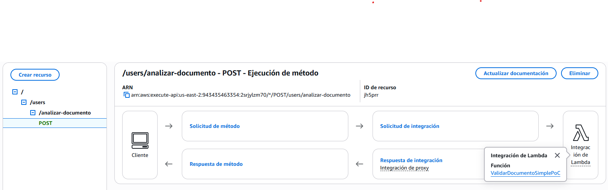

- **Compute**: An AWS Lambda function named `ValidarDocumentoSimplePoC` was created using the **Python** runtime. This function orchestrated the document analysis workflow.
    - **Script**: `ValidarDocumentoSimplePoC.py`

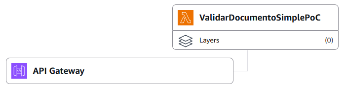

- **Data Storage**: An Amazon S3 bucket named `poc-documentos-datapv-danielo` was used to store the test images.


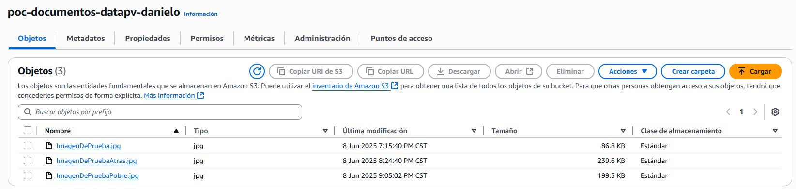

- **Artificial Intelligence**: **Amazon Textract** was used to perform the text extraction (OCR) from identity document images.
- **Security**: An AWS IAM role was configured to grant the Lambda function permissions to access both **S3** and **Textract** resources.


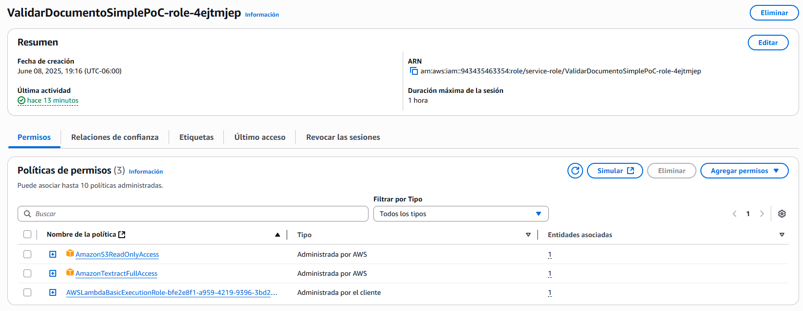

- **Observability**: **Amazon CloudWatch Logs** was used to monitor Lambda execution and analyze the extracted text in real-time.


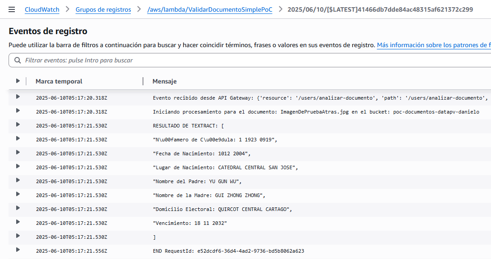

### 4. Execution Methodology
The process was divided into preparing the test data and executing the analysis requests.
- **Phase 1: Test Data Preparation** Three images were uploaded to the S3 bucket `poc-documentos-datapv-danielo` to simulate a range of real-world image conditions:
    - `ImagenDePrueba.jpg`: Clear image of the front of the ID card.
    - `ImagenDePruebaAtras.jpg`: Clear image of the back of the ID card.
    - `ImagenDePruebaPobre.jpg`: A low-quality image taken under poor lighting and angle conditions.
- **Phase 2: API Call Simulation** Each image was tested through a `POST` request to the `TeamOneApiGateway` endpoint. Requests were performed using Postman with JSON bodies such as:


```json
{
  "bucketName": "poc-documentos-datapv-danielo",
  "documentName": "ImagenDePruebaPobre.jpg"
}
```

- **Phase 3: Verification** The execution of the ValidarDocumentoSimplePoC Lambda was monitored via Amazon CloudWatch Logs. For each Postman request, the corresponding log stream was inspected to analyze the JSON output containing the text extracted by Amazon Textract.
### 5. Results & Findings
The PoC execution was successful across all three test cases, validating the hypothesis.
- **Test Case 1 (ImagenDePrueba.jpg)**: Textract demonstrated high accuracy in extracting all visible text fields from the front of the identity card. Character recognition was precise with minimal to no errors.

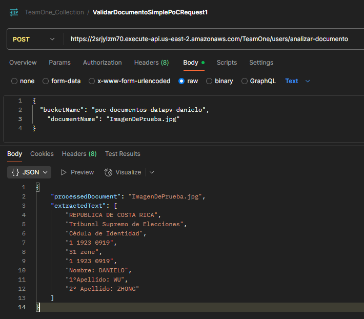

- **Test Case 2 (ImagenDePruebaAtras.jpg)**: The service successfully extracted text from the back of the card, including smaller font sizes, demonstrating its versatility.

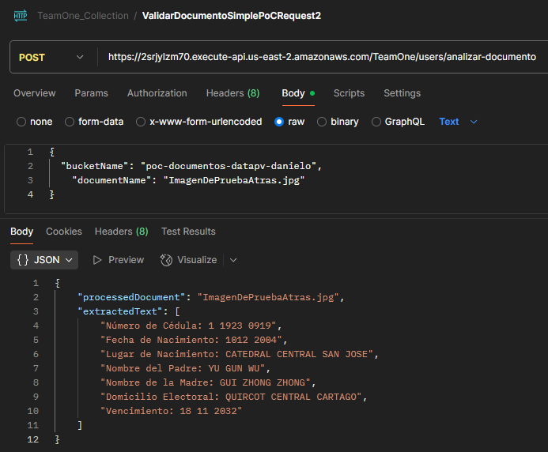

- **Test Case 3 (ImagenDePruebaPobre.jpg)**: Despite the challenging conditions of the image, Textract showed remarkable resilience, successfully extracting a significant portion of the critical text. While some minor errors were observed, key identifiers remained largely legible.

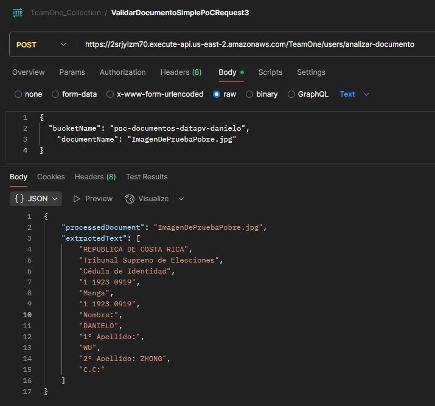

### 6. Conclusion
**Conclusion:** The PoC is considered a resounding success. It has been demonstrated that the proposed serverless architecture (API Gateway -> Lambda -> Textract) is effective and that **Amazon Textract** is a viable and sufficiently accurate technology for the document data extraction needs of the Data Pura Vida project, even under sub-optimal image conditions.

---

### PoC 2: Data Lake with Apache Iceberg (Final Report)

#### 1. Objective and Key Questions to Answer
The objective of this Proof of Concept (PoC) was to validate the proposed Data Lake architecture, confirming its technical feasibility, functional completeness, and performance for the **Data Pura Vida** use cases. The architecture is based on **Amazon S3** and **Apache Iceberg**.

The key questions to be answered were:
- **Query Performance**: Is the response time of **Amazon Athena** when querying Iceberg tables on S3 fast enough to support the interactive visualizations planned for the *Descubriendo Costa Rica* portal?
- **Data Versioning**: Is the versioning and *time travel* feature of **Apache Iceberg** practical to implement and functional enough to support data auditing and historical analysis?

#### 2. Justification / Risk Mitigated
The adoption of **Apache Iceberg** is a critical architectural decision to provide advanced capabilities (ACID transactions, data versioning, schema evolution) on top of an S3-based Data Lake. This PoC was essential to mitigate the risk of adopting a new technology by validating:
- That query performance supports smooth user experience in the dashboards.
- That historical versioning for auditing is technically achievable with Iceberg.

#### 3. Architecture & Implemented Technologies
The PoC implemented a simplified data pipeline using the following technologies:

- **Data Storage**: An Amazon S3 bucket (`poc-datalake-datapv-danielo`) to store source CSV files and the Iceberg table data.

- **Data Catalog**: An **AWS Glue** database (`poc_datalake_db`) was used to register metadata for the Iceberg table.

- **ETL (Processing)**: An **AWS Glue** job (`PoCIcebergWriter`) written in **PySpark** to read CSVs and write to the Iceberg table.

- **Analytical Query Engine**: **Amazon Athena** to run SQL queries directly on the Iceberg table.

- **Security**: An **AWS IAM** role was configured to allow the Glue job access to S3 and Glue Catalog.

- **Script Code**: File named `GlueScriptTeamOne.py`

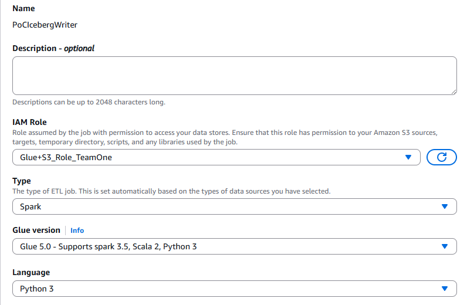
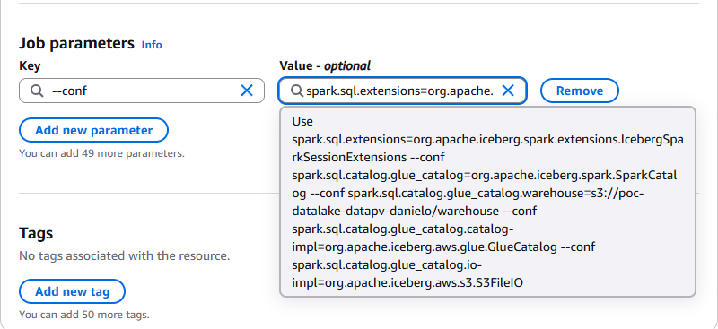

#### 4. Execution Methodology
The execution was divided into two phases: table versioning and analytical verification.

- **Phase 1: Version Creation and Data Loading**
    - **Version 1 (Initial Snapshot)**:
        - A file `datos_v1.csv` with 3 records was uploaded to S3.
        - The Glue job ran in **overwrite** mode, creating the `dataset_transacciones` table and writing version 1.
    - **Version 2 (Incremental Load)**:
        - A file `datos_v2.csv` with 2 additional records was uploaded.
        - The job was modified to use **append** mode, creating version 2 without modifying the original data.

- **Phase 2: Verification with Amazon Athena**
    - After loading both versions, validation queries were run using the Athena SQL editor.

#### 5. Results & Findings
The tests in Athena validated all PoC objectives.

- **Test Case 1: Latest Version Validation**
    - **Action**:  
    ```sql
    SELECT * FROM "poc_datalake_db"."dataset_transacciones";
    ```
    - **Result**: Returned 5 rows (3 from `datos_v1.csv` and 2 from `datos_v2.csv`), confirming successful append and correct reading of current table state.

    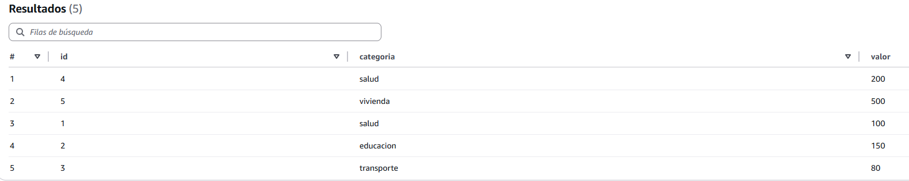

- **Test Case 2: Time Travel Functionality**
    - **Action**: Queried table history using `$history`, then used:
    ```sql
    SELECT * FROM "poc_datalake_db"."dataset_transacciones" FOR TIMESTAMP AS OF '<timestamp>';
    ```
    - **Result**: Returned only the original 3 rows from `datos_v1.csv`, confirming working time travel and versioning.

    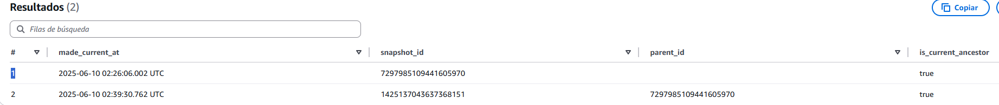
    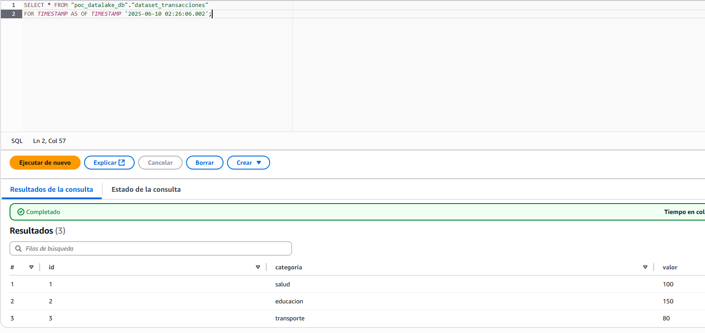

- **Test Case 3: Dashboard Query Simulation (Performance)**
    - **Action**: Executed a `GROUP BY` and `SUM` query simulating dashboard workload.
    - **Result**: Query completed in under 4 seconds, demonstrating sufficient performance for interactive use.

    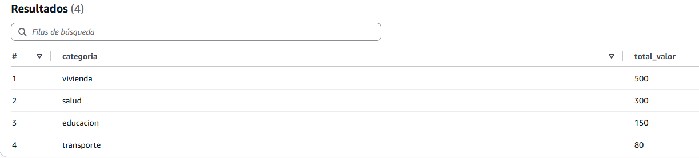

#### 6. Conclusion
**Conclusion**: The PoC is considered a complete success. It demonstrated that the proposed Data Lake architecture—using **Amazon S3**, **Apache Iceberg**, **AWS Glue**, and **Amazon Athena**—is robust, functional, and capable of supporting both performance and versioning requirements for **Data Pura Vida**.

---

### PoC 3: Structured Data Extraction and Logical Validation (Final Report)

#### 1. Objective and Key Questions to Answer
This Proof of Concept (PoC) serves as a direct continuation of PoC #1. Its primary objective was to validate the system's ability to process raw OCR output, structure it into a useful data model, apply simple business validation rules, and persist the structured result.

The key questions to be answered were:
- **Data Structuring**: Can we reliably parse the raw text output from **Amazon Textract** and map it to a predefined, structured JSON object?
- **Logical Validation**: Is it feasible to implement business logic within the same Lambda function to validate the integrity of the extracted data (e.g., presence of all required fields)?
- **Structured Persistence**: Can we successfully persist this clean, validated JSON object into a **NoSQL database (Amazon DynamoDB)** for subsequent use?

#### 2. Justification / Risk Mitigated
While PoC #1 mitigated the risk of initial text extraction, this PoC mitigates the subsequent risk of the extracted data being "noisy" or difficult to parse, which would render the automation fragile. By validating this step, confidence in achieving a nearly fully automated identity validation flow is significantly increased, focusing human intervention on only the most exceptional cases. 

This PoC directly addresses the **"Develop Structuring Logic"** recommendation.

#### 3. Architecture & Implemented Technologies
The architecture for this PoC was an extension of the first, creating a new, separate serverless flow to ensure isolation.

- **API Gateway**: A new endpoint was added to the `TeamOneApiGateway` API:
  - `POST /users/procesar-documento-estructurado`

  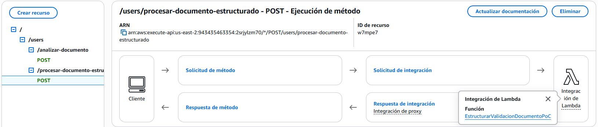

- **Compute**: A new AWS Lambda function `EstructurarValidacionDocumentoPoC` was created using the **Python** runtime.
  - **Script**: `EstructurarValidacionDocumentoPoC.py`

  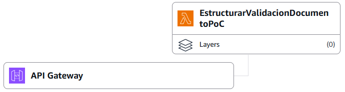

- **Artificial Intelligence**: **Amazon Textract** was used, specifically the `DetectDocumentText` API, followed by custom parsing logic.

- **Data Storage**: The existing Amazon S3 bucket `poc-documentos-datapv-danielo` was reused to store source images.

  

- **Database**: A new Amazon DynamoDB table `ResultadosValidacionDocumentos` was created to store the structured results.

  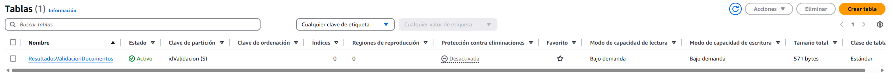

- **Security**: A new AWS IAM role was created for the Lambda, granting permissions to **S3**, **Textract**, and the new **DynamoDB** table.

  

#### 4. Execution Methodology
The process involved updating the backend logic and testing it against the same image set used in PoC #1.

- **Environment Setup**:  
  - Created a DynamoDB table `ResultadosValidacionDocumentos` with `idValidacion` as the partition key.  
  - Created a Lambda function `EstructurarValidacionDocumentoPoC` and assigned the appropriate IAM role.

- **Logic Implementation**:  
  The Lambda function performs the following:
  1. Calls `DetectDocumentText` from Textract.
  2. Parses returned text lines using a custom Python function to extract key-value pairs (e.g., "Nombre:", "1°Apellido:").
  3. Populates a structured Python dictionary.
  4. Validates required fields (e.g., `nombre`, `primerApellido`).
  5. Generates a unique ID and stores the final object (with validation status) in DynamoDB.

- **API Configuration**:  
  Configured `POST /users/procesar-documento-estructurado` in API Gateway to invoke the new Lambda function.

- **Testing**:  
  Used **Postman** to send test requests with:
  - `ImagenDePrueba.jpg` (high quality)
  - `ImagenDePruebaPobre.jpg` (low quality)

- **Verification**:  
  Verified results via:
  - JSON response in Postman
  - DynamoDB item inspection in AWS Console

#### 5. Results & Findings
The PoC execution was successful, demonstrating the effectiveness of the custom parsing and validation logic.

- **Test Case 1 (High-Quality Image)**:  
  - `ImagenDePrueba.jpg` returned `200 OK`.
  - All fields in `datosExtraidos` were correctly populated.
  - `erroresValidacion` was empty.
  - `estado` was `COMPLETADO_OK`.

  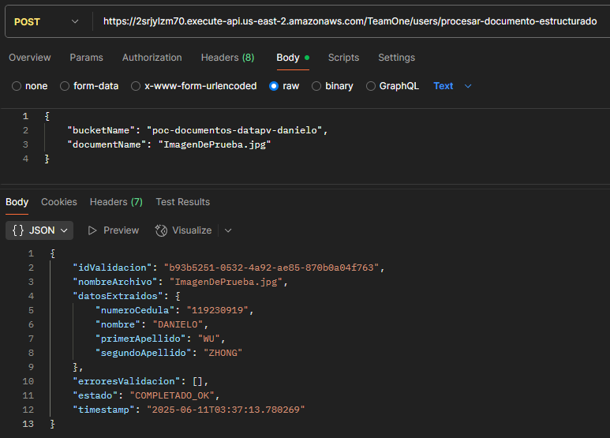

- **Test Case 2 (Low-Quality Image)**:  
  - `ImagenDePruebaPobre.jpg` also returned `200 OK`.
  - `nombre` and `primerApellido` were empty due to poor OCR.
  - `erroresValidacion` included messages for missing required fields.
  - `estado` was `COMPLETADO_CON_ERRORES`.

  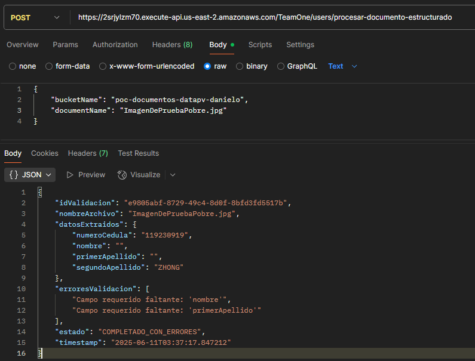

#### 6. Conclusion & Next Steps
**Conclusion:**  
This Proof of Concept was a complete success. It demonstrates that by combining **Amazon Textract** with custom parsing and validation logic in **AWS Lambda**, we can create a robust data extraction pipeline. The solution performs well on clean images and gracefully handles validation errors for poor-quality inputs. This approach is more resilient than relying solely on pre-trained models such as `AnalyzeID`.

---
