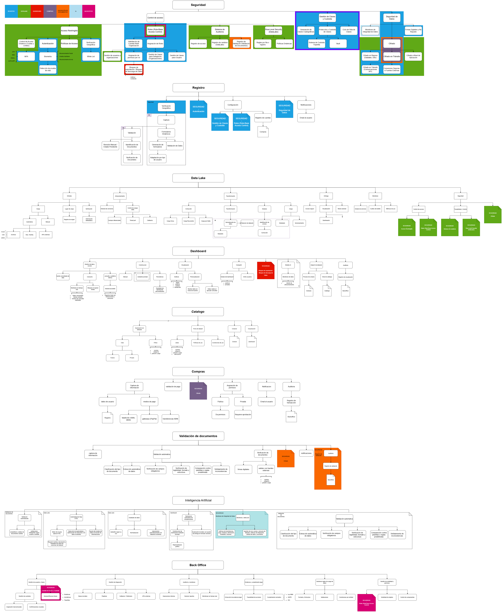

# Data-Pura-Vida

## 1. Introduction: The Challenge and the Opportunity
For years, Costa Rica has contended with a significant structural limitation: the absence of a centralized, secure data ecosystem. This fragmentation of information across public and private sectors has hindered evidence-based decision-making, slowed institutional processes, and limited the innovative solutions that could emerge from the strategic use of data. "Data Pura Vida" is born from this challenge, envisioned not merely as a technological platform, but as a strategic piece of national infrastructure designed to unlock Costa Rica's potential in the global digital economy.

### 1.1 Vision
To transform Costa Rica into a leading digital-first nation, fostering a sovereign data economy where critical government decisions, private sector innovation, and citizen empowerment are driven by democratic, secure, and transparent access to information. "Data Pura Vida" will be the engine that eliminates data silos, creating a single source of truth that fuels a more efficient state, a more dynamic market, and a more informed society, securing the nation's sustainable digital transformation for generations to come.
### 1.2 Core Guiding Principles 
- **Total Auditability:** Every action, query, and transaction within the ecosystem will be immutably logged. This ensures absolute traceability, providing a transparent record for accountability and regulatory oversight.
- **Provider Accountability:** The veracity and quality of information are the direct responsibility of the entity that provides it. The platform's architecture will be designed to enforce this traceability, making the data's origin unequivocally clear.
- **Controlled Flexibility:** The system will not be a rigid, one-size-fits-all solution. It will provide a powerful and granular ruleset, empowering data owners to precisely configure how their information is shared, modified, and monetized.
- **Supervised Automation:** We will leverage intelligent automation and AI for maximum efficiency, but will always provide the option for human-in-the-loop review for critical processes, perfectly balancing technological speed with human-led rigor.
- **Data Sovereignty and Security:** The design will guarantee that users and entities have ultimate control over their data and cryptographic keys. Security is not a feature but the foundation upon which the entire ecosystem's trust is built.
### 1.3 Key Benefits
**For Costa Rica and its Government:**
- **Enhanced Public Policy & Process Optimization:** By centralizing and standardizing disparate data sources, institutions can streamline operations, accelerate processes, and design more effective, evidence-based public policies.
- **Strengthened Juridical and Commercial Certainty:** The mandatory validation of identities and financial accounts against national banking systems creates a high-trust environment, reducing fraud and strengthening the legal certainty of transactions conducted within the ecosystem.
- **Transparent and Efficient Governance:** Absolute traceability provides an unprecedented tool for regulatory oversight and fosters a culture of transparency, enabling data-driven governance.

**For the Private Sector:**
- **A New Frontier for Innovation & Business Models:** Access to a regulated data marketplace will fuel the creation of new technology products and services in fields like fintech, agritech, and health tech. The freedom to set prices and define access models (e.g., public instant access vs. private approval-based) creates a dynamic new revenue stream.
- **Secure and Risk-Mitigated Collaboration:** The ability to explore detailed metadata and data samples before purchase reduces investment risk. Furthermore, the support for organizations to use their own encryption keys provides an unparalleled level of security for B2B 

**For a a Citizens and Civil Society:**
- **Empowerment Through Information Access:** Providing access to useful, reliable, and transparent information reinforces democratic principles, enables informed citizen participation, and strengthens social auditing.
- **Guaranteed User Rights:** The platform enshrines user control, granting individuals the granular right to manage their data lifecycle, including the "right to be forgotten," and ensures fair processes through the option of human review, preventing automated exclusion.
### 1.4 Unique Value Proposition: An Integral Architecture for Data Sovereignty
"Data Pura Vida" is distinguished by its holistic approach to creating a national ecosystem built on trust, value, and control. Our unique proposition is delivered through three core architectural pillars:
1. **A National-Grade, Zero-Trust Security Architecture:** Security is the bedrock of the entire system. We implement a strict **internal zero-trust model**, architecturally preventing any privileged technical staff from accessing plaintext data. This is achieved through universal **encryption at rest and in transit**, fortified by a tripartite key custody system for master keys, ensuring no single entity holds absolute power. User identity is shielded with **unbreakable biometric authentication and multi-factor protocols**, with identities cross-validated against national banking systems to provide the highest degree of assurance.
2. **AI as an End-to-End Value and Quality Engine:** Artificial Intelligence is woven into the fabric of the data lifecycle to maximize its value from ingestion to insight.
    - **At Registration:** AI intelligently validates the authenticity and completeness of identity documents, streamlining onboarding while preventing fraud.
    - **At Ingestion:** A sophisticated **ETDL (Extract, Transform, Depurate, Load)** engine uses AI to automatically clean, standardize, model, and enrich incoming data, detecting relationships and ensuring a high standard of quality before it enters the Data Lake.
    - **At Exploration:** AI empowers all users, regardless of technical skill, to become data analysts. Through the use of natural language prompts, users can ask complex questions and have the system automatically generate insightful dashboards and visualizations.
3. **A Sovereign Ecosystem for Secure Exploration and Monetization:** We have designed a unique dual-environment that masterfully balances the need for data exploration with the imperative for absolute control.
    - The "Descubriendo Costa Rica" (Discovering Costa Rica) portal serves as a secure "sandbox" for analysis. It allows users to build and share rich, interactive dashboards, but is governed by a fundamental rule: it is technically impossible to download raw data or export visualizations. This ensures that sensitive information never leaves the secure environment.
    - This is complemented by a flexible data marketplace within the "Feliz Compartiendo Datos" (Happy Sharing Data) module. Here, data providers exercise full sovereignty, setting their own prices, defining access models, and managing their data's lifecycle, all within a regulated framework that protects both producer and consumer.
## 2. Risk Assessment

### 2.1 Risk Identification

#### Technical Risks:
| ID  | Risk                                   | Description                                                        |
| --- | -------------------------------------- | ------------------------------------------------------------------ |
| T01 | Format incompatibility                 | Difficulty processing datasets of diverse formats (CSV, JSON, XML) |
| T02 | Failures in data processing approaches | Data loss or corruption during transformations                     |
| T03 | Data Lake scalability                  | Storage/query limitations with data growth                         |
| T04 | Visualization performance              | High latency in complex dashboards / high traffic                  |
| T05 | Legacy system integration              | Incompatibility with public institutions' APIs/databases           |
| T06 | System availability                    | Downtime during peak demand                                        |
| T07 | AI complexity                          | Implementation may have low accuracy                               |

#### Security Risks:
| ID  | Risk                    | Description                                              |
| --- | ----------------------- | -------------------------------------------------------- |
| S01 | Sensitive data breaches | Accidental exposure of personal/confidential information |
| S02 | Identity management     | MFA authentication failures or identity spoofing         |
| S03 | Inadequate encryption   | Vulnerability of data at rest/in transit                 |
| S04 | Access privileges       | Administrator permission abuse                           |
| S05 | Lack of auditing        | Insufficient traceability of access/changes              |

#### Legal & Compliance Risks:
| ID  | Risk                     | Description                                    |
| --- | ------------------------ | ---------------------------------------------- |
| L01 | Non-compliance with laws | Penalties for mishandling personal information |
| L02 | Data ownership           | Disputes over rights to shared datasets        |

#### Operational Risks:
| ID  | Risk                 | Description                              |
| --- | -------------------- | ---------------------------------------- |
| O01 | Resistance to change | Rejection by institutions or individuals |
| O02 | Vendor dependency    | Cloud outages or critical API changes    |

#### Financial Risks:
| ID  | Risk                      | Description                                 |
| --- | ------------------------- | ------------------------------------------- |
| F01 | High operational costs    | Infrastructure more expensive than budgeted |
| F02 | Failed monetization model | Low adoption of paid datasets               |

#### Quality Risks:
| ID  | Risk                    | Description                              |
| --- | ----------------------- | ---------------------------------------- |
| C01 | Data inconsistency      | Source errors affecting analysis         |
| C02 | Lack of metadata        | Hinders AI interpretation of datasets    |
| C03 | Interoperability issues | Datasets that cannot be cross-referenced |

### 2.2 Risk Analysis and Evaluation  
**Criteria**: Probability (Low <30%, Medium 30-70%, High >70%) × Impact (Minor, Medium, Major, Critical).  

| Risk ID | Level    | Actions to Take                                                                                                       |
| ------- | -------- | --------------------------------------------------------------------------------------------------------------------- |
| **S01** | Critical | - Apply AES-256 encryption for sensitive data - Restrict access using RBAC and RLS |
| **L01** | Critical | - Validate consent during registration                                                                                |
| **T02** | Critical | - Use the project's AI engine for data validation during loading (ETDL) - Maintain regular backups                 |
| **T03** | High     | - Use scalable cloud storage - Automatically clean unused data                                       |
| **S02** | High     | - Enforce MFA and liveness checks for registrations                                                                   |
| **S03** | High     | - Encrypt data in transit with TLS - Use tripartite keys as specified                                              |
| **O01** | High     | - Train officials on platform usage - Show success cases with open data                                            |
| **T01** | Moderate | - Convert files to standard formats (CSV/JSON) using built-in tools                                                   |
| **T05** | Moderate | - Create adapters for common APIs                                                          |
| **C01** | Moderate | - Use system AI to detect duplicates                                                                                  |
| **F01** | Moderate | - Monitor costs monthly                                                                                               |
| **T04** | Moderate | - Optimize queries with indexes                                                                                       |
| **S04** | Moderate | - Review admin permissions every 3 months - Log all actions                                                        |
| **T07** | Low      | - Allow users to manually correct AI errors                                                                           |
| **T06** | Low      | - Use load balancers to prevent downtime                                                                              |
| **L02** | Low      | - Include clear usage agreements when uploading datasets                                                              |
| **O02** | Low      | - Maintain contracts with multiple cloud providers                                                                    |
| **F02** | Low      | - Offer free sample datasets                                                                                          |
| **C02** | Low      | - Require column descriptions when uploading data                                                                     |
| **C03** | Low      | - Use relationship fields between datasets                                                                            |
| **S05** | Low      | - Maintain access logs for extended periods                                                                                                                                                                                                      |

## Relevant Laws and Standards for the **Data Pura Vida** Platform

### Law 8968 - Law on the Protection of Individuals Regarding the Processing of Their Personal Data (Costa Rica)

#### What is it?

**Law 8968**, published in Costa Rica, establishes the legal framework for the protection of individuals' personal data. This law guarantees individuals' fundamental rights regarding the processing of their personal information, ensuring their privacy and control over their data.

#### Application in the project

- **User registration**: When collecting personal information and identification documents, it is critical to obtain users’ explicit consent and ensure transparency in how their data is used.
- **"Happy sharing data" module**: Must allow users to decide what data to share, with whom, and under what conditions, respecting their autonomy and privacy.
- **Protection of sensitive data**: Implement technical and organizational measures to protect sensitive information, such as encryption and access controls.

#### Key modules

- **Green Bio Registration**: Must include mechanisms to obtain and record users’ informed consent.
- **Happy sharing data**: Tools for users to manage their privacy and data sharing preferences.
- **Backoffice**: Features to evaluate legal compliance and manage access, modification, or deletion requests.

### General Data Protection Regulation (GDPR)

#### What is it?

The **GDPR** is a regulation of the European Union that sets guidelines for the collection and processing of personal data of individuals within the EU. Although Costa Rica is not a member of the EU, the GDPR is considered an international standard in data protection.

#### Application in the project

- **Explicit consent**: Ensure that users understand and agree to how their data will be used.
- **User rights**: Facilitate access, modification, deletion, and portability of personal data.
- **Security breach notifications**: Establish protocols to inform authorities and users in case of security violations.

#### Key modules

- **Green Bio Registration**: Implement clear processes for obtaining and managing consent.
- **Backoffice**: Tools to manage and respond to user requests related to their rights under the GDPR.
- **Pura Vida Data Lake**: Monitoring and alert systems to detect and respond to potential security breaches.

### ISO/IEC 27001 - Information Security Management System

#### What is it?

**ISO/IEC 27001** is an international standard that provides a framework for establishing, implementing, maintaining, and continuously improving an information security management system. Its goal is to protect the confidentiality, integrity, and availability of information.

#### Application in the project

- **Risk management**: Identify and mitigate information security-related risks.
- **Security controls**: Implement policies and procedures to protect information from unauthorized access, loss, or damage.
- **Internal audits**: Conduct regular evaluations to ensure compliance with the standard and continuous improvement.

#### Key modules

- **Pura Vida Data Lake**: Implement access controls, encryption, and continuous monitoring to protect stored data.
- **Backoffice**: Tools for incident management, audits, and review of security policies.
- **API Backend**: Ensure that all programming interfaces comply with the security standards established by the norm.

### Data Governance According to the OECD

#### What is it?

The **Organisation for Economic Co-operation and Development (OECD)** promotes principles and best practices in data governance, focusing on the responsible and ethical management of data throughout its lifecycle. This includes aspects such as data quality, transparency, privacy, and interoperability.

#### Application in the project

- **Interoperability**: Facilitate efficient and secure data exchange between different entities and systems.
- **Transparency**: Provide clear information on how data is collected, processed, and used.
- **Data quality**: Implement mechanisms to ensure that data is accurate, complete, and up to date.

#### Key modules

- **Happy sharing data**: Tools for the standardization and validation of data shared by users.
- **Discovering Costa Rica**: Interfaces that allow users to explore and understand the available data, promoting transparency.
- **Pura Vida Data Lake**: Systems that ensure the integrity and quality of stored data, facilitating its use and reuse.

### Artificial Intelligence Regulation Bill in Costa Rica

#### What is it?

The **Artificial Intelligence Regulation Bill in Costa Rica**, identified as File No. 23.771, seeks to establish a legal framework for the ethical, safe, and sustainable development, implementation, and use of artificial intelligence (AI) in the country. This initiative focuses on the protection and promotion of human dignity, human rights, and people’s well-being, in accordance with the 1949 Political Constitution and international treaties to which Costa Rica is a party.

#### Application in the project

- **Ethical AI development**: Ensure that AI systems used on the platform adhere to ethical principles, avoiding bias and discrimination.
- **Transparency and explainability**: Implement mechanisms that allow users to understand how and why the AI makes certain decisions.
- **Protection of personal data**: Ensure that data processing by AI systems complies with privacy and security regulations.
- **Oversight and accountability**: Establish processes for human oversight of automated decisions and define clear responsibilities in case of errors or malfunctions.

#### Key modules

- **Green Bio Registration**: Incorporate ethical validations in the registration and identity verification processes using AI.
- **Happy sharing data**: Ensure that AI-generated recommendations and analyses are transparent and understandable to users.
- **Discovering Costa Rica**: Implement AI algorithms that respect privacy and provide clear explanations for presented results.
- **Backoffice**: Develop tools for auditing and monitoring AI systems, allowing for the detection and correction of potential biases or errors.
  
---

## Macro components diagrams

This section contains hierarchical decomposition diagrams, with a top-down (Macro-to-micro decomposition) functional analysis.
-   **Data Lake**: Core data integration, storage, processing, and governance.
-   **Security**: Platform-wide authentication, authorization, key management, and data protection layers.
-   **Inteligencia Artificial (AI)**: Embedded AI capabilities enhancing various system functions.
-   **Dashboard (Descubriendo Costa Rica)**: User interface for data exploration and visualization.
-   **Catálogo (Catalog)**: System for discovering and managing dataset information.
-   **Back Office**: Administrative portal for system management and oversight.
-   *(Note: Key processes like Document Validation and Purchases are detailed under relevant components or their own sections where they represent significant, distinct flows shown in diagrams.)*

### Diagram access
View the full hierarchical diagrams here: [Diagrams](https://app.diagrams.net/#G1yVFPUMvNwK_1kUzsVjszH3h54usKBPj5#%7B%22pageId%22%3A%22HHjvdh1xR4mO0dgaIlwd%22%7D)

### Component: Data Lake

#### General Overview

The **Data Lake** is the core of the *Data Pura Vida* ecosystem. It serves as the central repository for structured and semi-structured data, enabling integration, transformation, and analysis through intelligent services. Its design (see "Data Lake" diagram) ensures secure storage, versioning, dataset relationships, and full traceability, complying with security and data governance requirements.

The component's main functional areas, derived from its decomposition diagram, are:

#### 1. Input

Responsible for receiving data from multiple sources. Supports:

- Automatic ingestion via:
  - File uploads (Excel, CSV, JSON)
  - Connectors to SQL / NoSQL databases
  - External APIs
- Manual data entry
- Source and upload location registration
- Structure and format validation
- Metadata collection for AI processing

#### 2. Storage

Manages safe and versioned data retention:

- Dataset version control
- Relationships between datasets via linked columns
- Delta load management:
  - Differential fields
  - Timed pull configuration
  - Event-triggered callbacks

#### 3. Transformation (ETDL)

The smart data processing engine based on AI, composed of:

- **Extraction**: capturing new and existing data
- **Transformation**: normalization, schema redesign, automatic linking of datasets
- **Cleaning**: detection and correction of errors via AI
- **Modeling and final loading** into the system

#### 4. Delivery

Regulates secure and controlled access to processed data:

- Restricted access based on role, time, volume, or entity
- Internal dashboards for data visualization (no export allowed)
- Optional integration with AI models (vector format delivery)
- Real-time metrics on data usage and limits

#### 5. Security

A transversal system that guarantees data protection and traceability:

- Encryption at rest, in transit, and at the application level
- Role-Based Access Control (RBAC) and Row-Level Security (RLS)
- Multifactor authentication (MFA)
- Dynamic access policies per user/entity type
- Access and modification logging for full auditability

#### Architectural Justification

This hierarchical design was created based on system requirements and best practices in modular software architecture. Each subcomponent is a self-contained unit with clear responsibilities, supporting scalability, maintainability, and full data traceability. The Data Lake interacts with other major components (Backend API, Public Portal, and Backoffice) through secure and auditable integration layers, aligned with modern standards of data governance and information security.

---
### Component: Security

#### General Overview

The **Security** component provides platform-wide mechanisms for authentication, authorization, cryptographic key management, data protection, and auditing, ensuring a secure operational environment for all *Data Pura Vida* functionalities. (Refer to "Seguridad" diagram for detailed structure).

#### Key Capabilities

-   **Autenticación Multifactor (MFA) y Biométrica**:
    -   Implements advanced authentication methods including MFA, biometrics, and proof of life for user registration ("bio registro verde") and ongoing access.
    -   Includes OTP and potentially voice recognition.
-   **Control de Acceso Basado en Roles (RBAC) Unificado**:
    -   Manages roles and permissions centrally for users and organizations.
    -   Supports multi-organization account management from a single user account.
-   **Gestión de Claves Criptográficas y Custodia Tripartita**:
    -   Generates and manages symmetric and asymmetric keys for entities.
    -   Secures master keys via a tripartite system (Data Pura Vida + 2 custodians) and utilizes a secure vault.
-   **Seguridad de Datos en Tránsito y Reposo**:
    -   Ensures encryption for data in transit (e.g., API communications) and at rest across various storage systems (databases, Data Lake).
-   **Políticas de Acceso y Restricciones**:
    -   Enforces geographic IP restrictions (Costa Rica only, with whitelists).
    -   Manages access policies dynamically based on context and user/entity type.
-   **Auditoría de Seguridad**:
    -   Logs critical security events, access attempts, and administrative actions.
-   **Prevención de Exportación de Datos**:
    -   Enforces rules like blocking dashboard data/graphic exports, a key security requirement.

---
### Component: Inteligencia Artificial (AI)

#### General Overview

**Inteligencia Artificial (AI)** is integrated across *Data Pura Vida* to automate complex tasks, derive insights, enhance user experience, and improve data quality and security. (Refer to "Inteligencia Artificial" diagram).

#### Key Application Areas

-   **Validación de Documentos ("bio registro verde")**:
    -   Automates verification of document authenticity, completeness, and data extraction.
    -   Applies intelligent validation rules based on user/entity type.
-   **Procesamiento y Gobernanza en el Data Lake**:
    -   Assists in the ETDL pipeline: detecting duplicities, optimizing data relationships, and adjusting data models.
    -   Suggests metadata for datasets to improve cataloging.
-   **Asistencia en Dashboards ("Descubriendo Costa Rica")**:
    -   Enables generation of visualizations via natural language prompts.
    -   Potentially extracts and presents key insights automatically.
-   **Monitoreo y Detección de Anomalías**:
    -   Enhances security by analyzing patterns in data access, transfers, and system logs to identify potential threats or misuse.

---
### Component: Dashboard (Descubriendo Costa Rica)

#### General Overview

The **Dashboard** is the user's window into the "Data Pura Vida" ecosystem, enabling exploration, visualization, and analysis of accessible data in a secure, controlled environment that strictly prohibits direct data export. (Refer to "Dashboard" diagram).

#### Key Features

-   **Construcción de Dashboards**:
    -   Manual drag-and-drop interface.
    -   AI-assisted creation via prompts for automated visualization generation.
    -   Users can save and manage their personalized dashboards.
-   **Visualización de Datos**: Supports diverse representations (tables, charts, trends, predictions).
-   **Gestión de Consumo de Datos Pagados**:
    -   Real-time monitoring of usage (volume, queries, time).
    -   Enforcement of limits and options for renewal/extension.
    -   Accessible history of transactions and consumption.
-   **Seguridad Anti-Exportación**: All visualizations and data interactions are confined within the portal; no download of raw data or graphics is permitted.
-   **Interfaz Segura para Modelos de IA**: Provides a controlled pathway for using platform data to feed AI models, potentially via vectorial data, minimizing direct data exposure.
-   **Compartir Dashboards**: Option to share dashboards with other users or make them publicly visible within the platform.

---
### Component: Catálogo (Catalog)

#### General Overview

The **Catálogo** allows users to discover, understand, and manage information about datasets available within the *Data Pura Vida* ecosystem. It serves as the entry point for accessing or initiating the purchase of datasets. (Refer to "Catálogo" diagram).

#### Key Functionalities

-   **Exploración y Búsqueda de Datasets**:
    -   Filtering by name, category, public/private status, free/paid model.
-   **Ficha Detallada del Dataset**:
    -   Provides comprehensive metadata: description, columns (and AI-useful metadata about them), data owner, update frequency.
    -   Displays terms of use, price (if applicable), duration of access, and conditions of cobro.
-   **Integración con el Proceso de Compra**: Facilitates transition to purchasing access for non-free datasets.

---
### Proceso de Compra (Dataset Acquisition)

#### General Overview
This process, detailed in the "Compras" diagram, outlines how users acquire access to datasets, particularly those with an associated cost, as part of the "Feliz compartiendo datos" functionality.

#### Key Steps

1.  **Selección y Revisión**: User identifies a dataset (typically via the **Catálogo**).
2.  **Captura de Información de Pago**: Securely collects payment details (credit/debit card, national payment mechanisms, IBAN for certain setups).
3.  **Validación y Procesamiento del Pago**.
4.  **Asignación de Permisos**: Upon successful payment, access rights to the dataset are automatically granted according to the agreed terms (time, volume, frequency).
5.  **Notificación**: User receives confirmation of the transaction and access activation.
6.  **Auditoría**: All purchase transactions are logged for user review and system auditing.

---
### Component: Back Office

#### General Overview

The **Back Office** portal is the administrative backbone of *Data Pura Vida*, providing authorized staff with the tools for system management, user and entity oversight, data governance, operational monitoring, and compliance enforcement. (Refer to "Back Office" diagram).

#### Key Administrative Functions

-   **Gestión de Usuarios y Entidades**:
    -   Onboarding, validation, and role management (RBAC) for all registered entities and internal users.
    -   Management of security aspects like key custodians for the tripartite system.
-   **Configuración del Sistema y Reglas de Negocio**:
    -   Defining and managing rules for data loading, validation, and dataset structuring.
    -   Configuration of connectivity to external data sources.
-   **Supervisión y Monitoreo Operativo**:
    -   Real-time monitoring of platform services, data pipelines, ETL(D) processes, and system health.
    -   Generation of operational reports, usage statistics, data quality metrics, and anomaly detection.
-   **Gobernanza y Cumplimiento**:
    -   Comprehensive audit trails of all system operations and administrative actions.
    -   Tools for extracting information for legal or regulatory purposes (under authorization).
    -   Ensuring adherence to data protection laws (e.g., Ley 8968) and standards.
-   **Gestión de Contenido y Datasets**:
    -   Activating, deactivating, editing, and supervising data objects within the platform.

*(Note: The "Validación de Documentos" process, while having its own diagram, is a critical sub-function primarily within the "bio registro verde" (user registration) workflow, heavily utilizing "AI" and "Security" components, and managed/audited via the "Back Office".)*

---

This comprehensive decomposition, visually represented in the linked diagrams and aligned with the detailed requirements, forms a clear foundation for the strategic selection of technologies, ensuring that all functionalities and objectives of the Data Pura Vida ecosystem will be effectively implemented and supported.

## Customer Journeys

### Journey #1 (a company representative, register and validation)

#### Customer profile:
  - Its the legal representative of a Costa Rican company who has the necesity to share information and access public data sets
  - The key technologies in this case are: 
    - Amazon Textract + SageMaker (document validation)
    - Cognito + Rekognition (biometric authentication)
    - DynamoDB + Step Functions (registration status management)

### Journey Phases
| Phase         | Touchpoints                                                 | Customer Actions                                                           | Emotions/Thoughts                                                                       | Improvement Opportunities                        |
| ------------- | ----------------------------------------------------------- | -------------------------------------------------------------------------- | --------------------------------------------------------------------------------------- | ------------------------------------------------ |
| Discovery     | - Data Pura Vida website - Social media                  | - Looks for the registration process - Reads opinions                  | *"Will this be complicated?"* *"What documents do I need?"*                          | Provide step-by-step guide before registration   |
| Consideration | - Registration portal - FAQ                              | - Compares with other open data systems (in our case there are none) - Checks legal requirements     | *"Is this worth?"* *"Will my data be secure?"*                            | AWS Lex chatbot for queries                      |
| Registration  | - Web form (React + Amplify) - Document upload           | - Completes company info - Uploads legal ID and authorization documents | *"I hope they don't ask for too many papers."* *"Why is validation taking so long?"* | Real-time progress bar with Lambda + EventBridge |
| Validation    | - SES notification - Human backoffice review (if needed) | - Waits for approval - Receives confirmation email                      | *"Why was I rejected?"* (if error) *"Finally!"* (if successful)                      | Add SMS notifications via Pinpoint               |
| First Use     | - QuickSight dashboard - Dataset catalog                 | - Explores public data - Configures team permissions                    | *"How do I filter what I need?"* *"Visualization is so easy!"*                       | Interactive tutorial on first login              |

### Journey #2 (a TEC student, data purchase and analysis)

#### Customer profile:
  - a university researcher who needs data for an investigation
  - The hey technologies in this case are:
    - Lake Formation + Athena (catalog search)
    - Stripe connect (card payments)
    - QuickSight Q (AI-powered analysis)

### Journey Phases
| Phase         | Touchpoints                                     | Customer Actions                                                 | Emotions/Thoughts                                                                            | Improvement Opportunities                   |
| ------------- | ----------------------------------------------- | ---------------------------------------------------------------- | -------------------------------------------------------------------------------------------- | ------------------------------------------- |
| Discovery     | - Data Pura Vida website - Webinars             | - Researches available datasets - Checks pricing and licenses | *"Is there updated  data?"* *"Can I afford this?"*                    | Show success stories from other researchers |
| Consideration | - Interactive catalog - Data preview         | - Filters by topic, year, cost - Requests sample access    | *"This dataset is necessary."* *"Can I export the graphs?"*                 | Implement "pay-per-query" option (based on the amount of data scanned or processed by the query)           |
| Purchase      | - Stripe checkout - SES confirmation         | - Enters payment details - Downloads e-invoice                | *"I hope the payment is secure."* *"When will I get access?"*                             | Add SINPE for local payments          |
| Analysis      | - QuickSight Embedded - SageMaker (optional) | - Creates charts with natural language - Saves dashboards     | *"The AI suggests useful visualizations."* *"I can't download raw data..."* (frustration) | Allow raw data requests with justification  |
| Loyalty       | - New dataset notifications - User community | - Shares research - Recommends portal to colleagues           | *"This helped my thesis."* *"I wish there was more data of this topic."*                         | Academic program                   |

### Journey #3 (a public institution, Open data publishing)

#### Customer profile:
  - ministery of finance functionary
  - The key technologies in this case are:
    - AWS Glue + Deequ (data quality validation)
    - S3 + Iceberg (versioned storage)
    - Macie + CloudTrail (security and auditing)

### Journey Phases
| Phase       | Touchpoints                                                   | Customer Actions                                               | Emotions/Thoughts                                                                     | Improvement Opportunities                |
| ----------- | ------------------------------------------------------------- | -------------------------------------------------------------- | ------------------------------------------------------------------------------------- | ---------------------------------------- |
| Discovery   | - Government training - Technical manual                   | - Attends workshops - Consults publication guidelines       | *"How do I ensure no errors?"* *"Who will see this data?"*                         | Assign technical guides per institution  |
| Preparation | - Excel/CSV templates - Metadata tool                      | - Cleans data internally - Completes metadata               | *"This field doesn't apply to us."* *"What does 'sensitive classification' mean?"* | Interactive validator with Glue DataBrew |
| Upload      | - Backoffice portal (Next.js) - Integration API            | - Uploads files or connects database - Checks progress      | *"I hope it doesn't fail due to file size."* *"Why is validation taking so long?"* | Real-time notifications via EventBridge  |
| Validation  | - Quality report (Glue Jobs) - Manual approval (if needed) | - Fixes detected errors - Waits for confirmation            | *"It passed automatic validation!"* *"Why do they want me to review this again?"*  | Explain errors with clear examples       |
| Publication | - Public catalog - Usage dashboard                         | - Configures license (open/restricted) - Monitors downloads | *"Our data is helping researchers."* *"We should update this quarterly."*          | Automatic update reminders               |

## Collaborative Pattern  
This pattern is based on the idea that a complex problem is solved more efficiently and robustly through the cooperation of multiple specialized agents, rather than a single monolithic agent. Each agent has a specific skill or knowledge, and all collaborate by sharing information in a common space to arrive at a comprehensive solution.  

### Metaphor: "The Antique Furniture Restoration Workshop"  
Imagine our AI system is a prestigious artisanal workshop. Its specialty is taking batches of old, mismatched, and forgotten furniture and transforming them into coherent, optimized, and highly valuable display sets.  

### 1. Input: New Datasets and Metadata  
- **Metaphor:** The Newly Arrived Furniture Batch and the Owner's Notes.  
- **Description:** A truck arrives at the workshop and unloads a set of dusty and disorganized furniture (the datasets). Along with the furniture, the driver hands over a folder with notes (the metadata). Some notes are clear ("Dining table, mahogany"), others are cryptic ("Grandpa's box, has a number underneath", "Chairs from the good set"). This is the raw material and context the workshop must work with.  

### 2. Controller Agent  
- **Metaphor:** The Master Restorer (Workshop Foreman).  
- **Description:** This is the person who receives the batch of furniture and the notes. They don’t sand or varnish themselves but have the complete vision. Their job is to initiate the project, call their specialists, and ensure everyone works in a coordinated manner to achieve the goal: "Team, from this batch, we need to create a functional and aesthetic dining set." They are the ones who will make the final decision on the restoration plan.  

### 3. Shared Memory / Blackboard  
- **Metaphor:** The Central Workshop Blackboard.  
- **Description:** This is the heart of the operation. It’s a large whiteboard mounted on the main wall where the entire project is managed. The Master Restorer writes the project name at the top. As each specialist works, they go to the board and add their findings: sketches, measurements, style analysis, joining proposals. Everyone can see it, read each other’s contributions, and add their own, ensuring the team works with the same information.  

### 4. Semantic Analyst Agent  
- **Metaphor:** The Art and Antiques Historian.  
- **Description:** This specialist doesn’t focus on the wood but on the soul of the furniture. Using the owner’s notes and their own expertise, they examine the styles, engravings, and small details to understand the meaning and origin. They note on the board: "I’ve determined that the 'dining table' and the 'chairs from the good set' are Costa Rican neoclassical style. The 'grandpa’s box' with the number underneath appears to be a piece from the same era and maker, likely a sideboard. I propose grouping these three items conceptually."  

### 5. LLM / AI Service  
- **Metaphor:** The Vast Reference Library of Art History.  
- **Description:** The Art Historian doesn’t know everything by heart. When they encounter an engraving or joint type they don’t recognize (input), they go to their office, which contains an immense library with history books, auction catalogs, and artisan records (the LLM). They consult these books to precisely identify the style and era (output), then return to the board with validated knowledge.  

### 6. Structural Analyst Agent  
- **Metaphor:** The Structural Carpenter.  
- **Description:** This craftsman is purely technical. They ignore the style and focus on the physics of the furniture. They measure each piece, check the integrity of the joints, identify the type of wood, and look for unique identifiers. They note on the board: "Table: 1.80m x 0.90m, oak. Chairs: cedar. The number under the sideboard is 'SN-78-CR,' unique and not repeated in the batch (potential primary key). The chairs have a notch that perfectly matches the table’s edge (potential structural relationship)."  

### 7. Relationship Agent  
- **Metaphor:** The Assembler and Designer.  
- **Description:** This specialist connects the dots. They look at the board and see the Historian’s notes ("these pieces are from the same concept") and the Carpenter’s notes ("these pieces fit physically"). Then, they draw a detailed blueprint on the board and write: "DESIGN PROPOSAL: Merge the table, chairs, and sideboard into a single set called 'Neoclassical Dining Set.' The 'SN-78-CR' field of the sideboard will be the primary key of the set. Rename the 'number' column to 'Furniture_ID' in all pieces for standardization."  

### 8. Code Generator Agent  
- **Metaphor:** The Technical Scribe (Instruction Manual Writer).  
- **Description:** The Master Restorer reviews all proposals on the board and gives final approval. They call the Technical Scribe and say, "The plan is approved. Please draft the final assembly manual, step by step, so the apprentices can execute it without errors." The scribe takes the blueprints and notes and translates them into a clear and precise document.  

### 9. Result Output: Transformation Plan and Execution Script (SQL/DDL)  
- **Metaphor:** The Detailed Final Assembly Manual.  
- **Description:** This is the final product of the design process. It’s a bound manual containing the material list, detailed blueprints, and numbered step-by-step instructions for restoration and assembly (the SQL/DDL script). Any craftsman in the workshop can take this manual and build the dining set exactly as designed by the team of specialists.  

### Functional Explanation:  
1. **Input:** Receives datasets with their metadata.  
2. **Controller Agent:** Starts the work and distributes it among specialized agents.  
3. **Shared Memory:** Shared knowledge where all agents write and read.  
4. **Semantic Analyst Agent:** Groups data based on meaning, type, or role.  
5. **LLM:** Uses LLM models to fill missing knowledge, verify hypotheses, or name entities.  
6. **Structural Analyst Agent:** Checks column sizes, data types, etc.  
7. **Relationship Agent:** Based on the analysts' findings, proposes a logical relational structure: tables, foreign keys, etc.  
8. **Code Generator Agent:** Generates the code representing the approved design.  
9. **Output:** Formal document or executable script ready for another system (or human) to implement.  

### Diagram:  
[Collaborative pattern](https://drive.google.com/file/d/19RyEgnIBL0t_Xn1qkGxolLqWiGIJQ1Sx/view?usp=sharing)

