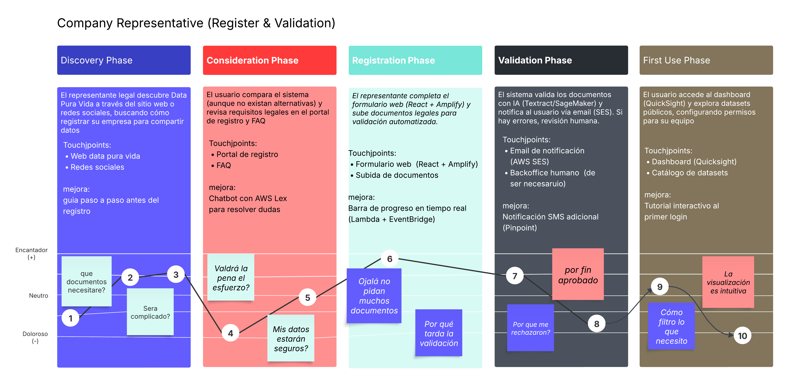

# Data-Pura-Vida

## 1. Introduction: The Challenge and the Opportunity
For years, Costa Rica has contended with a significant structural limitation: the absence of a centralized, secure data ecosystem. This fragmentation of information across public and private sectors has hindered evidence-based decision-making, slowed institutional processes, and limited the innovative solutions that could emerge from the strategic use of data. "Data Pura Vida" is born from this challenge, envisioned not merely as a technological platform, but as a strategic piece of national infrastructure designed to unlock Costa Rica's potential in the global digital economy.

### 1.1 Vision
To transform Costa Rica into a leading digital-first nation, fostering a sovereign data economy where critical government decisions, private sector innovation, and citizen empowerment are driven by democratic, secure, and transparent access to information. "Data Pura Vida" will be the engine that eliminates data silos, creating a single source of truth that fuels a more efficient state, a more dynamic market, and a more informed society, securing the nation's sustainable digital transformation for generations to come.
### 1.2 Core Guiding Principles 
- **Total Auditability:** Every action, query, and transaction within the ecosystem will be immutably logged. This ensures absolute traceability, providing a transparent record for accountability and regulatory oversight.
- **Provider Accountability:** The veracity and quality of information are the direct responsibility of the entity that provides it. The platform's architecture will be designed to enforce this traceability, making the data's origin unequivocally clear.
- **Controlled Flexibility:** The system will not be a rigid, one-size-fits-all solution. It will provide a powerful and granular ruleset, empowering data owners to precisely configure how their information is shared, modified, and monetized.
- **Supervised Automation:** We will leverage intelligent automation and AI for maximum efficiency, but will always provide the option for human-in-the-loop review for critical processes, perfectly balancing technological speed with human-led rigor.
- **Data Sovereignty and Security:** The design will guarantee that users and entities have ultimate control over their data and cryptographic keys. Security is not a feature but the foundation upon which the entire ecosystem's trust is built.
### 1.3 Key Benefits
**For Costa Rica and its Government:**
- **Enhanced Public Policy & Process Optimization:** By centralizing and standardizing disparate data sources, institutions can streamline operations, accelerate processes, and design more effective, evidence-based public policies.
- **Strengthened Juridical and Commercial Certainty:** The mandatory validation of identities and financial accounts against national banking systems creates a high-trust environment, reducing fraud and strengthening the legal certainty of transactions conducted within the ecosystem.
- **Transparent and Efficient Governance:** Absolute traceability provides an unprecedented tool for regulatory oversight and fosters a culture of transparency, enabling data-driven governance.

**For the Private Sector:**
- **A New Frontier for Innovation & Business Models:** Access to a regulated data marketplace will fuel the creation of new technology products and services in fields like fintech, agritech, and health tech. The freedom to set prices and define access models (e.g., public instant access vs. private approval-based) creates a dynamic new revenue stream.
- **Secure and Risk-Mitigated Collaboration:** The ability to explore detailed metadata and data samples before purchase reduces investment risk. Furthermore, the support for organizations to use their own encryption keys provides an unparalleled level of security for B2B 

**For a a Citizens and Civil Society:**
- **Empowerment Through Information Access:** Providing access to useful, reliable, and transparent information reinforces democratic principles, enables informed citizen participation, and strengthens social auditing.
- **Guaranteed User Rights:** The platform enshrines user control, granting individuals the granular right to manage their data lifecycle, including the "right to be forgotten," and ensures fair processes through the option of human review, preventing automated exclusion.
### 1.4 Unique Value Proposition: An Integral Architecture for Data Sovereignty
"Data Pura Vida" is distinguished by its holistic approach to creating a national ecosystem built on trust, value, and control. Our unique proposition is delivered through three core architectural pillars:
1. **A National-Grade, Zero-Trust Security Architecture:** Security is the bedrock of the entire system. We implement a strict **internal zero-trust model**, architecturally preventing any privileged technical staff from accessing plaintext data. This is achieved through universal **encryption at rest and in transit**, fortified by a tripartite key custody system for master keys, ensuring no single entity holds absolute power. User identity is shielded with **unbreakable biometric authentication and multi-factor protocols**, with identities cross-validated against national banking systems to provide the highest degree of assurance.
2. **AI as an End-to-End Value and Quality Engine:** Artificial Intelligence is woven into the fabric of the data lifecycle to maximize its value from ingestion to insight.
    - **At Registration:** AI intelligently validates the authenticity and completeness of identity documents, streamlining onboarding while preventing fraud.
    - **At Ingestion:** A sophisticated **ETDL (Extract, Transform, Depurate, Load)** engine uses AI to automatically clean, standardize, model, and enrich incoming data, detecting relationships and ensuring a high standard of quality before it enters the Data Lake.
    - **At Exploration:** AI empowers all users, regardless of technical skill, to become data analysts. Through the use of natural language prompts, users can ask complex questions and have the system automatically generate insightful dashboards and visualizations.
3. **A Sovereign Ecosystem for Secure Exploration and Monetization:** We have designed a unique dual-environment that masterfully balances the need for data exploration with the imperative for absolute control.
    - The "Descubriendo Costa Rica" (Discovering Costa Rica) portal serves as a secure "sandbox" for analysis. It allows users to build and share rich, interactive dashboards, but is governed by a fundamental rule: it is technically impossible to download raw data or export visualizations. This ensures that sensitive information never leaves the secure environment.
    - This is complemented by a flexible data marketplace within the "Feliz Compartiendo Datos" (Happy Sharing Data) module. Here, data providers exercise full sovereignty, setting their own prices, defining access models, and managing their data's lifecycle, all within a regulated framework that protects both producer and consumer.

---

## 2. Risk Assessment

### 2.1 Risk Identification

#### Technical Risks:
| ID  | Risk                                   | Description                                                        |
| --- | -------------------------------------- | ------------------------------------------------------------------ |
| T01 | Format incompatibility                 | Difficulty processing datasets of diverse formats (CSV, JSON, XML) |
| T02 | Failures in data processing approaches | Data loss or corruption during transformations                     |
| T03 | Data Lake scalability                  | Storage/query limitations with data growth                         |
| T04 | Visualization performance              | High latency in complex dashboards / high traffic                  |
| T05 | Legacy system integration              | Incompatibility with public institutions' APIs/databases           |
| T06 | System availability                    | Downtime during peak demand                                        |
| T07 | AI complexity                          | Implementation may have low accuracy                               |

#### Security Risks:
| ID  | Risk                    | Description                                              |
| --- | ----------------------- | -------------------------------------------------------- |
| S01 | Sensitive data breaches | Accidental exposure of personal/confidential information |
| S02 | Identity management     | MFA authentication failures or identity spoofing         |
| S03 | Inadequate encryption   | Vulnerability of data at rest/in transit                 |
| S04 | Access privileges       | Administrator permission abuse                           |
| S05 | Lack of auditing        | Insufficient traceability of access/changes              |

#### Legal & Compliance Risks:
| ID  | Risk                     | Description                                    |
| --- | ------------------------ | ---------------------------------------------- |
| L01 | Non-compliance with laws | Penalties for mishandling personal information |
| L02 | Data ownership           | Disputes over rights to shared datasets        |

#### Operational Risks:
| ID  | Risk                 | Description                              |
| --- | -------------------- | ---------------------------------------- |
| O01 | Resistance to change | Rejection by institutions or individuals |
| O02 | Vendor dependency    | Cloud outages or critical API changes    |

#### Financial Risks:
| ID  | Risk                      | Description                                 |
| --- | ------------------------- | ------------------------------------------- |
| F01 | High operational costs    | Infrastructure more expensive than budgeted |
| F02 | Failed monetization model | Low adoption of paid datasets               |

#### Quality Risks:
| ID  | Risk                    | Description                              |
| --- | ----------------------- | ---------------------------------------- |
| C01 | Data inconsistency      | Source errors affecting analysis         |
| C02 | Lack of metadata        | Hinders AI interpretation of datasets    |
| C03 | Interoperability issues | Datasets that cannot be cross-referenced |

### 2.2 Risk Analysis and Evaluation  
**Criteria**: Probability (Low <30%, Medium 30-70%, High >70%) × Impact (Minor, Medium, Major, Critical).  

| Risk ID | Level    | Actions to Take                                                                                                       |
| ------- | -------- | --------------------------------------------------------------------------------------------------------------------- |
| **S01** | Critical | - Apply AES-256 encryption for sensitive data - Restrict access using RBAC and RLS |
| **L01** | Critical | - Validate consent during registration                                                                                |
| **T02** | Critical | - Use the project's AI engine for data validation during loading (ETDL) - Maintain regular backups                 |
| **T03** | High     | - Use scalable cloud storage - Automatically clean unused data                                       |
| **S02** | High     | - Enforce MFA and liveness checks for registrations                                                                   |
| **S03** | High     | - Encrypt data in transit with TLS - Use tripartite keys as specified                                              |
| **O01** | High     | - Train officials on platform usage - Show success cases with open data                                            |
| **T01** | Moderate | - Convert files to standard formats (CSV/JSON) using built-in tools                                                   |
| **T05** | Moderate | - Create adapters for common APIs                                                          |
| **C01** | Moderate | - Use system AI to detect duplicates                                                                                  |
| **F01** | Moderate | - Monitor costs monthly                                                                                               |
| **T04** | Moderate | - Optimize queries with indexes                                                                                       |
| **S04** | Moderate | - Review admin permissions every 3 months - Log all actions                                                        |
| **T07** | Low      | - Allow users to manually correct AI errors                                                                           |
| **T06** | Low      | - Use load balancers to prevent downtime                                                                              |
| **L02** | Low      | - Include clear usage agreements when uploading datasets                                                              |
| **O02** | Low      | - Maintain contracts with multiple cloud providers                                                                    |
| **F02** | Low      | - Offer free sample datasets                                                                                          |
| **C02** | Low      | - Require column descriptions when uploading data                                                                     |
| **C03** | Low      | - Use relationship fields between datasets                                                                            |
| **S05** | Low      | - Maintain access logs for extended periods                                                                                                                                                                                                      |

---

## Technical Policies for the **Data Pura Vida** Platform

This section defines how each legal and regulatory framework is technically enforced within the **Data Pura Vida** platform. It translates abstract legal principles into actionable rules, showing exactly **what to implement**, **where**, and **how**, for system developers and security teams.

### Law 8968 – Costa Rica's Personal Data Protection

| Policy | Module | Technical Enforcement |
|--------|--------|------------------------|
| Informed consent | Green Bio Registration | Mandatory checkbox field + timestamp in DB; stored in audit trail |
| Data transparency | Happy Sharing Data | UI for data usage preferences; stored per user |
| Sensitive data access control | Data Lake, Security | RLS (Row-Level Security) by user/entity ID |
| Data deletion by request | Backoffice | `DELETE /user-data/:id` API with admin approval + MFA |
| Data encryption | DB layer | AES-256 encryption at rest + KMS-managed keys |

### GDPR – General Data Protection Regulation

| Policy | Module | Technical Enforcement |
|--------|--------|------------------------|
| Right to access/port data | Backoffice, API | `GET /user-data/export` returns JSON; signed |
| Right to erasure | Backoffice | Soft delete with `deleted_at`; purged via background task |
| Consent registry | Registration | Stored in `consents` table with `user_id`, `policy_id`, `timestamp` |
| Breach notification | Security, Notifications | Alert triggered via CloudWatch or App Insights; auto-email to users |

### ISO/IEC 27001 – Information Security Management

| Policy | Module | Technical Enforcement |
|--------|--------|------------------------|
| Access control | Security, Backoffice | IAM roles + RBAC + RLS enforced at endpoint and DB levels |
| Audit of changes and access | Audit system | Logs per user/event/resource; stored in `audit_logs` table |
| Encryption at rest and transit | Security | HTTPS + AES-256 + TLS 1.2+ |
| Key lifecycle management | Security | Rotation, expiry, revocation; managed via Key Vault |
| Risk alerts and evaluations | Security, AI | Monitoring with anomaly detection and metrics dashboards |

### OECD – Data Governance Principles

| Policy | Module | Technical Enforcement |
|--------|--------|------------------------|
| Interoperability | Happy Sharing Data | RESTful APIs documented via OpenAPI (Swagger); support for JSON/CSV |
| Data flow transparency | Dashboard, Audit | Graph of data lineage per dataset; log of access per user |
| Data quality controls | ETDL (Data Lake) | AI-powered validation for duplicates, missing fields, etc. |
| Dataset documentation | Catalog | Auto-generated metadata with structure, relations, and usage terms |

### AI Regulation Bill (Exp. 23.771 – Costa Rica)

| Policy | Module | Technical Enforcement |
|--------|--------|------------------------|
| Explainability of AI | Dashboard (Prompt AI) | Prompt logs + human-readable explanation field |
| Oversight of AI decisions | Backoffice, Audit | All AI actions tagged `triggered_by_AI`; viewable in control panel |
| Ethical validation in registration | AI + Registration | Use of traceable AI services (e.g., Azure Form Recognizer) with metadata |
| AI traceability | Security, Audit | Logs per inference: `input`, `output`, `model`, `timestamp`, `confidence` |

### Summary

These policies ensure that **Data Pura Vida** is legally compliant, secure, and auditable at every level — from data registration and AI processing to dashboard visualization and dataset purchases. Each rule is enforceable and traceable by design, ensuring not only political and legal alignment, but also real-world system integrity and developer clarity.
  
---

## Macro components diagrams

This section contains hierarchical decomposition diagrams, with a top-down (Macro-to-micro decomposition) functional analysis.
-   **Data Lake**: Core data integration, storage, processing, and governance.
-   **Security**: Platform-wide authentication, authorization, key management, and data protection layers.
-   **Inteligencia Artificial (AI)**: Embedded AI capabilities enhancing various system functions.
-   **Dashboard (Descubriendo Costa Rica)**: User interface for data exploration and visualization.
-   **Catálogo (Catalog)**: System for discovering and managing dataset information.
-   **Back Office**: Administrative portal for system management and oversight.
-   *(Note: Key processes like Document Validation and Purchases are detailed under relevant components or their own sections where they represent significant, distinct flows shown in diagrams.)*

### Diagram access
View the full hierarchical diagrams here: [Diagrams](https://app.diagrams.net/#G1yVFPUMvNwK_1kUzsVjszH3h54usKBPj5#%7B%22pageId%22%3A%22HHjvdh1xR4mO0dgaIlwd%22%7D)

## Macrocomponents

### Component: Registration

#### General Overview

The **Registration** component is the entry point for individuals and organizations into the Data Pura Vida ecosystem. It ensures that all actors are validated, authenticated, and securely onboarded using advanced identity verification, customizable registration flows, and role-aware configurations. The entire process integrates AI-based document validation, biometric authentication, geographic filtering, and multifactor mechanisms to guarantee integrity and compliance.

The component is divided into six key functional blocks:

#### 1. Identity and Security Verification

Handles the secure identification of users before access is granted.

- **Geographic Verification**: Restricts registration based on IP location (e.g., only from Costa Rica).
- **Authentication**:
  - MFA (Multi-Factor Authentication)
  - Biometric Authentication (e.g., facial recognition)
  - Proof-of-life detection to prevent spoofing

#### 2. Document Validation (AI-powered)

Ensures that required legal and identity documents are submitted, complete, and authentic.

- **Validation**: AI-based document structure recognition
- **Document Identification**: Detection of document type and content
- **Verification**: Cross-check against expected data patterns or legal templates
- **Manual Review**: Pending states trigger manual administrator validation

#### 3. Dynamic Form Handling and Data Adaptation

Tailors the registration experience according to the entity or individual profile.

- **Form Capture**: Collection of personal, legal, or corporate information
- **Dynamic Forms**: Fields change depending on the type of user (e.g., person, institution, company)
- **Form Generation**: Automatic UI creation per user category
- **Data Validation**: Ensures required fields are complete and values are within valid ranges

#### 4. Cryptographic Key and Custody Management

Manages the creation and secure handling of access keys associated with users or organizations.

- **Key Generation**: Creation of symmetric, asymmetric, and multi-party cryptographic keys
- **Key Lifecycle**: Tracks the status, validity, and expiration of keys
- **Custody and Protection**:
  - Vault-based storage
  - Tripartite custody system involving multiple trusted parties

#### 5. Account Configuration and Role Assignment

Defines roles, scopes, and account relationships.

- **Roles**: Assigns access levels and privileges depending on the entity's role (e.g., admin, data provider)
- **Multi-organization Accounts**: Allows a single user to manage multiple organizations under the same identity
- **Registration of Accounts**:
  - Supports individuals and organizations
  - Allows linking of purchases or data access models

#### 6. Notification System

Manages system-to-user communication during and after registration.

- **Email Notifications**: Confirmation of registration status, approvals, or rejections
- **Account Status Updates**: Inform users when their registration is pending, validated, or rejected

#### Architectural Justification

The Registration component was designed to ensure strict compliance with identity verification, legal data protection, and system governance. By integrating AI-powered document processing, biometric technologies, secure key management, and dynamic configuration per user type, the onboarding process becomes adaptive, secure, and scalable. All stages of the process are monitored, verifiable, and aligned with access and usage policies defined by the platform.

### Component: Security

#### General Overview

The **Security** component ensures the integrity, confidentiality, and controlled access to all operations within the Data Pura Vida ecosystem. It provides robust identity verification, encryption mechanisms, access control models, audit trails, and secure key management. This system supports legal compliance, resilience to misuse, and fine-grained policy enforcement throughout the platform.

The Security module is divided into five primary functional blocks:

#### 1. Access Control

Defines and enforces the rules under which users, systems, and organizations interact with the platform.

- **Restricted Access**: Limits entry to specific zones based on IP, roles, or other policies
  - **Geographic Verification**: IP-based region control
  - **Whitelist**: Approved institutional IP ranges
- **Authentication**:
  - **MFA** (OTP, SMS, Email, Authenticator App)
  - **Biometrics** (Facial, Fingerprint, Voice)
  - **Proof-of-Life Detection**
- **Dynamic Access Control**: Manages usage quotas, download limits, and role-specific rules
- **Access Policies**: Enforces conditional logic depending on user status or entity type

#### 2. Role-Based Access and Permissions

Applies structured RBAC logic for multi-entity collaboration and fine-grained user control.

- **Roles (RBAC)**:
  - Assignment of user and system roles
  - Multi-organization account enablement
  - Delegated account management (e.g., organizations)
- **Permissions by Role**: Assign and revoke access to features, datasets, and tools
- **Data Use Restrictions**:
  - Export and download blocking
  - Graphs/content protection per access level

#### 3. Audit and Validation System

Provides end-to-end traceability of user actions, data operations, and document verification.

- **Access Logs**: Tracks all access attempts and sessions
- **Change Logs (DataLake)**: Logs changes to datasets and resources
- **Document Validation Logs**: Records validation results and processes
- **Row-Level Security**:
  - Access segmentation at the row or record level
  - Enforced through dynamic policies

#### 4. Key Management and Custody

Handles the secure generation, storage, and lifecycle of cryptographic credentials.

- **Key Generation**: Creation of symmetric, asymmetric, and tripartite keys
- **Custody and Protection**:
  - Tripartite Custody System
  - Secure vault integration for storage
- **Key Lifecycle**: Rotation, expiration, revocation

#### 5. Data Security and Encryption

Guarantees protection of data at all stages: in storage, in transit, and at application level.

- **Data Encryption**:
  - **At Rest** (DataLake, databases)
  - **In Transit** (APIs, dashboards)
  - **At Application Level**
- **Secure External Communication**:
  - Encrypted APIs
  - Whitelisted connections
- **Data Integrity Monitoring**: Detects unauthorized modifications or anomalies
- **Digital Signatures and Non-repudiation**: Ensures authenticity and accountability of actions

#### Architectural Justification

This security architecture is designed to provide layered protection for sensitive data and user interactions. By combining MFA, biometric authentication, RBAC, encryption, auditability, and key lifecycle controls, the system ensures resilience, compliance, and strict policy enforcement. Each subcomponent is isolated and traceable, allowing for dynamic response to threats, full visibility, and secure delegation of authority across the Data Pura Vida platform.

### Component: Data Lake

#### General Overview

The **Data Lake** is the core of the *Data Pura Vida* ecosystem. It serves as the central repository for structured and semi-structured data, enabling integration, transformation, and analysis through intelligent services. Its hierarchical design ensures secure storage, versioning, dataset relationships, and full traceability, while complying with the system’s security and data governance requirements.

The component is decomposed into five main functional blocks:

#### 1. Input

Responsible for receiving data from multiple sources. Supports:

- Automatic ingestion via:
  - File uploads (Excel, CSV, JSON)
  - Connectors to SQL / NoSQL databases
  - External APIs
- Manual data entry
- Source and upload location registration
- Structure and format validation
- Metadata collection for AI processing

#### 2. Storage

Manages safe and versioned data retention:

- Dataset version control
- Relationships between datasets via linked columns
- Delta load management:
  - Differential fields
  - Timed pull configuration
  - Event-triggered callbacks

#### 3. Transformation (ETDL)

The smart data processing engine based on AI, composed of:

- **Extraction**: capturing new and existing data
- **Transformation**: normalization, schema redesign, automatic linking of datasets
- **Cleaning**: detection and correction of errors via AI
- **Modeling and final loading** into the system

#### 4. Delivery

Regulates secure and controlled access to processed data:

- Restricted access based on role, time, volume, or entity
- Internal dashboards for data visualization (no export allowed)
- Optional integration with AI models (vector format delivery)
- Real-time metrics on data usage and limits

#### 5. Security

A transversal system that guarantees data protection and traceability:

- Encryption at rest, in transit, and at the application level
- Role-Based Access Control (RBAC) and Row-Level Security (RLS)
- Multifactor authentication (MFA)
- Dynamic access policies per user/entity type
- Access and modification logging for full auditability

#### Architectural Justification

This hierarchical design was created based on system requirements and best practices in modular software architecture. Each subcomponent is a self-contained unit with clear responsibilities, supporting scalability, maintainability, and full data traceability. The Data Lake interacts with other major components (Backend API, Public Portal, and Backoffice) through secure and auditable integration layers, aligned with modern standards of data governance and information security.

### Component: Dashboard

#### General Overview

The **Dashboard** component provides users with a centralized interface to explore, visualize, and interact with datasets available within the Data Pura Vida platform. It enables real-time monitoring of data consumption, auditability, visualization through customizable graphs, and AI-assisted dashboard generation — all within a secure, non-exportable environment.

This component is organized into seven major functional blocks:

#### 1. Data Access and Consumption Management

Controls user access to data, tracks usage, and enforces limits.

- **Consolidated Data Source**: All queries are executed on a unified virtual layer of available data.
- **Consumption Tracking**:
  - Real-time monitoring of:
    - Amount of data consumed
    - Time remaining
    - Number of queries executed
  - Blocking of access upon exceeding allowed limits
- **Audit and Access History**:
  - All user interactions are logged
  - Query and consumption logs are made accessible for internal audit purposes

#### 2. Dashboard Construction

Allows users to build their own dashboards manually or via intelligent prompts.

- **Manual Construction**: Drag-and-drop or selection-based UI
- **AI-Powered Prompts**: Users can request dashboards using natural language
- **Persistence**: Dashboards can be saved for future access or reuse

#### 3. Visualization

Enables interactive and visual exploration of data without exporting.

- **Graphical Outputs**:
  - Tables
  - Charts
  - Counters
  - Trends
- **Preview Mode**:
  - Shows sample data while building dashboards
  - Executes actual queries only after completion to protect sensitive data

#### 4. Sharing Options

Manages how dashboards can be shared or viewed by other users.

- **Dashboard Visibility**:
  - Public dashboards: visible to all users
  - Private dashboards: visible only to owner
- **Sharing Between Users**: Selective sharing with named collaborators or organizations

#### 5. Data Security and Export Prevention

Ensures sensitive data cannot be extracted from the platform.

- **Export Blocking**:
  - Disables copying or exporting of visual elements or raw data
- **Download Restriction**:
  - Prevents downloading of underlying datasets through dashboards
  - Applies to graphs, charts, or source tables

#### 6. AI Model Integration

Restricts and supervises data access by AI systems connected to the platform.

- **Model Monitoring**:
  - Monitors data flow to AI agents
  - Detects and blocks attempts to persistently store data
- **Security Enforcement**:
  - Ensures AI only accesses data under strict, controlled use cases

#### 7. Dataset Acquisition and Audit

Supports access to paid datasets and enables auditing of data usage.

- **Dataset Acquisition**:
  - Purchase flow for datasets with cost
  - Catalog view of available datasets, terms, and prices
- **Audit Logs**:
  - Tracks dataset visualization activity
  - Accessible by administrators through the Backoffice module

#### Architectural Justification

This component combines user-friendly data exploration with strict governance and privacy control. It ensures that users can analyze information without compromising the security or ownership of the data. By integrating audit logs, AI moderation, access control, and real-time consumption metrics, the Dashboard supports responsible and compliant data usage within the ecosystem.

### Component: Catalog

#### General Overview

The **Catalog** component provides a centralized interface for exploring, filtering, and acquiring datasets within the Data Pura Vida platform. It allows users to distinguish between public and private datasets, review key information before purchase, and access datasets through dashboards post-acquisition. This component ensures transparency, usability, and secure dataset transactions.

The Catalog is composed of five major functional blocks:

#### 1. Dataset Exploration

Enables users to browse available datasets with visibility controls and filtering tools.

- **View**:
  - Public datasets: visible to all users
  - Private datasets: accessible based on permissions or roles
- **Filters**:
  - By dataset name
  - By category or thematic area
  - By access model (free or paid)
- **Dataset Metadata**:
  - Name
  - Category
  - Free or paid status
  - Short description

#### 2. Dataset Detail Sheet

Displays detailed information about a selected dataset before access or acquisition.

- **Usage Policies**: Describes who can access the dataset and under what terms.
- **Terms and Conditions**: Legal and technical constraints associated with dataset use.

#### 3. Purchase Functionality

Facilitates access to paid datasets through a clear and secure purchasing process.

- **Buy**: Initiates the transaction for datasets with an associated cost.
- **Purchase Record**: Creates a traceable record for auditing and access validation.

#### 4. Dataset Visualization

Allows users to access and use purchased datasets within the platform’s secure dashboard environment.

- **Access via Dashboard**: Users visualize datasets only through internal tools — direct downloads or exports are not permitted.
- **Link with Access Rights**: Ensures only authorized users visualize private or paid datasets.

#### 5. Data Access Management

Manages who can view or interact with datasets after exploring or purchasing them.

- Integrated with access control policies and security layer.
- Ensures the catalog is compliant with licensing, privacy, and traceability requirements.

#### Architectural Justification

The Catalog component is designed to serve as the user-facing entry point for discovering and accessing datasets. It integrates policy enforcement, visibility rules, and secure purchase flows, ensuring that dataset availability is transparent, controlled, and compliant. Combined with auditability and usage governance, the Catalog supports responsible data sharing and monetization within the Data Pura Vida platform.

### Component: Purchases

#### General Overview

The **Purchases** component manages the acquisition of datasets that are subject to payment within the Data Pura Vida platform. It handles data capture, payment validation, security protocols, permission assignment, user notification, and audit logging. This ensures a transparent, secure, and traceable process for accessing paid information.

The component is divided into six primary functional blocks:

#### 1. Information Capture

Collects the necessary data to process a purchase securely.

- **User Information**: Identity and account details from the registration system
- **Payment Methods**:
  - Credit/Debit Cards
  - Digital Gateways (e.g., PayPal)
  - IBAN Transfers

#### 2. Payment Validation

Verifies that the payment was successfully processed before granting access.

- Integrates with external payment gateways
- Triggers next steps in permission assignment and notification
- Ensures payment status is securely stored

#### 3. Data Encryption

Protects sensitive transactional information using cryptographic techniques.

- Encryption of payment data during transmission and storage
- Integration with the platform's central **Security** component

#### 4. Permission Assignment

Manages how access is granted after successful payment based on dataset type.

- **Public Datasets**: Immediate access is granted
- **Private Datasets**: Requires manual or automatic approval based on rules

#### 5. User Notification

Sends communication to the user regarding the outcome of their purchase.

- Email confirmation of payment receipt
- Notification of access granted or pending approval

#### 6. Auditing

Creates a persistent transaction log for administrative review and traceability.

- **Transaction Record**:
  - Stored for future reference and billing reconciliation
  - Accessible from the **Backoffice**
- Tracks who bought what, when, and under what conditions

#### Architectural Justification

The Purchases component ensures secure and compliant access to paid datasets. It integrates with external payment systems, internal security modules, and the platform’s access control framework to provide a seamless and traceable transaction process. This component supports revenue-generating models, strengthens auditability, and preserves user trust through secure data handling and transparent communication.

### Component: Artificial Intelligence (AI)

#### General Overview

The **Artificial Intelligence** component enhances various platform functionalities by introducing intelligent automation, pattern recognition, and dynamic adjustment of data processes. It operates across modules like document validation, data modeling, visualization, and security monitoring. AI is embedded to improve efficiency, accuracy, and scalability in the platform's key operations.

The component is structured into four main areas of integration:

#### 1. Document Validation Intelligence

Automates document processing and adapts validation according to the context of the user or entity.

- **Automated Validation**:
  - Checks completeness and correctness of uploaded files
  - Applies validation rules depending on entity type or user profile
- **Field-Level Validation**:
  - Document type classification
  - Automatic data extraction
  - Verification of required fields
  - Format and legibility checking
  - Comparison with templates and predefined rules
  - Highlighting of inconsistencies

#### 2. ETDL Automation in the Data Lake

Uses AI to streamline the Extract, Transform, Detect, Load (ETDL) flow and improve data relationships.

- **ETDL Engine**:
  - Orchestrates extraction and loading using AI logic
  - Requires metadata such as column name, description, and tags
- **Deduplication and Optimization**:
  - Detects repeated data
  - Links datasets with existing ones based on usage patterns
- **Model Adjustment**:
  - Refines the structure of datasets based on actual interrelations and usage

#### 3. Intelligent Data Modeling

Improves and simplifies how data is structured, linked, and used in the platform.

- **Model Optimization**:
  - Redesign datasets depending on actual access and usage
- **Normalization**:
  - Converts data into consistent formats and schema
- **Automated Linking**:
  - Establishes semantic or referential connections to existing datasets

#### 4. Visualization and Monitoring Support

Enables AI to assist in generating dashboards, detecting anomalies, and summarizing activity.

- **Dashboard Construction via Prompts**:
  - Users generate visualizations using natural language
  - AI translates prompts into graphs and charts
- **Vector-Based Data Delivery**:
  - Allows data to be exposed as vectors for ML/AI consumption with controlled access
- **Monitoring and Detection**:
  - Tracks ETDL events (transfers, cleanings, deletions, model changes)
  - Reports usage, integration anomalies, and data quality issues

#### Architectural Justification

The AI component acts as a cross-cutting enabler within the Data Pura Vida platform. It reduces manual effort in validation and transformation, enhances data discoverability, and supports regulatory enforcement through automated monitoring. AI-driven decisions help enforce security, improve the user experience, and enable scalable data governance.

### Component: Back Office (Extended View)

#### General Overview

The **Back Office** is the administrative core of the Data Pura Vida platform. It is used exclusively by authorized personnel to manage access keys, integrations, validations, data loading policies, user permissions, and compliance actions. This component provides complete operational oversight, enabling secure, auditable, and policy-driven control over the platform.

The component is structured into six principal functional domains:

#### 1. User and Key Management

Handles the secure creation, revocation, and assignment of cryptographic credentials and key custodianship.

- **Custodian Management**:
  - Mancomunated Assignment (multi-party approval for key management)
  - Cross-confirmation for sensitive operations
- **Key Generation/Revocation**:
  - Support for symmetric, asymmetric, and tripartite cryptographic keys

#### 2. Integration Management

Controls all platform-level integrations with external data sources and systems.

- **Database Connections**
- **ETL Pipelines** supervision
- **Callbacks / Webhooks** management
- **External APIs** connectivity and configuration

#### 3. Audit and Monitoring

Provides detailed operational visibility into all backoffice-related and system-wide activities.

- **Internal Operations**:
  - Logs, system events, service performance
- **Report Generation**:
  - Custom reports for access, datasets, usage
- **Real-Time Monitoring**:
  - Live dashboards showing system behavior

#### 4. Legal Evidence and Compliance

Supports legal procedures and ensures regulatory compliance through controlled access and traceability.

- **Legal Evidence Extraction**
- **Action Traceability**
- **Regulatory Compliance**:
  - Supports standards such as Ley 8968, GDPR, ISO/IEC 27001

#### 5. Data Load Rule Management

Allows for advanced configuration and enforcement of dataset ingestion rules.

- **Format and Structure Requirements**
- **Validations** based on entity type or content
- **Conditions by Entity**:
  - Custom rules per organization, institution, or user type

#### 6. Visibility and Permissions Management

Manages how roles, users, and entities interact with the system’s components and data.

- **Role-Based Access Control (RBAC)**:
  - Assignment and delegation of roles
- **Object Visibility**:
  - Dataset or component visibility by user scope
- **Component Control**:
  - Activation or deactivation of functionalities based on policy

#### Architectural Justification

This component enforces organizational governance and system control, allowing platform administrators to handle integrations, enforce security, monitor operations, and maintain compliance with national and international standards. Each subcomponent is modular, auditable, and tailored to ensure traceability and least-privilege access across every operational layer of the Data Pura Vida ecosystem.

## Key Administrative Functions

-   **Gestión de Usuarios y Entidades**:
    -   Onboarding, validation, and role management (RBAC) for all registered entities and internal users.
    -   Management of security aspects like key custodians for the tripartite system.
-   **Configuración del Sistema y Reglas de Negocio**:
    -   Defining and managing rules for data loading, validation, and dataset structuring.
    -   Configuration of connectivity to external data sources.
-   **Supervisión y Monitoreo Operativo**:
    -   Real-time monitoring of platform services, data pipelines, ETL(D) processes, and system health.
    -   Generation of operational reports, usage statistics, data quality metrics, and anomaly detection.
-   **Gobernanza y Cumplimiento**:
    -   Comprehensive audit trails of all system operations and administrative actions.
    -   Tools for extracting information for legal or regulatory purposes (under authorization).
    -   Ensuring adherence to data protection laws (e.g., Ley 8968) and standards.
-   **Gestión de Contenido y Datasets**:
    -   Activating, deactivating, editing, and supervising data objects within the platform.

*(Note: The "Validación de Documentos" process, while having its own diagram, is a critical sub-function primarily within the "bio registro verde" (user registration) workflow, heavily utilizing "AI" and "Security" components, and managed/audited via the "Back Office".)*

---

This comprehensive decomposition, visually represented in the linked diagrams and aligned with the detailed requirements, forms a clear foundation for the strategic selection of technologies, ensuring that all functionalities and objectives of the Data Pura Vida ecosystem will be effectively implemented and supported.

## Customer Journeys

### Journey #1 (a company representative, register and validation)

#### Customer profile:
  - Its the legal representative of a Costa Rican company who has the necesity to share information and access public data sets
  - The key technologies in this case are: 
    - Amazon Textract + SageMaker (document validation)
    - Cognito + Rekognition (biometric authentication)
    - DynamoDB + Step Functions (registration status management)

### Journey Phases
| Phase         | Touchpoints                                                 | Customer Actions                                                           | Emotions/Thoughts                                                                       | Improvement Opportunities                        |
| ------------- | ----------------------------------------------------------- | -------------------------------------------------------------------------- | --------------------------------------------------------------------------------------- | ------------------------------------------------ |
| Discovery     | - Data Pura Vida website - Social media                  | - Looks for the registration process - Reads opinions                  | *"Will this be complicated?"* *"What documents do I need?"*                          | Provide step-by-step guide before registration   |
| Consideration | - Registration portal - FAQ                              | - Compares with other open data systems (in our case there are none) - Checks legal requirements     | *"Is this worth?"* *"Will my data be secure?"*                            | AWS Lex chatbot for queries                      |
| Registration  | - Web form (React + Amplify) - Document upload           | - Completes company info - Uploads legal ID and authorization documents | *"I hope they don't ask for too many papers."* *"Why is validation taking so long?"* | Real-time progress bar with Lambda + EventBridge |
| Validation    | - SES notification - Human backoffice review (if needed) | - Waits for approval - Receives confirmation email                      | *"Why was I rejected?"* (if error) *"Finally!"* (if successful)                      | Add SMS notifications via Pinpoint               |
| First Use     | - QuickSight dashboard - Dataset catalog                 | - Explores public data - Configures team permissions                    | *"How do I filter what I need?"* *"Visualization is so easy!"*                       | Interactive tutorial on first login              |

### Journey #2 (a TEC student, data purchase and analysis)

#### Customer profile:
  - a university researcher who needs data for an investigation
  - The hey technologies in this case are:
    - Lake Formation + Athena (catalog search)
    - Stripe connect (card payments)
    - QuickSight Q (AI-powered analysis)

### Journey Phases
| Phase         | Touchpoints                                     | Customer Actions                                                 | Emotions/Thoughts                                                                            | Improvement Opportunities                   |
| ------------- | ----------------------------------------------- | ---------------------------------------------------------------- | -------------------------------------------------------------------------------------------- | ------------------------------------------- |
| Discovery     | - Data Pura Vida website - Webinars             | - Researches available datasets - Checks pricing and licenses | *"Is there updated  data?"* *"Can I afford this?"*                    | Show success stories from other researchers |
| Consideration | - Interactive catalog - Data preview         | - Filters by topic, year, cost - Requests sample access    | *"This dataset is necessary."* *"Can I export the graphs?"*                 | Implement "pay-per-query" option (based on the amount of data scanned or processed by the query)           |
| Purchase      | - Stripe checkout - SES confirmation         | - Enters payment details - Downloads e-invoice                | *"I hope the payment is secure."* *"When will I get access?"*                             | Add SINPE for local payments          |
| Analysis      | - QuickSight Embedded - SageMaker (optional) | - Creates charts with natural language - Saves dashboards     | *"The AI suggests useful visualizations."* *"I can't download raw data..."* (frustration) | Allow raw data requests with justification  |
| Loyalty       | - New dataset notifications - User community | - Shares research - Recommends portal to colleagues           | *"This helped my thesis."* *"I wish there was more data of this topic."*                         | Academic program                   |

### Journey #3 (a public institution, Open data publishing)

#### Customer profile:
  - ministery of finance functionary
  - The key technologies in this case are:
    - AWS Glue + Deequ (data quality validation)
    - S3 + Iceberg (versioned storage)
    - Macie + CloudTrail (security and auditing)

### Journey Phases
| Phase       | Touchpoints                                                   | Customer Actions                                               | Emotions/Thoughts                                                                     | Improvement Opportunities                |
| ----------- | ------------------------------------------------------------- | -------------------------------------------------------------- | ------------------------------------------------------------------------------------- | ---------------------------------------- |
| Discovery   | - Government training - Technical manual                   | - Attends workshops - Consults publication guidelines       | *"How do I ensure no errors?"* *"Who will see this data?"*                         | Assign technical guides per institution  |
| Preparation | - Excel/CSV templates - Metadata tool                      | - Cleans data internally - Completes metadata               | *"This field doesn't apply to us."* *"What does 'sensitive classification' mean?"* | Interactive validator with Glue DataBrew |
| Upload      | - Backoffice portal (Next.js) - Integration API            | - Uploads files or connects database - Checks progress      | *"I hope it doesn't fail due to file size."* *"Why is validation taking so long?"* | Real-time notifications via EventBridge  |
| Validation  | - Quality report (Glue Jobs) - Manual approval (if needed) | - Fixes detected errors - Waits for confirmation            | *"It passed automatic validation!"* *"Why do they want me to review this again?"*  | Explain errors with clear examples       |
| Publication | - Public catalog - Usage dashboard                         | - Configures license (open/restricted) - Monitors downloads | *"Our data is helping researchers."* *"We should update this quarterly."*          | Automatic update reminders               |

## Collaborative Pattern  
This pattern is based on the idea that a complex problem is solved more efficiently and robustly through the cooperation of multiple specialized agents, rather than a single monolithic agent. Each agent has a specific skill or knowledge, and all collaborate by sharing information in a common space to arrive at a comprehensive solution.  

### Metaphor: "The Antique Furniture Restoration Workshop"  
Imagine our AI system is a prestigious artisanal workshop. Its specialty is taking batches of old, mismatched, and forgotten furniture and transforming them into coherent, optimized, and highly valuable display sets.  

### 1. Input: New Datasets and Metadata  
- **Metaphor:** The Newly Arrived Furniture Batch and the Owner's Notes.  
- **Description:** A truck arrives at the workshop and unloads a set of dusty and disorganized furniture (the datasets). Along with the furniture, the driver hands over a folder with notes (the metadata). Some notes are clear ("Dining table, mahogany"), others are cryptic ("Grandpa's box, has a number underneath", "Chairs from the good set"). This is the raw material and context the workshop must work with.  

### 2. Controller Agent  
- **Metaphor:** The Master Restorer (Workshop Foreman).  
- **Description:** This is the person who receives the batch of furniture and the notes. They don’t sand or varnish themselves but have the complete vision. Their job is to initiate the project, call their specialists, and ensure everyone works in a coordinated manner to achieve the goal: "Team, from this batch, we need to create a functional and aesthetic dining set." They are the ones who will make the final decision on the restoration plan.  

### 3. Shared Memory / Blackboard  
- **Metaphor:** The Central Workshop Blackboard.  
- **Description:** This is the heart of the operation. It’s a large whiteboard mounted on the main wall where the entire project is managed. The Master Restorer writes the project name at the top. As each specialist works, they go to the board and add their findings: sketches, measurements, style analysis, joining proposals. Everyone can see it, read each other’s contributions, and add their own, ensuring the team works with the same information.  

### 4. Semantic Analyst Agent  
- **Metaphor:** The Art and Antiques Historian.  
- **Description:** This specialist doesn’t focus on the wood but on the soul of the furniture. Using the owner’s notes and their own expertise, they examine the styles, engravings, and small details to understand the meaning and origin. They note on the board: "I’ve determined that the 'dining table' and the 'chairs from the good set' are Costa Rican neoclassical style. The 'grandpa’s box' with the number underneath appears to be a piece from the same era and maker, likely a sideboard. I propose grouping these three items conceptually."  

### 5. LLM / AI Service  
- **Metaphor:** The Vast Reference Library of Art History.  
- **Description:** The Art Historian doesn’t know everything by heart. When they encounter an engraving or joint type they don’t recognize (input), they go to their office, which contains an immense library with history books, auction catalogs, and artisan records (the LLM). They consult these books to precisely identify the style and era (output), then return to the board with validated knowledge.  

### 6. Structural Analyst Agent  
- **Metaphor:** The Structural Carpenter.  
- **Description:** This craftsman is purely technical. They ignore the style and focus on the physics of the furniture. They measure each piece, check the integrity of the joints, identify the type of wood, and look for unique identifiers. They note on the board: "Table: 1.80m x 0.90m, oak. Chairs: cedar. The number under the sideboard is 'SN-78-CR,' unique and not repeated in the batch (potential primary key). The chairs have a notch that perfectly matches the table’s edge (potential structural relationship)."  

### 7. Relationship Agent  
- **Metaphor:** The Assembler and Designer.  
- **Description:** This specialist connects the dots. They look at the board and see the Historian’s notes ("these pieces are from the same concept") and the Carpenter’s notes ("these pieces fit physically"). Then, they draw a detailed blueprint on the board and write: "DESIGN PROPOSAL: Merge the table, chairs, and sideboard into a single set called 'Neoclassical Dining Set.' The 'SN-78-CR' field of the sideboard will be the primary key of the set. Rename the 'number' column to 'Furniture_ID' in all pieces for standardization."  

### 8. Code Generator Agent  
- **Metaphor:** The Technical Scribe (Instruction Manual Writer).  
- **Description:** The Master Restorer reviews all proposals on the board and gives final approval. They call the Technical Scribe and say, "The plan is approved. Please draft the final assembly manual, step by step, so the apprentices can execute it without errors." The scribe takes the blueprints and notes and translates them into a clear and precise document.  

### 9. Result Output: Transformation Plan and Execution Script (SQL/DDL)  
- **Metaphor:** The Detailed Final Assembly Manual.  
- **Description:** This is the final product of the design process. It’s a bound manual containing the material list, detailed blueprints, and numbered step-by-step instructions for restoration and assembly (the SQL/DDL script). Any craftsman in the workshop can take this manual and build the dining set exactly as designed by the team of specialists.  

### Functional Explanation:  
1. **Input:** Receives datasets with their metadata.  
2. **Controller Agent:** Starts the work and distributes it among specialized agents.  
3. **Shared Memory:** Shared knowledge where all agents write and read.  
4. **Semantic Analyst Agent:** Groups data based on meaning, type, or role.  
5. **LLM:** Uses LLM models to fill missing knowledge, verify hypotheses, or name entities.  
6. **Structural Analyst Agent:** Checks column sizes, data types, etc.  
7. **Relationship Agent:** Based on the analysts' findings, proposes a logical relational structure: tables, foreign keys, etc.  
8. **Code Generator Agent:** Generates the code representing the approved design.  
9. **Output:** Formal document or executable script ready for another system (or human) to implement.  

### Diagram:  
[Collaborative pattern](https://drive.google.com/file/d/19RyEgnIBL0t_Xn1qkGxolLqWiGIJQ1Sx/view?usp=sharing)

## Arquitectura de clases, patrones y dependencias (a corregir para ser orientado a capas)

### Módulo de Registro de Entidades (Portal "bio registro verde")

#### Visión General y Patrones Arquitectónicos Clave

Este módulo es el punto de entrada al ecosistema **Data Pura Vida**. Se encarga de registrar a personas físicas y jurídicas, solicitando datos diferenciados y adaptando dinámicamente los formularios. Debe validar la identidad de forma segura, incluyendo la verificación de documentos con IA y mecanismos de autenticación avanzada.

##### Tecnologías

- **Frontend:** React + Tailwind CSS  
- **Backend/Orquestación:** AWS Amplify, AWS AppSync (GraphQL) o API Gateway (REST) + AWS Lambda  
- **Notificaciones:** Amazon SES  

##### Patrones Arquitectónicos Sugeridos

- **API-Driven y Serverless:** El frontend (React) interactuará con un backend serverless (Lambda) a través de APIs (AppSync/API Gateway). Esto facilita la escalabilidad y reduce la carga de gestión de infraestructura. 
- **Component-Based (Frontend):** React, por naturaleza, promueve una arquitectura basada en componentes reutilizables para la interfaz de usuario (formularios, campos de entrada, indicadores de progreso, etc.).  
- **Event-Driven (para flujos asíncronos):** Procesos como la validación de documentos (que puede tomar tiempo) o el envío de notificaciones post-registro se beneficiarán de un desacoplamiento mediante eventos (e.g., una Lambda que publica un evento a EventBridge o SNS una vez que el usuario sube documentos, y otra Lambda que reacciona a ese evento para iniciar la validación).

---

#### Clases/Módulos Principales y sus Responsabilidades

Aquí delineamos las "clases" o agrupaciones lógicas de funcionalidad, que en un contexto de React y Lambda podrían ser componentes de React, funciones Lambda con su lógica interna encapsulada, o clases de servicio en el backend.

##### Frontend (React + Tailwind CSS + AWS Amplify)

**`RegistroView` (Contenedor Principal/Página)**  
- **Responsabilidad:**  Orquestar las diferentes etapas del proceso de registro en la UI (selección de tipo de entidad, llenado de formularios, subida de documentos, confirmación). Gestionar el estado general del flujo de registro en el cliente.
- **Interacciones:** Usa componentes como `FormularioDinamico`, `UploaderDocumentos`. Se comunica con `RegistroServiceAPIClient`.

**`FormularioDinamico` (Componente React)**  
- **Responsabilidad:** Renderizar los campos del formulario de manera dinámica según el tipo de entidad seleccionada (persona física, jurídica, institución, etc.) y los metadatos del formulario recibidos del backend. Implementar validaciones de entrada en el cliente (e.g., usando una librería como Yup).
- **Tecnologías:** React.js  
- **Atributos Clave:** `schemaFormulario`, `datosActuales`.  
- **Métodos Clave:** `renderizarCampo()`, `validarFormulario()`, `manejarCambioInput()`.

**`UploaderDocumentos` (Componente React)**  
- **Responsabilidad:** Permitir al usuario seleccionar y subir los documentos requeridos (cédulas, actas, registros tributarios, etc.). Mostrar el progreso de la subida y manejar errores. Podría interactuar directamente con S3 (usando Amplify Storage) para subidas seguras.  

**`RegistroServiceAPIClient` (Módulo/Clase en Frontend)**  
- **Responsabilidad:**  Encapsular la comunicación con el backend API (AppSync/API Gateway). Realizar las llamadas para obtener la estructura de los formularios, enviar los datos del registro, iniciar la subida de documentos, etc.
- **Métodos Clave:**
  - `obtenerSchemaFormulario(tipoEntidad)`
  - `enviarDatosRegistro(datos)`
  - `solicitarUrlSubidaDocumento(nombreArchivo)`

##### Backend (AWS Lambda, AppSync/API Gateway, DynamoDB)

**`RegistroRequestHandler` (Función Lambda / Controlador API)**  
- **Responsabilidad:** Punto de entrada principal para las solicitudes de registro. Orquesta el flujo de registro en el backend: valida la solicitud, interactúa con el GestorFormulariosService para la lógica de formularios, invoca al ServicioValidacionIdentidad, y al ServicioPersistenciaRegistro.
- **Tecnologías:** AWS Lambda.

**`GestorFormulariosService` (Módulo/Clase en Backend Lambda)**  
- **Responsabilidad:** Proveer la estructura y las reglas de los formularios dinámicos según el tipo de entidad. Esta información podría estar almacenada en DynamoDB o como JSON Schemas. Adapta los campos requeridos dinámicamente.
- **Tecnologías:** AWS Lambda.
- **Método Clave:** `obtenerDefinicionFormulario(tipoEntidad)`

**`ServicioValidacionDatosEntrada` (Módulo/Clase en Backend Lambda)**  
- **Responsabilidad:**  Realizar validaciones de negocio más complejas en los datos enviados que no se pueden hacer solo en el frontend (e.g., cruces con listas internas, validaciones tributarias preliminares si aplica).
- **Tecnologías:** AWS Lambda.

**`ServicioPersistenciaRegistro` (Módulo/Clase en Backend Lambda)**  
- **Responsabilidad:** Guardar la información del registro (parcial o completo) en una base de datos (e.g., DynamoDB), marcando los registros como pendientes hasta su aprobación.
- **Tecnologías:** AWS Lambda, DynamoDB.

**`OrquestadorFlujoRegistro` (AWS Step Functions) - *Opcional***  
- **Responsabilidad:** Si el proceso de registro implica múltiples pasos asíncronos (registro inicial, espera de subida de documentos, validación de documentos, notificación, aprobación manual), Step Functions puede orquestar estas Lambdas y servicios.
**Tecnologías:** AWS Step Functions.

(Nota: El ServicioValidacionDocumentoIA y el ModuloAutenticacionUsuario se detallarán más en sus respectivos componentes de "Validación de Documentos con IA" y "Seguridad", pero el RegistroRequestHandler interactuará con ellos.)
---

#### Patrones de Diseño Relevantes

##### Patrones Creacionales
- **Builder:** Podría ser útil en `GestorFormulariosService` para construir objetos de formulario complejos y dinámicos paso a paso, según el tipo de entidad y los datos requeridos. Esto permitiría que el mismo proceso de construcción cree diferentes representaciones de formularios.
- **Factory Method / Abstract Factory:** Si existen diferentes tipos de "Registros" (ej. `RegistroPersonaFisica`, `RegistroPersonaJuridica`) que comparten una interfaz común pero tienen lógicas de creación o validación específicas, una Factory podría gestionarlos.

##### Patrones Estructurales
- **Facade:**
  - `RegistroServiceAPIClient` n el frontend actúa como una fachada simplificando la interacción con las complejidades del API backend.
  - En el backend, `RegistroRequestHandler` podría ser visto como una fachada que coordina múltiples servicios más pequeños (`GestorFormulariosService`, `ServicioValidacionDatosEntrada`, etc.).

- **Adapter:** Si en el futuro se necesita integrar con un sistema de registro externo heredado o un servicio de validación con una API incompatible, el patrón Adapter sería crucial.

##### Patrones de Comportamiento
- **Chain of Responsibility:** Para el proceso de validación de datos en el backend. Cada validador en la cadena podría manejar un tipo específico de validación (formato, lógica de negocio, completitud) y pasar la solicitud al siguiente.
- **State:** El proceso de registro de una entidad pasará por varios estados (Borrador, PendienteSubidaDocumentos, PendienteValidacionIA, PendienteRevisionManual, Aprobado, Rechazado). El patrón State podría modelar estos estados y el comportamiento asociado a cada uno de forma elegante, especialmente si se gestiona con Step Functions.
- **Command:**  Las acciones del usuario en la UI (ej. "Guardar Borrador", "Enviar Registro") podrían encapsularse como objetos Command, facilitando su manejo y potencial encolamiento o logging.
- **Observer:** Una vez que el registro es validado y aprobado (o cualquier cambio de estado significativo), otros módulos o el propio usuario podrían ser notificados. El ServicioNotificacionesRegistro (usando Amazon SES) actuaría como un notificador para los observadores interesados. Esto se alinea con el uso de SNS/EventBridge para una arquitectura Event-Driven.
- **Strategy:** Diferentes estrategias de validación o formulario por país o tipo de entidad.Si hay diferentes estrategias de validación de datos de entrada o de conformación de formularios según el país o tipo de entidad (más allá de solo campos diferentes), este patrón podría ser aplicable.

---

#### Dependencias Clave

##### Internas
- Los componentes UI (RegistroView, FormularioDinamico, UploaderDocumentos) dependen del RegistroServiceAPIClient.
- El RegistroRequestHandler (Lambda) depende de GestorFormulariosService, ServicioValidacionDatosEntrada, ServicioPersistenciaRegistro y orquesta llamadas a servicios de otros componentes.

##### Externas (Otros Componentes de Data Pura Vida)
- **Módulo de Validación de Documentos con IA**: El flujo de registro invocará este módulo después de que se suban los documentos.
- **Componente Central de Seguridad:**  
  - Para la creación y gestión inicial de la identidad digital del usuario/representante (a través de AWS Cognito).
  - Para la generación de las llaves criptográficas iniciales (vía AWS KMS).
  - Para la verificación geográfica (vía AWS WAF).
- **Portal de Backoffice:**  
  - Para los flujos de revisión manual de registros marcados como pendientes. 
- **Servicio de Notificaciones Transversal:**  
  - Para enviar correos de confirmación, aprobación, etc., usando Amazon SES.
    
##### Servicios Externos (AWS)
- **Frontend:** AWS Amplify (hosting, auth, storage UI)  
- **APIs Backend:**  AWS AppSync o Amazon API Gateway.  
- **Lógica de Negocio:** AWS Lambda  
- **Almacenamiento de Estado/Configuración:** Amazon DynamoDB  
- **Orquestación de Flujos (opcional):** AWS Step Functions  

> *Nota:* Las dependencias para Validación de Documentos con IA y Seguridad se detallarán en sus respectivos componentes, pero son invocadas desde aquí.

### Módulo de Validación de Documentos con IA

#### Visión General y Patrones Arquitectónicos Clave

Este módulo es un componente backend crítico, invocado principalmente durante el "Módulo de Registro de Entidades". Su función es recibir los documentos subidos por los usuarios, procesarlos utilizando un conjunto de servicios de Inteligencia Artificial y lógica de negocio personalizada para verificar su autenticidad, validez, completitud y extraer información relevante. El resultado de esta validación determinará si el proceso de registro puede continuar automáticamente o si requiere una revisión manual.

##### Tecnologías

- **Tecnologías Backend Clave:** Amazon Textract, Amazon Comprehend, Amazon SageMaker, AWS Lambda, AWS Step Functions, DynamoDB.  
- **Interacción Principal:** API Gateway o invocación directa de Lambda desde otros servicios backend.  

##### Patrones Arquitectónicos Sugeridos

- **Serverless y Microservicios:** Cada etapa de la validación (OCR, clasificación, verificación de reglas, etc.) podría ser implementada como una función Lambda independiente o un microservicio pequeño, lo que facilita el mantenimiento y la escalabilidad individual de cada paso.
- **Event-Driven Architecture (EDA):** Para procesos de validación que pueden ser largos o involucrar múltiples pasos, una arquitectura basada en eventos (usando SNS, SQS, EventBridge y Step Functions) es ideal. Por ejemplo, la subida de un documento puede disparar un evento que inicie el flujo de validación.
- **Pipes and Filters:** El flujo de validación de un documento puede verse como una tubería donde el documento pasa por varios filtros (etapas de procesamiento).

---

#### Clases/Módulos Principales y sus Responsabilidades

Dado que es un módulo backend con uso intensivo de Lambdas y servicios de IA, las "clases" pueden representar la lógica dentro de las Lambdas, clientes para los servicios de AWS, o entidades de datos.

**`OrquestadorValidacionDocumento` (AWS Step Functions o AWS Lambda)**
- **Responsabilidad:** Gestionar el flujo completo de validación de un documento. Invoca secuencialmente o en paralelo los diferentes servicios de análisis y validación. Maneja los estados del proceso (e.g., EN_PROCESO, VALIDADO_CON_ERRORES, PENDIENTE_REVISION_MANUAL, VALIDADO_OK).
- **Tecnologías:** AWS Step Functions para orquestar múltiples Lambdas y servicios, o una Lambda principal si el flujo es más simple.
- **Métodos Clave (conceptuales):** iniciarFlujoValidacion(idDocumento, tipoDocumentoEsperado), manejarResultadoPasoValidacion().
  
**`ServicioExtraccionDatos` (AWS Lambda)**
- **Responsabilidad:** Utilizar Amazon Textract para realizar OCR sobre el documento, extraer texto crudo, datos de formularios y tablas. Puede identificar el tipo de documento basado en su estructura inicial.
- **Tecnologías:** Tecnologías: AWS Lambda, Amazon Textract.
- **Métodos Clave:** extraerTexto(documento), extraerFormularios(documento).
  
**`ServicioClasificacionDocumento` (AWS Lambda)**
- **Responsabilidad:** Utilizar Amazon Comprehend y/o un modelo en Amazon SageMaker para clasificar el tipo de documento (cédula, acta constitutiva, registro tributario, etc.) basado en su contenido y/o metadatos extraídos.
- **Tecnologías:** AWS Lambda, Amazon Comprehend, Amazon SageMaker.
- **Métodos Clave:** clasificar(textoDocumento, metadatos).

**`ServicioVerificacionContenido` (AWS Lambda)**
- **Responsabilidad:** Aplicar reglas de negocio y modelos de SageMaker para verificar la información extraída. Esto incluye:
    - Verificación de campos obligatorios.
    - Verificación de legibilidad, formato y estructura (contra patrones esperados).
    - Comparación contra plantillas o reglas predefinidas (podría usar DynamoDB para almacenar estas reglas/plantillas).
    - Señalamiento de inconsistencias o posibles fraudes (usando modelos de detección en SageMaker).
    - Validaciones inteligentes según tipo de usuario o entidad.
        - **Tecnologías:** AWS Lambda, Amazon SageMaker, DynamoDB.
        - **Métodos Clave:** validarCamposObligatorios(datosExtraidos, tipoDocumento), verificarFormato(datosExtraidos, tipoDocumento), detectarInconsistencias(datosExtraidos).
  
**`ServicioValidacionFirmasDigitales ` (AWS Lambda)**
- **Responsabilidad:** Si los documentos pueden contener firmas digitales, este servicio se encarga de su verificación utilizando AWS KMS y/o AWS Signer.
- **Tecnologías:** AWS Lambda, AWS KMS, AWS Signer.
- **Métodos Clave:** verificarFirma(documento, certificadoPublico).
  
**`ServicioConsultaFuentesExternas ` (AWS Lambda)**
- **Responsabilidad:** Interactuar con APIs externas (a través de API Gateway si es necesario) para validar información específica del documento contra registros oficiales (ej. validez de un número de identificación fiscal, registro de una empresa).
- **Tecnologías:** AWS Lambda, Amazon API Gateway.
- **Métodos Clave:** consultarValidezExterna(tipoConsulta, datosConsulta).
  
**`RegistroEstadoValidacion` (Módulo/Clase de acceso a datos - Lambda + DynamoDB)**
- **Responsabilidad:** Almacenar y actualizar el estado de cada paso del proceso de validación para cada documento en DynamoDB. Esta tabla sería consultada por el OrquestadorValidacionDocumento y potencialmente por el Backoffice.
- **Tecnologías:** AWS Lambda, Amazon DynamoDB.

---

#### Patrones de Diseño Relevantes (Considerando el repositorio y tecnologías)

##### Patrones Creacionales
- **Factory Method:** Si diferentes tipos de documentos (CedulaValidator, ActaConstitutivaValidator, etc.) requieren flujos de validación o conjuntos de reglas ligeramente diferentes dentro del ServicioVerificacionContenido, un Factory Method podría instanciar el validador específico.

##### Patrones Estructurales:
- **Facade:** El OrquestadorValidacionDocumento (si es una Lambda compleja) o un API Gateway que exponga este módulo pueden actuar como una fachada, simplificando la interacción desde el "Módulo de Registro de Entidades" hacia la complejidad interna del proceso de validación.
- **Adapter:** Necesario si el ServicioConsultaFuentesExternas debe interactuar con APIs externas que tienen interfaces no estándar.
- **Decorator:** Podría usarse para añadir dinámicamente pasos de validación opcionales a un flujo base. Por ejemplo, una validación de firma digital podría ser un "decorador" sobre un proceso de validación de contenido.
  
##### Patrones de Comportamiento:
- **Chain of Responsibility:** El proceso de verificación de contenido dentro de ServicioVerificacionContenido podría implementarse como una cadena. Cada eslabón de la cadena se encarga de una regla o tipo de validación específica (campos obligatorios, formato, consistencia lógica). Si una validación falla, la cadena puede detenerse o acumular errores.
- **State:** El estado de un documento durante su validación (Recibido, ExtrayendoTexto, Clasificando, VerificandoContenido, ValidadoOK, ErrorValidacion, PendienteRevisionManual) es fundamental. AWS Step Functions implementa este patrón de forma nativa. Si se usa una Lambda orquestadora, se tendría que gestionar el estado explícitamente (posiblemente con la ayuda de RegistroEstadoValidacion en DynamoDB).
- **Strategy:** Diferentes tipos de documentos o entidades podrían requerir "estrategias" de validación distintas. Por ejemplo, la estrategia para validar una cédula de identidad será diferente a la de un acta constitutiva. El OrquestadorValidacionDocumento podría seleccionar la estrategia adecuada.
- **Template Method:** Un flujo de validación base podría definirse en una clase o función Lambda "plantilla", y pasos específicos (como las reglas exactas de verificación de contenido para un tipo de documento) podrían ser implementados por subclases o funciones especializadas.
- **Observer:** Una vez que el proceso de validación de un documento finaliza (con éxito, error, o derivación a revisión manual), se podría notificar al "Módulo de Registro de Entidades" o al OrquestadorFlujoRegistro para que continúe con el siguiente paso.

---

#### Dependencias Clave

##### Internas
- El OrquestadorValidacionDocumento depende de y coordina todos los demás servicios (ServicioExtraccionDatos, ServicioClasificacionDocumento, ServicioVerificacionContenido, etc.).
- Varios servicios dependen de RegistroEstadoValidacion para persistir y consultar el progreso.

##### Externas (hacia otros Componentes de Data Pura Vida)
- **Módulo de Registro de Entidades**: Es el principal invocador de este módulo, enviando los documentos a validar y recibiendo los resultados.
- **Portal de Backoffice:** Para los casos que requieren revisión manual, este módulo debe informar al Backoffice y permitir a los administradores ver los detalles de la validación y el documento. El PDF menciona "Backoffice Admin Panel + DynamoDB + Step Functions" para la revisión manual.
- **Servicio de Notificaciones Transversal:**  
  - Podría ser invocado para notificar fallos críticos en el proceso de validación o para alertar sobre documentos pendientes de revisión.
    
##### Servicios Externos (AWS)
- **Procesamiento de IA:** Amazon Textract, Amazon Comprehend, Amazon SageMaker. 
- **Lógica de Negocio y Orquestación:**  AWS Lambda, AWS Step Functions.
- **Almacenamiento de Estado/Reglas:** Amazon DynamoDB.  
- **Gestión de Documentos (almacenamiento temporal/intermedio):** Amazon S3 (implícito, ya que Textract y otros servicios suelen operar sobre documentos en S3).  
- **Seguridad para Firmas:** AWS KMS, AWS Signer.  
- **Interacción API (si expone o consume):** Amazon API Gateway.

### Componente Central de Seguridad

#### Visión General y Patrones Arquitectónicos Clave

Este componente transversal es la piedra angular para proteger la integridad, confidencialidad y disponibilidad de toda la plataforma Data Pura Vida. Establece y gestiona los mecanismos de autenticación, autorización, la protección de datos (cifrado, integridad), la gestión segura de claves criptográficas (incluyendo el complejo sistema de custodia tripartita) y la auditoría de seguridad centralizada. Su diseño debe ser robusto y adaptable para cumplir con los altos estándares de seguridad requeridos.

##### Tecnologías
- **Backend Clave:** AWS Cognito, AWS IAM (Identity Center, Roles, Policies), AWS KMS, AWS Secrets Manager, AWS CloudHSM, AWS WAF, Lambda@Edge, AWS CloudTrail, Amazon Macie, AWS Signer, AWS Encryption SDK. 

##### Patrones Arquitectónicos Sugeridos

- **Zero Trust Architecture (Principios):** Aunque no es un patrón único, se deben aplicar principios de "confianza cero", verificando explícitamente cada acceso, aplicando el menor privilegio y asumiendo que las amenazas pueden originarse tanto interna como externamente.
- **Defense in Depth:** Múltiples capas de controles de seguridad independientes para proteger los activos.
- **Centralized Identity and Access Management (IAM):** Uso de servicios como AWS Cognito y AWS IAM Identity Center para una gestión unificada de identidades y políticas de acceso.
- **Security as Code:** Las políticas de seguridad, configuraciones de firewall y otros controles deberían definirse como código (e.g., usando AWS CloudFormation, CDK, o Terraform) para asegurar consistencia, versionado y auditabilidad.

---

#### Clases/Módulos Principales y sus Responsabilidades

Estos módulos representan agrupaciones lógicas de funcionalidad de seguridad, implementados principalmente mediante la configuración y orquestación de servicios de AWS y lógica en Lambdas.

**`ServicioAutenticacionIdentidad` (Backend - AWS Cognito, Amazon Rekognition, Lambda)**  
- **Responsabilidad:**  Gestionar el ciclo de vida completo de la autenticación de usuarios y sistemas.
    - Registro de credenciales y configuración de factores de autenticación.
    - Implementación de Autenticación Multifactor (MFA) nativa de Cognito (OTP/SMS/Email/Auth App).
    - Integración con Amazon Rekognition para biometría (detección facial) y detección de prueba de vida.
    - Federación de identidades (si aplica).
- **Tecnologías:** AWS Cognito, Amazon Rekognition, AWS Lambda para lógica personalizada.

**`ModuloAutorizacionRBAC` (Backend - AWS IAM Identity Center, IAM Policies, AppSync Auth Resolvers, Lambda)**  
- **Responsabilidad:**  Definir y hacer cumplir las políticas de control de acceso basado en roles (RBAC) para toda la plataforma.
    - Gestión centralizada de roles y asignación de permisos granulares a funciones, APIs y recursos de datos.
    - Soporte para cuentas multi-organización y delegación de administración de usuarios dentro de una organización.
    - Implementación de políticas de acceso dinámicas basadas en el contexto (ej. IP, geografía, tipo de entidad).
- **Tecnologías:** AWS IAM Identity Center, IAM Policies, AWS Lambda, AppSync.  

**`GestorClavesCustodia` (Backend - AWS KMS, AWS CloudHSM, AWS Secrets Manager, Lambda)**  
- **Responsabilidad:**  Administrar de forma segura todo el ciclo de vida de las claves criptográficas y los secretos.
    - Generación de claves criptográficas simétricas y asimétricas (AWS KMS).
    - Implementación y coordinación del sistema de custodia tripartita: una parte de la clave en KMS, otra en CloudHSM (o HSM externo), y otra en la organización, con coordinación vía Lambda.
    - Almacenamiento seguro de secretos y credenciales (AWS Secrets Manager o HashiCorp Vault).
    - Gestión de la rotación automática y personalizada de claves (AWS KMS Rotation + Lambda).
- **Tecnologías:** AWS KMS, AWS CloudHSM, AWS Secrets Manager, AWS Lambda.

**`ServicioProteccionPerimetral` (Configuración de Servicios AWS - AWS WAF, Lambda@Edge, CloudFront)**  
- **Responsabilidad:**   Proteger los puntos de entrada de la aplicación (APIs, portales web) contra amenazas comunes y aplicar políticas de acceso a nivel de red.
    - Verificación geográfica para restringir el acceso a Costa Rica y gestionar listas blancas de IPs (AWS WAF con reglas Geo + Lambda@Edge).
    - Protección contra ataques web comunes (XSS, SQLi) usando AWS WAF.
    - Control de cuotas y límites de acceso por IP, país, frecuencia (AWS WAF + Lambda).
    - Bloqueo de exportación de datos/gráficos a nivel de red si es aplicable (WAF + Lambda).
- **Tecnologías:** AWS WAF, Lambda@Edge, Amazon CloudFront.

**`ModuloSeguridadDatos` (Configuración de Servicios AWS y Lambdas - AWS KMS, Amazon Macie, AWS Encryption SDK)**  
- **Responsabilidad:**  Asegurar la confidencialidad e integridad de los datos en reposo, en tránsito y, opcionalmente, a nivel de aplicación.
    - Configuración y gestión del cifrado en reposo para todos los almacenamientos de datos (S3, RDS, DynamoDB, Redshift) usando AWS KMS.
    - Aplicación de TLS 1.2+ para todas las comunicaciones API.
    - Monitoreo de integridad de datos y detección de datos sensibles (Amazon Macie).
    - Soporte para cifrado a nivel de aplicación para datos ultra-sensibles (AWS Encryption SDK + Lambda).
    - Implementación de firmas digitales para no repudio y verificación de artefactos (AWS Signer, AWS KMS).
- **Tecnologías:** AWS KMS, Amazon Macie, AWS Encryption SDK, AWS Signer.

**`ServicioAuditoriaCentralizada` (Configuración de Servicios AWS - AWS CloudTrail, Amazon OpenSearch/Athena, EventBridge)**  
- **Responsabilidad:**  Recopilar, almacenar y facilitar el análisis de logs de auditoría de toda la plataforma.
    - Registro de todas las llamadas a APIs de AWS y acciones relevantes (AWS CloudTrail).
    - Agregación y análisis de logs de auditoría (Amazon OpenSearch o Amazon Athena).
    - Configuración de alertas para eventos de seguridad sospechosos (CloudWatch Events/EventBridge + SNS).
- **Tecnologías:** AWS CloudTrail, Amazon OpenSearch, Amazon Athena, Amazon EventBridge.

---

#### Patrones de Diseño Relevantes (Considerando el repositorio y tecnologías)

##### Patrones Creacionales
- **Singleton:** Podría considerarse para clases cliente que gestionan la configuración centralizada de ciertos aspectos de seguridad, aunque en un entorno serverless con Lambdas, la gestión del estado y las instancias es diferente. A menudo, la "unicidad" se logra a través de la configuración del servicio de AWS (e.g., una única configuración de Cognito User Pool).

##### Patrones Estructurales
- **Facade:**
  - `GestorClavesCustodia` actuaría como una fachada para la complejidad de interactuar con KMS, CloudHSM, Secrets Manager y la lógica Lambda de coordinación tripartita.
  - `ServicioAutenticacionIdentidad` podría ser una fachada para las diversas funcionalidades de Cognito y Rekognition.

- **Proxy:** Un Lambda@Edge o una función de API Gateway Authorizer pueden actuar como proxies para interceptar solicitudes, realizar validaciones de seguridad (token, IP, geografía) y luego pasar la solicitud al servicio backend o denegarla.

- **Decorator:** Podría usarse para añadir capas de validación de seguridad de forma dinámica a ciertos flujos o llamadas API.

##### Patrones de Comportamiento
- **Chain of Responsibility:** En la autorización de API, una cadena de validadores podría verificar diferentes aspectos (token JWT, permisos de rol, cuotas de uso) antes de permitir el acceso al recurso. AppSync resolvers y API Gateway authorizers pueden implementar este concepto.
- **Strategy:** Diferentes estrategias de autenticación (e.g., usuario/contraseña + MFA, federación SAML, biometría) podrían ser manejadas por ServicioAutenticacionIdentidad seleccionando la estrategia apropiada.
- **Observer:** ServicioAuditoriaCentralizada y sus alertas (EventBridge + SNS) implementan este patrón, donde los servicios de monitoreo "observan" los logs de CloudTrail y notifican a los administradores o a otros sistemas ante eventos específicos.
- **Command:**  Las operaciones administrativas de seguridad (ej. revocar una clave, deshabilitar un usuario) podrían encapsularse como comandos para su procesamiento y auditoría.

---

#### Dependencias Clave

##### Internas
- ServicioAutenticacionIdentidad interactúa con ModuloAutorizacionRBAC para obtener roles post-autenticación.
- Ambos dependen de ServicioAuditoriaCentralizada para el logging.
- GestorClavesCustodia es utilizado por otros módulos de seguridad y por componentes de la plataforma que requieren cifrado o firmas.

##### Externas (Otros Componentes de Data Pura Vida)
- **Todos los componentes funcionales** (Registro, Data Lake, Dashboard, Backoffice, etc.) dependen de este Componente Central de Seguridad para:
    - Autenticar usuarios y sistemas.
    - Autorizar accesos a sus recursos y funcionalidades.
    - Obtener y utilizar claves para cifrado/descifrado y firmas.
    - Ser protegidos por las capas de seguridad perimetral.
- **Servicio de Notificaciones Transversal:**  
  - Para enviar alertas de seguridad a administradores o usuarios.
    
##### Servicios Externos (AWS)
- La lista es extensa y cubre prácticamente todos los servicios de seguridad de AWS mencionados en la sección de tecnologías: Cognito, IAM, KMS, Secrets Manager, CloudHSM, WAF, Lambda, CloudTrail, Macie, Signer, Encryption SDK, etc..
- **Opcional:**  HashiCorp Vault.  

### Módulo de Gestión de Datasets por el Usuario (Contribución a "Feliz compartiendo datos")

#### Visión General y Patrones Arquitectónicos Clave

Este módulo permite a los usuarios registrados (personas físicas o jurídicas) compartir sus datasets dentro del ecosistema Data Pura Vida. Proporciona las herramientas para cargar datos en múltiples formatos, definir metadatos descriptivos y técnicos (con asistencia de IA), configurar la naturaleza del dataset (público/privado, gratuito/pagado, permanente/temporal), establecer modelos de cobro, y gestionar los permisos de acceso. También orquesta la validación inicial y el inicio del proceso ETDL (Extract, Transform, Load) que se ejecuta en el backend.

##### Tecnologías
- **Frontend:** React + Tailwind CSS.
- **Backend/Orquestación:** Amplify (para el frontend), AWS AppSync (GraphQL) o API Gateway (REST) + AWS Lambda, Amazon S3, AWS Glue (Data Catalog, Jobs, Deequ, DataBrew), Amazon SageMaker, Amazon EventBridge, SNS.

##### Patrones Arquitectónicos Sugeridos

- **API-Driven y Serverless:** La interfaz de usuario interactuará con servicios backend serverless para todas las operaciones de gestión de datasets.
- **Component-Based (Frontend):** Se utilizarán componentes de React para la interfaz de carga, el asistente de metadatos, la configuración de acceso y precios, etc.
- **Event-Driven Architecture (EDA):** La finalización de la carga de un archivo o la configuración de una conexión a base de datos puede disparar eventos que inicien procesos de validación, extracción de metadatos por IA, o el pipeline ETDL en el Data Lake.
- **Staged Upload / Asynchronous Processing:** Para datasets grandes, la carga y el procesamiento subsecuente serán procesos asíncronos.

---

#### Clases/Módulos Principales y sus Responsabilidades

##### Frontend (React + Tailwind CSS + AWS Amplify)

**`GestionDatasetsView` (Contenedor Principal/Página)**  
- **Responsabilidad:**  Interfaz principal para que el usuario vea sus datasets compartidos, inicie el proceso de compartir un nuevo dataset y gestione los existentes.

**`FormularioCargaDataset` (Componente React)**  
- **Responsabilidad:**  Guiar al usuario a través del proceso de compartir un nuevo dataset. Incluye:
    - Selección del método de carga (archivo, API, conexión a BD).
    - Configuración de parámetros de conexión (de forma cifrada).
    - Subida de archivos (interactuando con Amplify Storage hacia S3).
- **Tecnologías:** React, Amplify Storage.

**`AsistenteMetadatosDataset` (Componente React)**  
- **Responsabilidad:**   Permitir al usuario ingresar y editar metadatos descriptivos (nombre, descripción) y técnicos. Podría interactuar con un servicio backend para obtener sugerencias de metadatos generadas por IA (basadas en Glue DataBrew o SageMaker) sobre las columnas del dataset.
- **Métodos Clave:** cargarMetadatosSugeridos(idDatasetTemporal), guardarMetadatos().

**`ConfiguradorAccesoPrecioDataset` (Componente React)**  
- **Responsabilidad:**   Permitir al usuario definir si el dataset es público o privado, gratuito o pagado, permanente o con disponibilidad temporal. Si es pagado, configurar los montos de acceso. Definir control granular de acceso (por institución, persona, grupo). Permitir seleccionar campos específicos a cifrar.

**`DatasetManagementAPIClient` (Módulo/Clase en Frontend)**  
- **Responsabilidad:**  Encapsular la comunicación con el API backend para todas las operaciones relacionadas con la gestión de datasets.

##### Backend (AWS Lambda, AppSync/API Gateway, S3, Glue, SageMaker, DynamoDB, etc.)

**`DatasetUploadHandler` (Función Lambda / Controlador API)**  
- **Responsabilidad:**  Manejar las solicitudes de carga de nuevos datasets. Para cargas de archivos, podría generar URLs pre-firmadas de S3. Para conexiones a BD o APIs, almacena de forma segura los parámetros de conexión (cifrados, usando Secrets Manager). Inicia el proceso de validación y ETDL.
- **Tecnologías:** Lambda, S3, Secrets Manager.

**`MetadataExtractionService` (Función Lambda, integrado con Glue DataBrew/SageMaker)**  
- **Responsabilidad:**  Una vez que los datos están en una ubicación temporal (S3), este servicio utiliza AWS Glue DataBrew o modelos de SageMaker para analizar las columnas del dataset, detectar tipos de datos, generar estadísticas y proponer metadatos técnicos útiles para la IA y el catálogo.
- **Tecnologías:** Lambda, Glue DataBrew, SageMaker.

**`DatasetConfigurationService` (Función Lambda / Controlador API)**  
- **Responsabilidad:**  Almacenar y gestionar la configuración de cada dataset: nombre único, descripción, metadatos, tipo (público/privado), modelo de cobro, reglas de acceso, campos a cifrar, disponibilidad temporal, etc. Probablemente use DynamoDB para esta configuración.
- **Tecnologías:** Lambda, DynamoDB.

**`DatasetLifecycleManager` (Función Lambda, EventBridge)**  
- **Responsabilidad:**  Gestionar la disponibilidad temporal de datasets, la recurrencia de cargas (completas o por deltas) y los parámetros para deltas (campos diferenciales, frecuencia por "timed pull" o notificación mediante callbacks ).
- **Tecnologías:** Lambda, EventBridge para "timed pull", SNS/API Gateway para callbacks.

**`ETDLOrchestratorTrigger` (Función Lambda o Evento)**  
- **Responsabilidad:**  Iniciar el pipeline ETDL en el Núcleo del Data Lake una vez que un dataset es cargado y configurado. Pasa la información necesaria (ubicación de datos, configuración, metadatos) al Data Lake. Podría ser un evento de S3 que active una Lambda, o una invocación directa.

**`DatasetAccessPolicyManager` (Función Lambda, integrado con Lake Formation/IAM)**  
- **Responsabilidad:**  Traducir las configuraciones de acceso definidas por el usuario en políticas técnicas aplicables (e.g., políticas de IAM, permisos en Lake Formation) para controlar quién puede acceder a qué datos.

---

#### Patrones de Diseño Relevantes (Considerando el repositorio y tecnologías)

##### Patrones Creacionales
- **Builder:** Para la construcción del objeto DatasetConfiguration que puede tener muchos parámetros opcionales (precio, disponibilidad temporal, campos a cifrar, reglas de acceso granular, etc.). El frontend podría guiar al usuario a través de un asistente (Builder) para completar esta configuración.
- **Prototype:** Si los usuarios pueden crear nuevos datasets basados en la configuración de uno existente (como una plantilla), el patrón Prototype sería útil.

##### Patrones Estructurales
- **Facade:** DatasetUploadHandler y DatasetConfigurationService actúan como fachadas para las operaciones complejas de backend relacionadas con la carga y configuración de datasets.

- **Decorator:** Se podría usar para añadir dinámicamente funcionalidades a un dataset, como diferentes capas de validación de calidad de datos o enriquecimiento de metadatos, antes de que se active en el Data Lake.

##### Patrones de Comportamiento
- **Strategy:**
    - Diferentes estrategias de carga de datos (archivo, API, BD SQL, BD NoSQL) podrían ser implementadas usando este patrón.
    - Diferentes estrategias para la detección de deltas o la aplicación de reglas de calidad podrían ser seleccionadas.
- **Observer:** Cuando un dataset cambia de estado (e.g., "validado", "ETDL completado", "publicado"), otros componentes (como el Catálogo o el sistema de Notificaciones) podrían ser notificados.
- **State:** Un dataset pasará por varios estados (Subiendo, PendienteMetadatos, ValidandoFormato, ProcesandoETDL, Activo, Inactivo, Archivado). Este patrón (posiblemente gestionado con Step Functions o una máquina de estados en DynamoDB/Lambda) ayudaría a manejar la lógica de cada estado.
- **Template Method:**  Un proceso base para la ingesta y validación de datasets podría definirse, y pasos específicos (como la extracción de metadatos exacta o las reglas de validación de contenido) podrían ser personalizados según el tipo de fuente o datos.
- **Command:**  Las acciones de usuario como "Publicar Dataset", "Desactivar Dataset", "Actualizar Metadatos" podrían encapsularse como comandos.

---

#### Dependencias Clave

##### Internas (dentro del Módulo de Gestión de Datasets):
- Los componentes UI dependen del DatasetManagementAPIClient.
- Los manejadores API/Lambda (DatasetUploadHandler, DatasetConfigurationService) coordinan con servicios de backend más pequeños (MetadataExtractionService, DatasetLifecycleManager).

##### Externas (hacia otros Componentes de Data Pura Vida)
- **Núcleo del Data Lake y Procesamiento Backend**  Este módulo es el principal proveedor de datos crudos y configuración para el Data Lake. ETDLOrchestratorTrigger inicia los flujos en el Data Lake.
- **Módulo de Validación de Documentos con IA:**  No directamente, pero la IA para la extracción/sugerencia de metadatos (Glue DataBrew, SageMaker) es una dependencia conceptual.
- **Componente Central de Seguridad:**
    - Para almacenar de forma segura los parámetros de conexión a bases de datos externas (usando AWS Secrets Manager).
    - Para aplicar el cifrado selectivo de campos.
    - Para la autenticación/autorización del usuario que gestiona el dataset.
    - Para la gestión de las políticas de acceso que se traducirán a permisos técnicos.
- **Catálogo de Datasets:**  Una vez que un dataset es aprobado y procesado, su información (metadata) se publica en el Catálogo.
- **Servicio de Notificaciones Transversal:**  Para notificar al usuario sobre el estado de sus datasets (e.g., carga completada, procesado, errores).
    
##### Servicios Externos (AWS)
- **Almacenamiento:**  Amazon S3 (para la subida inicial de archivos).
- **Procesamiento y Metadatos:**  AWS Glue (Data Catalog, Jobs, Deequ, DataBrew ), Amazon SageMaker (para IA en metadatos y calidad).  
- **Lógica de Negocio y APIs:**  AWS Lambda, AWS AppSync/API Gateway.  
- **Gestión de Secretos:**  AWS Secrets Manager.  
- **Gestión de Configuración/Estado:**  Amazon DynamoDB. 
- **Orquestación de Eventos/Tareas Programadas:**  Amazon EventBridge, Amazon SNS.
  

### Núcleo del Data Lake y Procesamiento de Datos Backend

#### Visión General y Patrones Arquitectónicos Clave

Este componente es responsable de la ingesta, almacenamiento seguro y versionado, transformación inteligente (ETDL), y gobernanza de todos los datasets dentro del ecosistema Data Pura Vida. Implementa los pipelines de datos, asegura la calidad de los datos, y los prepara para ser consumidos de forma segura por el Módulo de Dashboard, servicios de IA, u otros sistemas autorizados. No tiene una interfaz de usuario directa, sino que opera como un conjunto de servicios y procesos backend.

##### Tecnologías
- **Backend Clave:** Amazon S3, Apache Iceberg, AWS Glue (Crawlers, Data Catalog, Jobs, Deequ, DataBrew), AWS Lambda, Amazon SageMaker (o Amazon Entity Resolution para duplicados), Amazon Athena, AWS Lake Formation, Amazon EventBridge, Amazon SNS, AWS Step Functions, AWS KMS, DynamoDB (para versionamiento de metadatos o flujos específicos).

##### Patrones Arquitectónicos Sugeridos

- **Data Lake Architecture:** Utilización de Amazon S3 como almacenamiento central, con formatos de tabla abiertos como Apache Iceberg para gestionar el versionamiento, esquema y transacciones ACID sobre el data lake.
- **Pipeline de Datos (Data Pipeline):** Definición de flujos de datos secuenciales o paralelos para la ingesta, validación, limpieza, transformación y carga, utilizando servicios como AWS Glue y AWS Step Functions para la orquestación.
- **Event-Driven Architecture (EDA):** Muchos procesos del Data Lake (ej. inicio de transformaciones tras la llegada de nuevos datos, procesamiento de deltas) se activarán por eventos (S3 events, EventBridge rules, SNS notifications).
- **Infrastructure as Code (IaC):** La definición de la infraestructura del Data Lake (buckets S3, tablas Glue, jobs, roles IAM, políticas de Lake Formation) debería gestionarse como código (e.g., AWS CloudFormation, CDK, Terraform) para la automatización y consistencia.

---

#### Clases/Módulos Principales y sus Responsabilidades

Dada la naturaleza de este componente, las "clases" o "módulos" representan principalmente configuraciones de servicios de AWS, scripts de procesamiento de datos (ej. en PySpark para Glue), funciones Lambda, y definiciones de flujos de trabajo.

**`ModuloIngestaDatos` (AWS Glue, S3, Lambda, AppFlow, DataSync, API Gateway)**  
- **Responsabilidad:**  Gestionar la entrada de datos desde diversas fuentes.
    - ConectorArchivos: Para CSV, JSON, Excel subidos a S3 (puede usar AppFlow o DataSync para sincronización o Lambdas para procesamiento inicial).
    - ConectorBasesDatos: Utiliza AWS Glue para conectarse a fuentes SQL y NoSQL y extraer datos.
    - ConectorAPIsExternas: Lambdas que consumen APIs externas y depositan los datos en S3.
    - ValidadorFormatoEIntegridadInicial: Utiliza AWS Glue Jobs y Amazon Deequ para realizar validaciones de calidad de datos tempranas sobre los datos ingeridos.
    - RegistradorMetadatosTecnicos: AWS Glue Crawlers y Glue Data Catalog para descubrir esquemas y registrar metadatos técnicos de las fuentes. También puede usar Glue DataBrew para analizar datos y generar metadatos.

**`ModuloAlmacenamientoVersionado` (Amazon S3, Apache Iceberg)**  
- **Responsabilidad:**  Almacenar los datos de forma segura, eficiente y versionada.
    - GestorCapasS3: Organiza los datos en S3 en capas (ej. raw, processed, curated).
    - MotorTablaIceberg: Implementa Apache Iceberg sobre S3 para proporcionar historial de versiones, evolución de esquemas, y gestión eficiente de deltas a nivel de almacenamiento.

**`ModuloProcesamientoETDL` (AWS Glue, Amazon SageMaker, AWS Lambda, AWS Step Functions)**  
- **Responsabilidad:**   Orquestar y ejecutar la transformación, limpieza, detección de contexto, modelado y carga final de los datos. Este es el "motor de IA que aplique un flujo ETDL" mencionado en los requisitos.
    - OrquestadorETDL (Step Functions o Glue Workflows): Define y gestiona el flujo completo de ETDL para cada dataset.
    - ExtractorDatosCrudos (Glue Jobs): Extrae datos de la capa raw o de las cargas incrementales/deltas.
    - ModuloLimpiezaTransformacionDatos (Glue Jobs con PySpark, SageMaker):
        - Normalización de datos y rediseño de esquemas (puede usar SageMaker para lógica compleja o reglas en Glue).
        - Detección y manejo de duplicados (SageMaker o Amazon Entity Resolution).
        - Corrección de errores, imputación de valores faltantes, etiquetado (SageMaker).
        - Aplicación de reglas de negocio y enriquecimiento de datos.
    - ModuloModeladoCargaFinal (Glue Jobs, Athena CTAS): Modela los datos en el formato final optimizado para consulta y los carga en la capa "curated" o "modeled".

**`ModuloGestionCargasDelta` (AWS Glue, Amazon Deequ, EventBridge, Lambda, SNS, API Gateway)**  
- **Responsabilidad:**   Manejar las cargas incrementales o deltas.
    - IdentificadorDeltas: Utiliza AWS Glue y Deequ para identificar los cambios (campos diferenciales) entre cargas.
    - ManejadorTimedPull: Amazon EventBridge + Lambda para programar la revisión y carga periódica de deltas.
    - ManejadorCallbacks: Amazon SNS + API Gateway para activar la carga de deltas mediante notificaciones de la fuente de datos.

**`ModuloGobernanzaDatos` (AWS Lake Formation, AWS Glue Data Catalog, Amazon Macie)**  
- **Responsabilidad:**  Aplicar políticas de acceso, catalogación y protección de datos sensibles.
    - GestorPermisosLakeFormation: Define y aplica permisos granulares (a nivel de tabla, columna, fila - RLS) sobre los datos catalogados.
    - DescubridorDatosSensibles: Utiliza Amazon Macie para identificar y clasificar datos sensibles dentro del Data Lake.

**`ServicioMonitorizacionDataLake` (Amazon CloudWatch, AWS X-Ray, AWS CloudTrail, Athena)**  
- **Responsabilidad:**  Monitorear la salud, rendimiento y uso del Data Lake.
    - Estado de los servicios y pipelines (CloudWatch).
    - Detección de cuellos de botella (X-Ray).
    - Métricas de uso y acceso a datos (CloudTrail + Athena).

---

#### Patrones de Diseño Relevantes (Considerando el repositorio y tecnologías)

##### Patrones Creacionales
- **Factory Method:** Podría usarse en el ModuloIngestaDatos para crear diferentes tipos de "conectores" (ConectorArchivos, ConectorBasesDatos, ConectorAPIsExternas) según la fuente de datos.

##### Patrones Estructurales
- **Facade:** El OrquestadorETDL (Step Functions) actúa como una fachada para la compleja secuencia de pasos de transformación y limpieza.

- **Adapter:** Se utilizaría dentro de los conectores del ModuloIngestaDatos si las fuentes de datos externas tienen APIs o formatos que necesitan ser adaptados al estándar interno de ingesta.

- **Composite:** Si se definen flujos de ETDL jerárquicos (un flujo principal compuesto de sub-flujos más pequeños), el patrón Composite podría modelar esta estructura.

##### Patrones de Comportamiento
- **Chain of Responsibility:** Dentro del ModuloLimpiezaTransformacionDatos, diferentes pasos de limpieza o validación de calidad podrían encadenarse. Cada paso maneja una tarea específica y pasa los datos al siguiente.
- **Strategy:**
    - Diferentes estrategias de ingesta o transformación podrían aplicarse según el tipo de dataset o su criticidad.
    - Estrategias para la detección de duplicados (ej. diferentes algoritmos en SageMaker) podrían ser intercambiables.
- **Template Method:** Un job de AWS Glue podría definir un esqueleto para un proceso ETDL (extracción, transformación básica, carga), permitiendo que "pasos" específicos (como las reglas de transformación exactas) sean personalizados para diferentes datasets.
- **State:**  El estado de un dataset a medida que se mueve por el pipeline ETDL (Ingestado, Validado, Transformando, Limpiando, Cargado, Fallido) es crucial y sería gestionado por el OrquestadorETDL (Step Functions inherentemente maneja estados).
- **Observer:**  El ModuloMonitorizacionDataLake actúa como un observador de los diferentes procesos del Data Lake, registrando métricas y generando alertas (CloudWatch Alarms). Eventos de S3 pueden notificar al OrquestadorETDL para iniciar procesamientos.

---

#### Dependencias Clave

##### Internas (dentro del Núcleo del Data Lake):
- ModuloIngestaDatos alimenta al ModuloAlmacenamientoVersionado.
- ModuloAlmacenamientoVersionado provee datos al ModuloProcesamientoETDL.
- ModuloProcesamientoETDL es orquestado y sus componentes interactúan secuencialmente o en paralelo.
- ModuloGobernanzaDatos (Lake Formation) actúa sobre los datos catalogados y almacenados.
- Todos los módulos son monitoreados por ServicioMonitorizacionDataLake.

##### Externas (hacia otros Componentes de Data Pura Vida)
- **Módulo de Gestión de Datasets por el Usuario**  Recibe los datos crudos y la configuración inicial de este módulo para iniciar el proceso de ingesta.
- **Componente Central de Seguridad:**
    - Para la gestión de claves (KMS) usadas en el cifrado en reposo y en tránsito dentro del Data Lake.
    - Para la aplicación de roles y políticas de IAM que rigen el acceso a los servicios del Data Lake (S3, Glue, SageMaker, Lake Formation).
- **Dashboard y Exploración de Datos:** Consume los datos procesados y gobernados desde el Data Lake (a través de Athena y QuickSight, con permisos de Lake Formation).
- **Módulos de IA (si hay modelos que se entrenan/ejecutan sobre datos del Lake):**  Acceden a datos preparados del Data Lake.
- **Portal de Backoffice:**  Para visualizar métricas de monitoreo, estado de los pipelines, y posiblemente gestionar algunas configuraciones de gobernanza o calidad de datos.
    
##### Servicios Externos (AWS)
- Prácticamente toda la suite de servicios de datos y analítica de AWS mencionada en la sección de tecnologías (S3, Iceberg, Glue, Lambda, SageMaker, Athena, Lake Formation, EventBridge, SNS, Step Functions, KMS, CloudWatch, X-Ray, CloudTrail, Macie, etc.).
  

### Catálogo de Datasets

#### Visión General y Patrones Arquitectónicos Clave

El Catálogo de Datasets es el componente central donde los usuarios (tanto proveedores como consumidores de datos) pueden explorar, buscar y entender los datasets disponibles en el ecosistema Data Pura Vida. Proporciona una interfaz para navegar por los datasets, ver sus metadatos detallados (descriptivos, técnicos, de uso, y de gobernanza), filtrar según diversos criterios y, para datasets que requieren adquisición, iniciar el proceso de compra.

##### Tecnologías
- **Frontend:** React + Tailwind CSS.
- **Backend/Servicios de Datos:** AWS AppSync (GraphQL) o API Gateway (REST) + AWS Lambda, AWS Glue Data Catalog, Amazon Athena, Amazon DynamoDB, AWS Lake Formation, Amazon S3.

##### Patrones Arquitectónicos Sugeridos

- **API-Driven y Serverless:** El frontend interactuará con servicios backend serverless para buscar, filtrar y obtener detalles de los datasets.
- **Component-Based (Frontend):** Se utilizarán componentes de React para la lista de datasets, los filtros, la vista detallada de la ficha del dataset, etc.
- **Data Mesh (Principios):** Aunque no es un patrón de diseño de software per se, el catálogo es un elemento clave en una arquitectura de malla de datos, promoviendo el descubrimiento y la autogestión de "productos de datos" (los datasets). Los metadatos y la gobernanza son cruciales

---

#### Clases/Módulos Principales y sus Responsabilidades

##### Frontend (React + Tailwind CSS)

**`CatalogoView` (Contenedor Principal/Página)**  
- **Responsabilidad:**  Orquestar la interfaz de usuario principal del catálogo, incluyendo la barra de búsqueda, los filtros, y la visualización de la lista de resultados de datasets.
- 
**`FiltrosDataset` (Componente React)**  
- **Responsabilidad:**  Proveer los controles de UI para que los usuarios puedan filtrar los datasets por nombre, categoría, tipo (público/privado), modelo de precio (gratuito/pagado), etiquetas, etc.
- **Interacciones:**  Actualiza la consulta que se envía al CatalogoServiceAPIClient.
  
**`ListaResultadosDataset` (Componente React)**  
- **Responsabilidad:**   Mostrar una lista paginada de datasets que coinciden con los criterios de búsqueda/filtrado. Cada item de la lista es un ResumenDatasetCard.
  
**`ResumenDatasetCard` (Componente React)**  
- **Responsabilidad:**   Mostrar información resumida de un dataset (nombre, descripción breve, proveedor, tipo, precio si aplica) y permitir la navegación a la FichaDetalladaDatasetView.

**`FichaDetalladaDatasetView` (Contenedor/Página o Modal)**  
- **Responsabilidad:**  Mostrar toda la información detallada de un dataset específico, incluyendo:
    - Metadatos descriptivos (nombre, descripción completa, origen, frecuencia de actualización).
    - Metadatos técnicos (esquema de columnas, tipos de datos, sugerencias de IA sobre columnas).
    - Políticas de uso y condiciones (licencia, duración del acceso, restricciones).
    - Información de precio y enlace al módulo de compras si es un dataset pagado.
    - Posibles visualizaciones de muestra o estadísticas del dataset (podría usar QuickSight Embedded).

**`CatalogoServiceAPIClient` (Módulo/Clase en Frontend)**  
- **Responsabilidad:**  Encapsular la comunicación con el API backend para buscar datasets, obtener detalles, etc.

##### Backend (AWS Lambda, AppSync/API Gateway, Glue Data Catalog, Athena, DynamoDB, Lake Formation)

**`DatasetSearchService` (Función Lambda / Resolver AppSync)**  
- **Responsabilidad:**  Procesar las solicitudes de búsqueda y filtrado de datasets. Consulta el AWS Glue Data Catalog (posiblemente a través de Athena para búsquedas más complejas o sobre metadatos extendidos) y/o una tabla de DynamoDB que podría indexar metadatos enriquecidos para búsquedas rápidas. Aplica filtros de acceso basados en el usuario (usando Lake Formation para la visibilidad de datasets privados/restringidos).
- **Tecnologias:**  Lambda, Athena, Glue Data Catalog, DynamoDB, Lake Formation.

**`DatasetDetailService` (Función Lambda / Resolver AppSync)**  
- **Responsabilidad:**  Obtener la información detallada (ficha del dataset) para un dataset específico. Combina información del Glue Data Catalog (metadatos técnicos) con metadatos descriptivos, de negocio y políticas de uso almacenadas en DynamoDB o S3 (para documentos de políticas más extensos).
- **Tecnologias:**  Lambda, Glue Data Catalog, DynamoDB, S3.

**`MetadataEnrichmentService` (Módulo/Proceso Backend - podría ser parte del pipeline del Data Lake)**  
- **Responsabilidad:**  (Aunque no es directamente parte del catálogo en tiempo real, es crucial para su funcionamiento) Enriquecer los metadatos técnicos del Glue Data Catalog con información de negocio, descriptiva, de calidad, y de uso, almacenándolos en DynamoDB o S3 para ser servidos por DatasetDetailService. Esto puede incluir la salida de los análisis de IA sobre las columnas de los datasets.
- **Tecnologias:**  Lambda, DynamoDB, S3.

**`DatasetAccessAdvisor` (Módulo/Clase en Backend Lambda)**  
- **Responsabilidad:**  Integrado con DatasetSearchService y DatasetDetailService, utiliza AWS Lake Formation y las políticas definidas para determinar si un dataset específico debe ser visible o accesible para el usuario que realiza la consulta, especialmente para datasets privados o con acceso restringido.
- **Tecnologias:**  Lambda, AWS Lake Formation.

---

#### Patrones de Diseño Relevantes (Considerando el repositorio y tecnologías)

##### Patrones Creacionales
- **Builder:** Si la "Ficha Detallada del Dataset" se construye dinámicamente a partir de múltiples fuentes de metadatos (Glue, DynamoDB, S3), un Builder podría ensamblar el objeto de respuesta complejo.
  
##### Patrones Estructurales
- **Facade:**
    - CatalogoServiceAPIClient en el frontend simplifica la interacción con las APIs del catálogo.
    - DatasetSearchService y DatasetDetailService en el backend actúan como fachadas que coordinan la obtención de datos de Glue Data Catalog, Athena, DynamoDB y Lake Formation.
 
- **Composite:** Si las categorías de datasets son jerárquicas, el patrón Composite podría usarse para representar y navegar estas categorías en la UI de filtros.

- **Flyweight:** Si se muestran muchos ResumenDatasetCard con información repetitiva (íconos, etiquetas comunes), Flyweight podría optimizar el uso de memoria en el frontend (aunque React ya tiene sus propias optimizaciones de renderizado).

##### Patrones de Comportamiento
- **Strategy:**
    - Diferentes estrategias de búsqueda podrían implementarse en DatasetSearchService (búsqueda por palabras clave, búsqueda semántica si se implementa IA, búsqueda facetada).
    - Diferentes estrategias de presentación para la FichaDetalladaDatasetView según el tipo de dataset o el rol del usuario.
- **Observer:** Si un dataset es actualizado (nueva versión, cambio de metadatos, cambio de precio), los usuarios que lo hayan marcado como favorito o lo estén usando podrían ser notificados. El catálogo podría suscribirse a eventos del "Módulo de Gestión de Datasets" o del "Núcleo del Data Lake".
- **Iterator:**  Para la paginación de resultados en ListaResultadosDataset.
- **Chain of Responsibility:**  En el DatasetSearchService, se podría usar una cadena para aplicar secuencialmente diferentes filtros o criterios de búsqueda y permisos de acceso.

---

#### Dependencias Clave

##### Internas (dentro del Núcleo del Data Lake):
- Los componentes UI (CatalogoView, FiltrosDataset, ListaResultadosDataset, FichaDetalladaDatasetView) dependen del CatalogoServiceAPIClient.
- Los servicios backend (DatasetSearchService, DatasetDetailService) dependen de las fuentes de metadatos y permisos.

##### Externas (hacia otros Componentes de Data Pura Vida)
- **Núcleo del Data Lake y Procesamiento Backend**  El catálogo consume metadatos técnicos directamente del AWS Glue Data Catalog, que es poblado y gestionado por el Data Lake. También puede consumir metadatos enriquecidos que son un subproducto de los pipelines del Data Lake.
- **Módulo de Gestión de Datasets por el Usuario:** Cuando un proveedor de datos configura y publica un dataset, esa información (metadata, políticas) debe reflejarse en el catálogo.
- **Módulo de Compras de Datasets:** La ficha detallada de un dataset pagado debe enlazar o iniciar el flujo de compra en este módulo.
- **Dashboard y Exploración de Datos:**  El catálogo puede ofrecer enlaces a visualizaciones de muestra (QuickSight Embedded) o permitir abrir datasets directamente en el Dashboard (si el usuario tiene acceso).
- **Componente Central de Seguridad:**  Para la autenticación del usuario que navega el catálogo y para la aplicación de políticas de visibilidad de datasets (a través de Lake Formation).
    
##### Servicios Externos (AWS)
- **Metadatos y Consultas:**  AWS Glue Data Catalog, Amazon Athena, Amazon DynamoDB (para metadatos enriquecidos/de negocio), Amazon S3 (para documentos de políticas o metadatos extensos).
- **Gobernanza de Acceso:**  AWS Lake Formation.  
- **Lógica de Negocio y APIs:**  AWS Lambda, AWS AppSync/API Gateway.  
- **Visualización (opcional, para muestras):**  Amazon QuickSight Embedded.  

 

  

